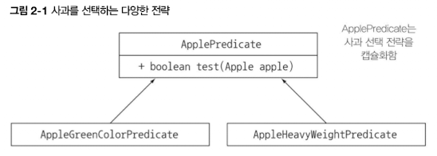

# Chapter 2 - 동작 파라미터화 코드 전달하기

자주 바뀌는 요구사항에 효과적으로 대응

동작 파라미터화 : 아직 어떻게 실행할 것인지 결정하지 않은 코드블록

## 2.1 변화하는 요구사항에 대응하기

농장 재고 목록 어플리케이션에서 사과 필터링

### 2.1.1 첫 번째 시도 : 녹색 사과 필터링

- 녹색사과 필터링

    ```java
    enum Color {
      RED,
      GREEN
    }
    
    public static List<Apple> filterGreenApples(List<Apple> inventory){
    	List<Apple> result = new ArrayList<>(); //사과 누적 리스트
    	for (Apple apple: inventory){
    		if(GREEN.equals(apple.getColor()){ //녹색만 선택
    			result.add(apple);
    		}
    	}
    	return result;
    }
    ```


### 2.1.2 두 번째 시도 : 색을 파라미터화

- 다른색도 필터링

    ```java
    public static List<Apple> filterApplesByColor(List<Apple> inventory, Color color){
    	List<Apple> result = new ArrayList<>(); //사과 누적 리스트
    	for (Apple apple: inventory){
    		if(apple.getColor().equals(color)){ //color에 해당하는 사과 선택
    			result.add(apple);
    		}
    	}
    	return result;
    }
    
    //호출
    List<Apple> greenApples = filterApplesByColor(inventory, GREEN);
    ```

- 무게도 필터링

    ```java
    public static List<Apple> filterApplesByWeight(List<Apple> inventory, int weight){
    	List<Apple> result = new ArrayList<>(); //사과 누적 리스트
    	for (Apple apple: inventory){
    		if(apple.getWeight() > weight){ //기준치보다 무거운 사과 선택
    			result.add(apple);
    		}
    	}
    	return result;
    }
    ```


색을 필터링 하는 것과 무게를 필터링 하는 것, 거의 유사한 흐름이라 더 최적화가 가능할 것만 같다....

### 2.1.3 세 번째 시도 : 가능한 모든 속성으로 필터링

- 이런거 하지마...

    ```java
    public static List<Apple> filterApples(List<Apple> inventory, Color color,
    																							int weight, boolean flag){
    	List<Apple> result = new ArrayList<>(); //사과 누적 리스트
    	for (Apple apple: inventory){
    		if((flag && apple.getColor().equals(color))||
    			(!flag && apple.getWeight() > weight)){ //color에 해당하는 사과 선택
    			result.add(apple);
    		}
    	}
    	return result;
    }
    
    //호출
    List<Apple> greenApples = filterApples(inventory, GREEN, 0, true);
    ```


지금까지는 메서드를 파라미터화 했지만 동작을 파라미터화 해서 유연성을 얻을 수 있다

## 2.2 동작 파라미터화

- 프레디케이트 : 참 또는 거짓을 반환하는 함수

    ```java
    //알고리즘 패밀리
    public interface ApplePredicate{
    	boolean test (Apple apple); //코드실행결과 return을 품고있음 -> 코드뭉치를 품고있음
    }
    
    //선택조건을 대표하는 여러 버전의 predicate -> 전략
    public class AppleHeavyWeightPredicate implements ApplePredicate{
    	public boolean test(Apple apple){ //apple이 150보다 큰지 반환
    		return apple.getWeight() > 150;
    	}
    }
    public class AppleGreenColorPredicate implements ApplePredicate{
    	public boolean test(Apple apple){ //apple이 GREEN인지 아닌지 반환
    		return GREEN.equals(apple.getColor());
    	}
    }
    ```


전략 디자인 패턴 : 캡슐화하는 알고리즘 패밀리를 정의하고 런타임에 알고리즘을 선택



### 2.2.1 네 번째 시도 : 추상적 조건으로 필터링

```java
//알고리즘 패밀리
public interface ApplePredicate{
	boolean test (Apple apple); //코드실행결과 return을 품고있음 -> 코드뭉치를 품고있음
}

//선택조건을 대표하는 여러 버전의 predicate -> 전략
public class AppleHeavyWeightPredicate implements ApplePredicate{
	public boolean test(Apple apple){ //apple이 150보다 큰지 반환
		return apple.getWeight() > 150;
	}
}
public class AppleGreenColorPredicate implements ApplePredicate{
	public boolean test(Apple apple){ //apple이 GREEN인지 아닌지 반환
		return GREEN.equals(apple.getColor());
	}
}

//호출
public static List<Apple> filterApples(List<Apple> inventory, ApplePredicate p){
	List<Apple> result = new ArrayList<>();
	for(Apple apple : inventory){
		if(p.test(apple)){ //프레디케이트 객체가 return True이면
			result.add(apple);
		}
	}
}
```

어떤 ApplePredicate를 전달하냐에 따라 filterApples의 동작이 달라진다


test 메서드 안에 내가 원하는 동작 정의

메서드는 객체만 인수로 받으므로 test메서드를 Predicate객체로 감싸서 전달


**⇒ 컬랙션 탐색 로직과 각 항목에 적용할 동작을 분리할 수 있음**

### Quiz) prettyPrintApple

- 메소드 선언부

    ```java
    public static void prettyPrintApple(List<Apple> inventory, AppleFormatter p){
    	for(Apple apple:inventory){
    		String output = p.accept(apple);
    		System.out.println(output);	
    	}
    }
    ```

- 추상화

    ```java
    public interface AppleFormatter{
    	String accept(Apple a);
    }
    ```

- 세부조건 구현

    ```java
    public class AppleFancyFormatter implements AppleFormatter {
    	public String accept(Apple apple){
    		String characteristic = apple.getWeight() > 150 ? "heavy":"light";
    		return "A " + characteristic + " " + apple.getColor() + " apple";
    	}
    }
    
    public class AppleSimpleFormatter implements AppleFormatter {
    	public String accept(Apple apple){
    		return "An apple of " + apple.getWeight() + " g";
    	}
    }
    ```

- 실행

    ```java
    prettyPrintApple(inventory, new AppleFancyFormatter());
    
    ////결과////
    // A light green apple
    // A heavy red apple
    ```

- 다만 클래스를 구현해서 인스턴스화 해야한다. 이를 개선할 수 없을까?

## 2.3 복잡한 과정 간소화

익명 클래스 : 클래스의 선언과 인스턴스화를 동시에 수행

람다 표현식으로 가독성 향상

### 2.3.1 익명 클래스

클래스 선언과 인스턴스화를 동시에

### 2.3.2 다섯 번째 시도 : 익명 클래스 사용

- 귀찮은 예시 1

    ```java
    List<Apple> redApples = filterApples(inventory, new ApplePredicate(){
    	public boolean test(Apple apple){
    		return RED.equals(apple.getColor()); //메서드 동작을 안에다 직접 파라미터화(바로 구현)
    	}
    });
    ```

- 귀찮은 예시 2

    ```java
    button.setOnAction(new EventHandler<ActionEvent>(){
    	public void handle(ActionEvent event){
    		System.out.println("Whooooo a click!");
    	}
    }
    ```

- 어려운 예시

    ```java
    public class MeaningOfThis{
    	public final int value = 4;
    	public void doIt(){
    		int value = 6;
    		Runnable r = new Runnable(){
    			public final int value = 5;
    			public void run(){
    				int value = 10;
    				System.out.println(this.value);
    			}
    		}
    	}
    
    	public static void main(String[] args){
    		MeaningOfThis m = new MeaningOfThis();
    		m.doIt(); //결과는? 5 (Runnable을 참조하기때문)
    	}
    }
    ```


### 2.3.3 여섯 번째 시도 : 람다 표현식 사용

```java
List<Apple> result = 
	filterApples(inventory, (Apple apple) -> RED.equals(apple.getColor()));
```


### 2.3.4 일곱 번째 시도 : 리스트 형식으로 추상화

```java
public interface Predicate<T>{
	boolean test(T t);
}

public static <T> List<T> filter(List<T> list, Predicate<T> p){
	List<T> result = new ArrayList<>();
	for(T e:list){
		if(p.test(e)){
			result.add(e);
		}
	}
	return result;
}
```

```java
List<Apple> redApples = filter(inventory, 
															(Apple apple) -> RED.equals(apple.getColor()));
```

## 2.4 실전 예제

동작 파라미터화 : 동작을 캡슐화한 다음에 메서드로 전달해서 메서드의 동작을 파라미터화

### 2.4.1 Comparator로 정렬하기

무게가 적은 순서로 정렬 동작 수행

```java
//java.util.Comparator
public interface Comparator<T>{
	int compare(T o1, T o2);
}

inventory.sort(new Comparator<Apple>(){
	public int compare(Apple a1, Apple a2){
		return a1.getWeight().compareTo(a2.getWeight());
	}
}

//람다식
inventory.sort((Apple a1, Apple a2) 
								-> a1.getWeight().compareTo(a2.getWeight()));
```

### 2.4.2 Runnable로 코드 블록 실행하기

병렬로 코드 블록 실행 + 스레드에게 알려주기

```java
//java.lang.Runnable 
public interface Runnable{
	void run();
}

Thread t = new Thread(new Runnable(){
			public void run(){
		System.out.println("Hello world");
	}
});

//람다식
Thread t = new Thread(()->System.out.println("Hello world"));
```

### 2.4.3 GUI 이벤트 처리하기

ExecutorService 인터페이스 : 태스크를 스레드 풀로 보내고 결과를 Future로 저장

```java
//java.util.concurrent.Callable
public interface Callable<V>{
	V call();
}

ExecutorService executorService = Executors.newCachedThreadPool();
Future<String> threadName = executorService.submit(new Callable<String>() {
	@Override public String Cacall() throws Exception{
		return Thread.currentThread().getName();
	}
});

//람다식
Future<String> threadName = executorService.submit(
							()->Thread.currentThread()/getName());
```

### 2.4.4 GUI 이벤트 처리하기

마우스 클릭이나 그런거... eventHandler전달

```java
Button button = new Button("Send");
button.setOnAction(new EventHandler<ActionEvent>() {
	public void handle(ActionEvent event){
		label.setText("Sent!!");
	}
}

//람다식
button.setOnAction((ActionEvent event) -> label,setText("Sent!!"));
```

## 2.5 마치며

- 동작 파라미터는 메서드 내부적으로 다양한 동작을 할 수 있도록 메서드 인수로 전달
- 코드 전달 기법을 쓸 때, 익명 클래스로 더 나아가 인터페이스 상속으로 깔끔한 코드 구현 가능
- 정렬, 스레드, GUI 처리 등 다양한 동작으로 파라미터화 가능