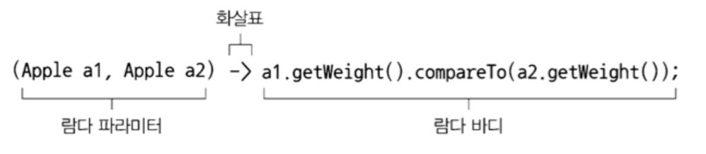
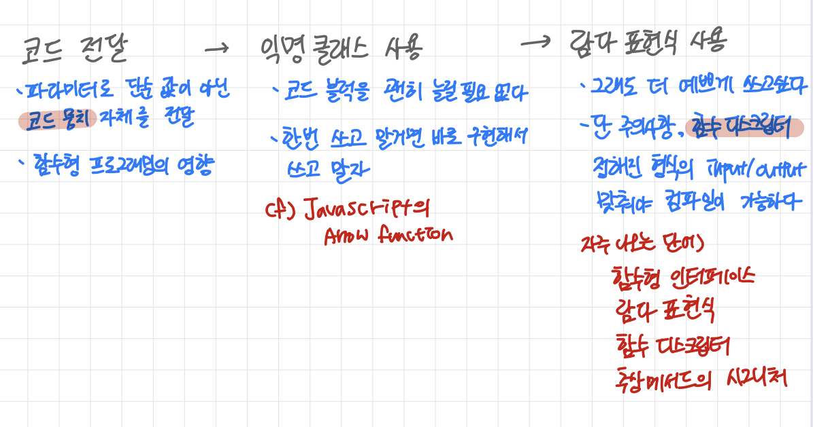

# Chapter 3 - 람다 표현식

메서드참조

간결하고 유연한 코드

# 3.1 람다란 무엇인가?

메서드로 전달할 수 있는 익명 함수를 단순화한 것

- 익명
- 함수
- 전달 : 인수로 저장하거나 변수로 저장할 수 있다
- 간결성

⇒ 코드가 간결하고 유연해짐

- 비교 예시코드 (사과 2개 무게 비교)

    ```java
    //기존코드
    Comparator<Apple> byWeight = new Comparator<Apple>(){
    	public int compare(Apple a1, Apple a2){
    		return a1.getWeight().compareTo(a2.getWeight());
    	}
    }
    
    //람다
    Comparator<Apple> byWeight = 
    	(Apple a1, Apple a2) -> a1.getWeight().compareTo(a2.getWeight());
    ```




다섯 가지 람다 표현식 예제

```java
// return함축
(String s) -> s.length()

// boolean 반환
(Apple a) -> a.getWeight() > 150

// Return void
(int x, int y) -> {
	System.out.println("Result:");
	System.out.println(x + y);
}

() -> 42

// int 반환
(Apple a1, Apple a2) -> a1.getWeight().compareTo(a2.getWeight())
```


- 구문 statement
- 표현식 expression

# 3.2 어디에, 어떻게 람다를 사용할까?

- ex. 필터 메서드

    ```java
    List<Apple> greenApples = 
    	filter(inventory, (Apple a) -> GREEN.equals(a.getColor()));
    ```


## 3.2.1 함수형 인터페이스

정확히 하나의 추상 메서드를 지정하는 인터페이스

- Predicate
- Comparaotr
- Runnable
- ActionListener
- Callable
- PrivilegedAction


하나의 추상 메서드를 포함해야 함수형 인터페이스임

전체 표현식을 함수형 인터페이스의 인스턴스로 취급

- Runnable 함수형 인터페이스 예시

    ```java
    // 람다
    Runnable r1 = () -> System.out.println("Hello World 1");
    
    // 익명 클래스
    Runnable r2 = new Runnable(){
    	public void run(){
    		System.out.println("Hello World 2");
    	}
    };
    
    public static void process(Runnable r){
    	r.run();
    }
    process(r1);
    process(r2);
    process(()->System.out.println("Hello World 3"));
    ```


## 3.2.2 함수 디스크립터

- 시그니처(signature) : 람다 표현식의 시그니처
- 함수 디스크립터 : 람다 표현식의 시그니처를 서술하는 메서드
- 인수가 없으며 void를 반환하는 람다 표현식

    ```java
    public void process(Runnable r){
    	r.run();
    }
    
    process(() -> System.out.println("This is awsome!!"));
    ```

  한 개의 void 메소드 호출은 중괄호로 감쌀 필요가 없다


**함수형 인터페이스를 인수로 받는 메서드에만 람다 표현식 사용 가능**


>💡 **@FunctionalInterface**  
>함수형 인터페이스임을 가리키는 어노테이션


# 3.3 람다 활용 : 실행 어라운드 패턴


- ex. 자원 처리하는 코드처럼 설정과 정리 두 과정이 둘러싸는 형태

    ```java
    public String processFile() throws IOException{
    	try(BufferedReader br = 
    			new BufferedReader(new FileReader("data.txt"))){
    		return br.readLine();	
    	}
    }
    ```


## 3.3.1 1단계 : 동작 파라미터화를 기억하라

- 한 번에 두 행을 읽게하려면?

    ```java
    String result = processFile((BufferedReader br)->
    				br.readLine() + br.readLine());
    ```


## 3.3.2 2단계 : 함수형 인터페이스를 이용해서 동작 전달

- 시그니처와 일치하는 함수형 인터페이스 생성

    ```java
    @FunctionalInterface
    public interface BufferedReaderProcessor{
    	String process(BufferedReader b) throws IOExcpetion;
    }
    ```

    ```java
    public String processFile(BufferedReaderProcessor p) 
    		throws IOException{
     //...
    }
    ```


## 3.3.3 3단계 : 동작 실행

람다 표현식으로 함수형 인터페이스의 추상 메서드 구현을 직접 전달할 수 있으며

전달된 코드는 함수형 인터페이스의 인스턴스로 전달된 코드와 같은 방식으로 처리

- processFile 바디 내에서 BufferedReaderProcessor 객체의 process 호출

    ```java
    public String processFile(BufferedReaderProcessor p) 
    				throws IOException{
    	try(BufferedReader br = 
    		new BufferedReader(new FileReader("data.txt"))){
    		return p.process(br); //BufferedReader 객체 처리 
    	}
    }
    ```


## 3.3.4 4단계 : 람다 전달

```java
String oneLines = 
	processFile((BufferedReader br)->br.readLine());

String twoLines = 
	processFile((BufferedReader br)->br.readLine() + br.readLine());
```

processFile 메서드를 더 유연하게 만듦


# 3.4 함수형 인터페이스 사용

람다 표현식을 사용하려면 공통의 함수 디스크립터를 기술하는 함수형 인터페이스 집합이 필요함

## 2.4.1 Predicate

- 제너릭 T → boolean
- 따로 인터페이스를 정의할 필요 없이 사용 가능
- ex. String 객체를 인수로 받는 람다

    ```java
    @FunctionalInterface
    public interface Predicate<T>{
    	boolean test(T t);
    }
    public <T> List<T> filter(List<T> list, Predicate<T> p){
    	List<T> results = new ArrayList<>();
    	for(T t: list){
    		if(p.test(t)){
    			results.add(t);
    		}
    	}
    	return results;
    }
    
    Predicate<Stirng> nonEmptyStringPredicate = (String s) -> !s.isEmpty();
    List<String> nonEmpty = filter(listOfStrings, nonEmptyStringPredicate);
    ```


## 2.4.2 Consumer

- 제너릭T → void
- accpet라는 추상 메서드 정의
- ex. 리스트의 모든 항목을 출력

    ```java
    @FunctionalInterface
    public interface Consumer<T>{
    	void accpet(T t);
    }
    public <T> void forEach(List<T> list, Consumer<T> c){
    	for(T t: list){
    		c.accept(t);
    	}
    }
    
    forEach(
    	Arrays.asList(1,2,3,4,5),
    	(Integer i) -> System.out.println(i)
    );
    ```

- **그냥 받아서 보내기만할거면 얘 왜씀..?**

  함수형 인터페이스로 넘겨줘야하니까!

  여러 번 호출해서 복잡한 파라미터로 던지는 것을 안하려고


## 2.4.3 Function

- 제너릭T → 제너릭R
- apply라는 추상 메서드 정의
- String의 길이를 포함하는 Integer리스트로 변환하는 map 메서드 정의

    ```java
    @FunctionalInterface
    public interface Function<T, R>{
    	R apply(T t);
    }
    public <T, R> List<R> map(List<T> list, Function<T, R> f){
    	List<R> result = new ArrayList<>();
    	for(T t: list){
    		result.add(f.apply(t));
    	}
    	return result;
    }
    
    // [7,2,6]
    List<Integer> l = map(
    	Arrays.asList("lambdas", "in", "action"),
    	(String s) -> s.length() //Function의 apply메서드를 구현하는 람다
    );
    ```


### 기본형 특화

- 참조형 : Byte, Integer, Object, List
- 기본형 : int, bouble, byte, char

제네릭 파라미터에는 참조형만 사용 가능


>💡 **기본형을 참조형으로 변환하는 “박싱" 기능 제공**  
>← 그러나, 변환 과정에서 비용이 소모되고  
>박싱한 값은 기본형을 감싸는 래퍼며 힙에 저장되고  
>따라서 메모리를 더 소비하며 기본형을 가져올 때도 메모리를 탐색하는 과정이 필요

- ex. 자바8에서 제공하는 오토박싱을 피하는 특별 버전의 함수형 인터페이스

    ```java
    public interface IntPredicate{
    	boolean test(int t);
    }
    IntPredicate evenNumbers = (int i) -> i%2 == 0;
    evenNumbers.test(1000); //참(박싱없음)
    
    Predicate<Integer> oddNumbers = (Integer i) -> i%2 != 0;
    oddNumbers.test(1000); //거짓(박싱)
    ```

  

- 람다, 함수형 인터페이스의 관계

  예외를 던지는 람다 표현식을 만들려면 확인된 예외를 선언하는 함수형 인터페이스를 직접 정의하거나 람다를 try/catch 블록으로 감싸야함

    ```java
    Function<BufferedReader, String> f = (BufferedReader b) -> {
    	try{
    		return b.readLine();
    	}
    	catch(IOException e){
    		throw new RuntimeException(e);
    	}	
    };
    ```


# 3.5 형식 검사, 형식 추론, 제약

컴파일러가 람다의 형식을 어떻게 확인하는지, 피해야 할 사항은 무엇인지

람다 표현식 자체에는 람다가 어떤 함수형 인터페이스를 구현하는지 정보가 포함되지 않는다

## 3.5.1 형식 검사

대상 형식 : 어떤 콘텍스트에서 기대되는 람다 표현식의 형식


필요한 디스크립터 : (Apple → boolean)

람다가 그에 맞게 작성 되었나? : ✅

코드 형식검사 : ✅

## 3.5.2 같은 람다, 다른 함수형 인터페이스

하나의 람다 표현식을 다양한 함수형 인터페이스에 사용할 수 있다

```java
Comparator<Apple> c1 = 
		(Apple a1, Apple a2) -> a1.getWeight().compareTo(a2.getWeight());

ToIntBiFunction<Apple, Apple> c2 = 
		(Apple a1, Apple a2) -> a1.getWeight().compareTo(a2.getWeight());

BiFunction<Apple, Apple, Integer> c3 = 
		(Apple a1, Apple a2) -> a1.getWeight().compareTo(a2.getWeight());
```


>💡 **다이아몬드 연산자 (<>)**  
>콘텍스트에 따른 제네릭 형식 추론  
>주어진 클래스 인스턴스 표현식을 두 개 이상의 다양한 콘텍스트에서 사용 가능  
>(형식인수는 콘텍스트에 의해 추론된다)  
>
>```java
>List<String> listOfStrings = new ArrayList<>();
>List<Integer> listOfIntegers = new ArrayList<>();
>```

- 람다 바디에 일반 표현식이 있으면 void반환 디스크립터와 호환

    ```java
    Predicate<String> p = s -> list.add(s); //return boolean
    Consumer<String> b = s -> list.add(s); //return void
    
    // => 둘다 가능!
    ```

- 🤔형식 검사 문제

    ```java
    Object o = () -> { System.out.println("Tricky example"); };
    
    //캐스팅
    Object o = (Runnable)() -> { System.out.println("Tricky example"); };
    ```

    - object는 함수형 인터페이스가 아님
    - 캐스트해서 명시적 대상으로 Runnable로 지정

**⇒ 람다의 표현식과 콘텍스트가 맞아야하며, 역으로 대상 형식을 통해 람다 파라미터 형식도 추론 가능함**

## 3.5.3 형식 추론

코드를 단순화할 수 있다

컴파일러는 람다의 시그니처도 추론할 수 있다 → 람다 문법에서 생략할 수 있다

```java
//람다 파라미터 형식 추론 (이 경우 predicate임)
List<Apple> greenApples = 
		filter(inventory, apple -> GREEN.equals(apple.getColor()));

Comparator<Apple> c = 
		(Apple a1, Apple a2) -> a1.getWeight().compareTo(a2.getWeight()); //형식추론X
Comparator<Apple> c = 
		(a1, a2) -> a1.getWeight().compareTo(a2.getWeight()); //형식추론O
```

명시하는게 좋을수도 있고 아닐수도있는데, 상황에 따라 개발자가 알아서 해야한다

## 3.5.4 지역 변수 사용

람다 캡처링 : 인수를 자신의 바디 안에서만 사용했지만 익명 함수처럼 자유변수 활용 가능

자유변수 : 파라미터로 넘겨진 변수가 아닌 외부에서 정의된 변수

- 인스턴스 변수 : 힙에 저장 (힙은 스레드가 공유함)
- 정적 변수
- 지역 변수 : 스택
- 람다에서 참고하는 지역 변수는 final로 선언되거나 실질적으로 final처럼 취급되어야함

    ```java
    int portNumber = 1337;
    Runnable r = () -> System.out.println(portNumber);
    portNumber = 31337; //Error!!
    ```


### 지역 변수의 제약

- 지역 변수와 인스턴스 변수는 위치가 다름
- 변수 할당된 스레드 vs 람다 실행 스레드 : 할당 해제 이후 실행하려한다면 문제가 생긴다.

  (자유 지역 변수 복사본을 제공하지만 복사본의 값이 바뀌면 안돼서 지역 변수에는 한번만 할당 가능)


>💡 **클로저**  
함수의 비지역 변수를 자유롭게 참조할 수 있는 함수의 인스턴스  
클로저는 클로저 외부에 정의된 변수의 값에 접근하고 값을 바꿀 수 있다  
>
>람다와 익명 클래스는 람다가 정의된 메서드의 지역 변수(final)의 값은 바꿀 수 없다  
>⇒ 람다는 변수가 아닌 값에 국한되어 동작 수행  

>지역 변숫값은 스택에 존재하므로 자신을 정의한 스레드와 생존을 같이 해야하며   
> 따라서 지역 변수는 final이어야 함

>가변 지역 변수를 새로운 스레드에서 캡처할 수 있다면 안전하지 않은 동작을 수행할 가능성이 생긴다
>인스턴스 변수는 스레드가 공유하는 힙에 존재하므로 특별한 제약이 없다


# 3.6 메서드 참조

특정 람다 표현식을 축약

```java
//기존코드
inventory.sort((Apple a1, Apple a2) -> a1.getWeight().compareTo(a2.getWeight()));

//ajva.util.Comparator.comparing
inventory.sort(comparing(Apple::getWeight));
```

## 3.6.1 요약

메소드 참조 : 특정 메서드만을 호출하는 람다의 축약형 (람다를 편리하게 표현하는 문법)

⇒ 코드 가독성을 높일 수 있음

### 메소드 참조 만드는 방법

1. 정적 메서드 참조 (ex. Integer::parseInt)
2. 다양한 형식의 인스턴스 메서드 참조

    ```java
    //2개 같은 것
    (String s) → s.toUpperCase()
    String::length
    ```

3. 기존 객체의 인스턴스 메서드 참조 (ex. cmccEncnDTO::getEncnTlno)


메서드 참조는 콘텍스트의 형식과 일치해야함

## 3.6.2 생성자 참조

클래스명과 new 키워드를 이용해서 기존 생성자의 참조 생성

- Supplier 예시

    ```java
    Supplier<Apple> c1 = Apple::new;
    Apple a1 = c1.get(); //Supplier의 get 메서드를 호출해서 새로운 객체 생성
    
    Supplicer<Apple> c1 = () -> new Apple();
    Apple a1 = c1.get();
    ```

- 인터페이스의 시그니처 예시

    ```java
    Function<Integer, Apple> c2 = Apple::new;
    Apple a2 = c2.apply(110);
    
    Function<Integer, Apple> c2 = (weight) -> new Applee(weight); //특정 무게의 사과를 만드는 람다식
    Apple a2 = c2.apply(110);
    ```

    ```java
    List<Integer> weights = Arrays.asList(7,3,4,10);
    List<Apple> apples = map(weights, Apple::new);
    public List<Apple> map(List<Integer> list, Function<Integer, Apple> f){
    	List<Apple> result = new ArrayList<>();
    	for(Integer i: list){
    		result.add(f.apply(i));
    	}
    	return result;
    }
    ```


인스턴스화하지 않고도 생성자에 접근 가능

- Map으로 생성자와 문자열값을 관련시킬 수 있음

    ```java
    static Map<String, Function<Integer, Fruit>> map = new HashMap<>();
    static{
    	map.put("apple", Apple::new);
    	map.put("orange", Orange::new);
    }
    
    public static Fruit giveMeFruit(String fruit, Integer weight){
    	return map.get(fruit.toLowerCase())
    						.apply(weight);
    }
    ```


생성자 참조와 일치하는 시그니처를 갖는 함수형 인터페이스가 필요함

# 3.7 람다, 메서드 참조 활용하기

## 3.7.1 1단계 : 코드 전달

sort라는 함수는 Comparator 객체를 인수로 받아 비교를 수행한다

➡️ sort에 전달되는 정렬 전략에 따라 sort의 동작이 달라진다

➡️ sort의 동작이 파라미터화 되었다

- 1단계 코드

    ```java
    public class AppleComparator implements Comparator<Apple> {
    	public int compare(Apple a1, Apple a2){
    		return a1.getWeight().compareTo(a2.getWeight());
    	}
    }
    inventory.sort(new AppleComparator());
    ```


## 3.7.2 2단계 : 익명 클래스 사용

Comparator는 한 번만 쓸거니까 익명 클래스 사용

- 2단계 코드

    ```java
    inventory.sort(new Comparator<Apple>(){
    	public int compare(Apple a1, Apple a2){
    		return a1.getWeight().compareTo(a2.getWeight());
    	}
    });
    ```


## 3.7.3 3단계 : 람다 표현식 사용

더 경량화된 문법으로 작성 가능 ⇒ 함수형 인터페이스 ⇒ 람다 표현식

- 함수형 인터페이스 : 오직 하나의 추상 메서드를 정의하는 인터페이스
- 함수 디스크립터 : 추상 메서드의 시그니처 (→ 람다 표현식의 시그니처와 일치해야함)

Comparator의 디스크립터 : (T, T) → int



필요한 키만 추출 정적 메서드 사용해서 가독성 향상

- 3단계 코드

    ```java
    inventory.sort((Apple a1, Apple a2) ->
    								a1.getWeight().compareTo(a2.getWeight())
    );
    
    //정적메소드 사용
    Comparator<Apple> c = Comparator.comparing((Apple a) -> a.getWeight());
    
    import static java.util.Comparator.comparing;
    inventory.sort(comparing(apple -> apple.getWeight()));
    ```


## 3.7.4 4단계 : 메서드 참조 사용

```java
inventory.sort(comparing(Apple::getWeight));
```

# 3.8 람다 표현식을 조합할 수 있는 유용한 메서드

함수형 인터페이스는 람다 표현식을 조합할 수 있도록 유틸리티 메서드를 제공

⇒ 여러 람다 표현식을 조합해서 복잡한 람다 표현식으로

디폴트 메서드 : 함수형 인터페이스임에도 추가 메서드를 제공?!?!?!?!

## 3.8.1 Comparator 조합

- 역정렬

    ```java
    inventory.sort(comparing(Apple::getWeight).reversed());
    ```

- Comparator 연결

  무게가 같은 사과가 있다면?

    ```java
    inventory.sort(comparing(Apple::getWeight)
    					.reversed() //무게순 내림차순
    					.thenComparing(Apple::getCountry)); //무게가 같으면 국가별 정렬
    ```


## 3.8.2 Predicate 조합

- negate
- and
- or
- 특정 프레디케이트 반전

    ```java
    Predicate<Apple> notRedApple = redApple.negate();
    ```

- 두 람다 조합

    ```java
    Predicate<Apple> redAndHeavyApple = 
    	redApple.and(apple -> apple.getWeight() > 150);
    ```

- 추가 조건 구현

    ```java
    Predicate<Apple> redAndHeavyAppleOrGreen = 
    	redApple.and(apple -> apple.getWeight() > 150)
    					.or(apple -> GREEN.equals(a.getColor()));
    ```


## 3.8.3 Function 조합

- andThen
    - 주어진 함수를 먼저 적용한 결과를 다른 함수의 입력으로 전달
    - g(f(x))
- compose
    - 인수로 주어진 함수 먼저 실행하고 그 결과를 외부 함수의 인수로 제공
    - f(g(x))
- 예시) 변환 파이프라인

    ```java
    Function<String, String> addHeader = Letter::addHeader;
    Function<String, String> transformationPipeline = 
    	addHeader.andThen(Letter::checkSpelling)
    					.andThen(Letter::addFooter);
    ```

  


# 3.9 비슷한 수학적 개념

문송합니다🙏


# 3.10 마치며

- 람다 표현식은 익명 함수의 일종이다
- 함수형 인터페이스는 하나의 추상 메서드만을 정의하는 인터페이스이다.
- 함수형 인터페이스를 기대하는 곳에서만 람다 표현식을 사용할 수 있다
- 람다 표현식 전체가 함수형 인터페이스의 인스턴스로 취급된다
- 함수형 인터페이스 종류
    - Predicate
    - Function
    - Supplier
    - Consumer
    - BinaryOperator 등등
- 제네릭 함수형 인터페이스와 관련한 박싱 동작을 피할 수 있는 기본형 특화 인터페이스도 제공함 (IntPerdicate)
- 실행 어라운드 패턴(코드 중간에 실행해야하는 메서드에 꼭 필요한 코드)을 람다와 활용하면 유연성과 재사용성을 얻을 수 있다
- 람다의 기대 형식을 대상 형식이라고 한다
- 메서드 참조를 통해 기존 메서드 구현을 재사용하고 직접 전달할 수 있다
- 함수형 인터페이스는 람다 표현식을 조합할 수 있는 다양한 디폴트 메서드를 제공한다