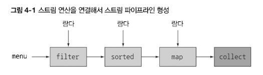

# Chapter 4 - 스트림 소개

SQL질의처럼 컬랙션도 그렇게 사용할 수 있지 않을까?

멀티코어 병렬처리를 하고싶다

# 4.1 스트림이란 무엇인가?

선언형으로 컬렉션 데이터 처리

데이터를 투명하게 병렬처리 가능

- [java7] SELECT name FROM dishes WHERE calories < 400 ORDER BY calories

    ```java
    List<Dish> lowCaloricDishes = new ArrayList<>(); //가비지 변수
    for (Dish d : dishes) { //누적자로 요소 필터링
      if (d.getCalories() < 400) {
        lowCaloricDishes.add(d);
      }
    }
    
    Collections.sort(lowCaloricDishes, new Comparator<Dish>() { //익명클래스로 요리 정렬
      @Override
      public int compare(Dish d1, Dish d2) {
        return Integer.compare(d1.getCalories(), d2.getCalories());
      }
    });
    
    List<String> lowCaloricDishesName = new ArrayList<>();
    for (Dish d : lowCaloricDishes) {
      lowCaloricDishesName.add(d.getName());
    }
    ```

  컨테이너 역할만 하는 중간 변수(가비지 변수) 사용

  step1) 400칼로리 미만 arrayList 만들기

  step2) 익명클래스로 요리 정렬

  step3) 이름만 뽑은 새 arrayList 만들어서 return

- [java8] SELECT name FROM dishes WHERE calories < 400 ORDER BY calories

    ```java
    List<String> lowCaloricDishesName = 
    				 menu.stream()
    		        .filter(d -> d.getCalories() < 400) //400이하 요리 선택
    		        .sorted(comparing(Dish::getCalories)) //칼로리로 정렬
    		        .map(Dish::getName) //요리명 추출
    		        .collect(toList()); //모든 요리명을 리스트에 저장
    ```

    ```java
    List<String> lowCaloricDishesName = 
    				 menu.parallelStream() //멀티코어 아키텍처에서 병렬로 실행
    		        .filter(d -> d.getCalories() < 400)
    		        .sorted(comparing(Dish::getCalories))
    		        .map(Dish::getName)
    		        .collect(toList());
    ```

- 선언형으로 코드 구현 가능
- 람다식 사용 가능



- 여러 빌딩 블록 연산을 연결하여 데이터 처리 파이프라인을 만들 수 있음
    - 메소드가 연결되어 실행

# 4.2 스트림 시작하기

컬렉션 스트림

스트림 : 데이터 처리 연산을 지원하도록 소스에서 추출된 연속된 요소

- 연속된 요소를 통한 계산
- 데이터 제공 소스를 그대로 유지
- 데이터 처리 연산

스트림의 중요 특징

1. 파이프라이닝 : 최적화 가능
2. 내부 반복
- 예시

    ```java
    import static java.util.stream.Collectors.toList;
    
    List<String> threeHighCaloricDishNames = 
    	menu.stream() //스트림을 얻는다
            .filter(dish -> dish.getCalories() > 300) //고칼로리 요리 필터링
            .map(Dish::getName) //요리명 추출
            .limit(3) //선착순 3개만 선택
            .collect(toList()); //결과를 다른 리스트로 저장
    ```

  filter, map, limit, collect ⇒ 데이터 처리 연산 파이프라인

  collect가 호출되기 전까지 메서드 호출이 저장됨


# 4.3 스트림과 컬렉션

순차적으로 값에 접근함

데이터를 언제 계산하느냐

- 컬렉션 : 현재 자료구조가 포함하는 모든 값을 메모리에 저장 (추가하려는 요소는 미리 계산되어있어야함)

  ⇒ 적극적으로 생성 (생선자 중심)

- 스트림 : 요청할 때만 요소를 계산 (요소를 추가하거나 제거하는 것 불가능)

  ⇒ 사용자가 요청하는 값만 스트림에서 추출 (즉석제조)


EX. 끝 없는 소수 List생성

컬렉션 : 끝없이 무한 루프로 계산하고 추가하기에 영원히 결과를 볼 수 없음

스트림 : 사용자가 요청하는 값만 스트림에서 추출

## 4.3.1 딱 한 번만 탐색할 수 있다

탐색된 스트림의 요소는 소비된다

고로 if else가 안된다

[](https://www.baeldung.com/java-8-streams-if-else-logic)

```java
List<String> title = Arrays.asList("Java8", "In" , "Action");
Stream<String> s = title.stream();

s.forEach(System.out::println); //title의 각 단어 출력
s.forEach(System.out::println); //java.lang.IllegalStateException
```

## 4.3.2 외부 반복과 내부 반복

데이터 반복 처리 방법에서의 차이점

컬렉션은 사용자가 직접 요소를 반복 - **외부반복**

스트림은 반복을 알아서 처리하고 결과 스트림값을 어딘가에 저장 - **내부반복**

```java
//컬렉션 for-each 외부반복
List<String> names = new ArrayList<>();
for(Dish dish: menu){ //메뉴 리스트를 명시적으로 순차 반복
	names.add(dish.getName()); //이름을 추출해서 리스트에 추가
}

//컬렉션 반복자 외부반복
List<String> names = new ArrayList<>();
Iterator<String> iterator = menu.iterator();
while(iterator.hasNext()){ //명시적 반복
	Dish dish = iterator.next();
	names.add(dish.getName());
}

//스트림 내부반복
List<String> names = menu.stream()
													.map(Dish::getName) //파라미터화해서 요리명 추출
													.collect(toList()); //파이프라인 실행
```

내부반복을 이용하면 작업을 투명하게 병렬로 처리하거나 더 최적화된 다양한 순서로 처리 가능

병렬성 구현 자동 선택


연산 리스트가 미리 정의되어있어야함

- Quiz 4-1

    ```java
    //컬렉션
    List<String> highCaloricDishes = new ArrayList<>();
    Iterator<String> iterator = menu.iterator();
    while(iterator.hasNext()){
    	Dish dish = iterator.next();
    	if(dish.getCalories() > 300){
    		highCaloricDishes.add(d.getName());
    	}
    }
    
    //스트림 **오탈자**
    List<Dish> highCaloricDishes = menu.stream()
    		.filter(dish->dish.getCalories() > 300)
    		.collect(toList());			
    ```


# 4.4 스트림 연산

중간 연산 : 연결할 수 있는 스트림 연산

최종 연산 : 스트림을 닫는 연산


## 4.4.1 중간 연산

다른 스트림을 반환함

단말 연산을 스트림 파이프라인에 실행하기 전까지는 아무 연산도 수행하지 않음

⇒ 게으름 Lazy

- 현재 처리중인 요리 출력

    ```java
    List<String> names = menu.stream()
            .filter(dish -> {
              System.out.println("filtering " + dish.getName());
              return dish.getCalories() > 300;
            })
            .map(dish -> {
              System.out.println("mapping " + dish.getName());
              return dish.getName();
            })
            .limit(3)
            .collect(toList());
        System.out.println(names);
    ```


최적화 효과

- 쇼스서킷 (to be continue)
- 루프 퓨전

## 4.4.2 최종 연산

List, Integer, void 등 스트림 이외의 결과가 반환됨

결과 도출

## 4.4.3 스트림 이용하기

- 질의를 수행할 데이터 소스
- 스트림 파이프라인을 구성할 중간 연산 연결
- 스트림 파이프라인을 실행하고 결과를 만들 최종 연산

builder랑 비슷함


# 4.5 로드맵

5장 - 스트림 제공 연산(필터링, 슬라이싱, 검색, 매칭, 매핑, 리듀싱) 및 사용사례

6장 - 데이터 수집 방법

# 4.6 마치며

- 스트림은 내부 반복을 지원하며 filter, map, sorted 등의 연산으로 반복을 추상화한다
- 스트림에는 중간 연산(중개 연산)과 최종 연산이 있다
- 스트림 요소는 Lazy하게 계산된다. (빠닥빠닥 다 하는게 아니라 최종연산이 나오면 그때서야 최적화하고 한다)