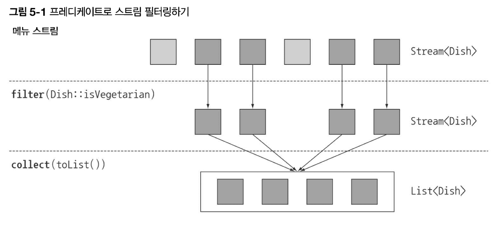

# Chapter 5 - 스트림 활용

스트림 API가 지원하는 다양한 연산

# 5.1 필터링

스트림의 요소를 선택하는 방법

[Stream (Java Platform SE 8 )](https://docs.oracle.com/javase/8/docs/api/java/util/stream/Stream.html#filter-java.util.function.Predicate-)

## 5.1.1 프레디케이트로 필터링

```java
List<Dish> vegetarianMenu = menu.stream()
			.filter(Dish::isVegetarian)
			.collect(toList());
```



## 5.1.2 고유 요소 필터링

distinct


```java
List<Integer> numbers = Arrays.asList(1, 2, 1, 3, 3, 2, 4);
    numbers.stream()
        .filter(i -> i % 2 == 0)
        .distinct()
        .forEach(System.out::println);
```

# 5.2 스트림 슬라이싱

요소를 선택하거나 스킵

## 5.2.1 프레디케이트를 이용한 슬라이싱

- TAKEWHILE 활용

  주어진 리스트가 이미 정렬되어 있다면?!

    ```java
    List<Dish> slicedMenu1 = specialMenu.stream()
            .takeWhile(dish -> dish.getCalories() < 320)
            .collect(toList());
    ```

- DROPWHILE 활용

  나머지 요소 선택 (프레디케이트 거짓인 지점부터 반환)

    ```java
    List<Dish> slicedMenu2 = specialMenu.stream()
            .dropWhile(dish -> dish.getCalories() < 320)
            .collect(toList());
    ```

  무한 스트림에서도 동작함


## 5.2.2 스트림 축소

- limit

  

    ```java
    List<Dish> dishesLimit3 = menu.stream()
            .filter(d -> d.getCalories() > 300)
            .limit(3)
            .collect(toList());
    ```

  정렬되지 않은 스트림에도 사용 가능


## 5.2.3 요소 건너뛰기

- skip(n)

  limit 상호보완적

  

    ```java
    List<Dish> dishesSkip2 = menu.stream()
            .filter(d -> d.getCalories() > 300)
            .skip(2)
            .collect(toList());
    ```

- Quiz 5-1 필터링

  처음 등장하는 두 고기 요리 필터링

    ```java
    List<Dish> dishes = menu.stream()
    					.filter(d->d.getType() == Dish.Type.MEAT)
    					.limit(2)
    					.collect(toList());
    ```


# 5.3 매핑

특정 객체에서 특정 데이터 선택

## 5.3.1 스트림의 각 요소에 함수 적용하기

새로운 버전을 만든다

- map

  map 출력 → Stream<String>

  [Stream (Java Platform SE 8 )](https://docs.oracle.com/javase/8/docs/api/java/util/stream/Stream.html#filter-java.util.function.Predicate-)

    ```java
    //스트림의 요리명 추출
    List<String> dishNames = menu.stream()
            .map(Dish::getName)
            .collect(toList());
    ```

    ```java
    //각 단어의 글자수 반환
    List<String> words = Arrays.asList("Hello", "World");
    List<Integer> wordLengths = words.stream()
            .map(String::length)
            .collect(toList());
    ```

    ```java
    //요리명의 길이 (map 2개)
    List<Integer> dishNameLenghts = menu.stream()
    		.map(Dish::getName)
    		.map(String::length)
    		.collect(toList());
    ```

## 5.3.2 스트림 평면화

배열 스트림 대신 문자열 스트림

2개 합치기

- map과 Arrays.stream 활용 ⇒ Fail

    ```java
    String[] arrayOfWords = {"Goodbye", "World"};
    Stream<String> streamOfwords = Arrays.stream(arrayOfWords);
  
    words.stream()
    	.map(word -> word.split("")) //각 단어를 개별 문자열 배열로 변환
    	.map(Arrays::stream) //각 배열을 별도의 스트림으로 생성
    	.distinct()
    	.collect(toList()));
    ```

- flatMap 사용 ⇒ Success

    ```java
    List<String> uniqueCharacters = 
    		words.stream()
    			.map(word -> word.split(""))
    			.flatMap(Arrays::stream) //생성된 스트림을 하나의 스트림으로 평면화
    			.distinct()
    			.collect(toList());
    ```


- Quiz) 5-2 매핑

    ```java
    // 1. 제곱근 리스트 반환
    List<Integer> numbers = Arrays.asList(1, 2, 3, 4, 5);
    List<Integer> squares = numbers.stream()
    							.map(n->n*n)
    							.collect(toList());
    ```

    ```java
    // 2. 모든 숫자 쌍 리스트 반환
    List<Integer> numbers1 = Arrays.asList(1, 2, 3);
    List<Integer> numbers2 = Arrays.asList(3, 4);
    List<int[]> pairs = numbers1.stream()
    						.flatMap(i->numbers2.stream()
    						.map(j->new int[]{i,j}))
    						.collect(toList());
    ```

    ```java
    // 3. 합이 3으로 나누어떨어지는 쌍만 반환
    List<Integer> numbers1 = Arrays.asList(1, 2, 3);
    List<Integer> numbers2 = Arrays.asList(3, 4);
    List<int[]> paris = numbers1.stream()
    						.flatMap(i->numbers2.stream()
    						.filter(j->(i+j)%3 == 0)
    						.map(j->new int[]{i,j}))
    						.collect(toList());
    ```


# 5.4 검색과 매칭

allMatch, anyMatch, noneMatch, findFirst, findAny

## 5.4.1 프레디케이트가 적어도 한 요소와 일치하는지 확인

- anyMatch

    ```java
    if(menu.stream().anyMatch(Dish::isVegetarian)){
    	System.out.println("The menu is (somewhat) vegetarian friendly!");
    }
    ```


boolean을 반환하므로 최종 연산임

## 5.4.2 프레디케이트가 모든 요소와 일치하는지 검사

- allMatch

  

    ```java
    boolean isHealthy = menu.stream()
    					.allMatch(dish -> dish.getCalories() < 1000);
    ```

- NONEMATCH

  

    ```java
    boolean isHealthy = menu.stream()
    					.noneMatch(d -> d.getCalories() >= 1000);
    ```


>💡 **쇼트서킷**  
>anyMatch, allMatch, noneMatch  
>자바 &&, || 와 같은 연산 활용  
>→ 표현식에서 하나라도 거짓이면 나머지에 상관없이 전체가 거짓이됨  
>→ 원하는 요소를 찾으면 즉시 결과 반환  
>이를 통해, 무한 스트림을 유한 스트림으로 변환 가능  
>(limit도 쇼트서킷 연산)
>

## 5.4.3 요소 검색

- findAny

  임의 요소 반환

  

    ```java
    Optional<Dish> dish = 
    		menu.stream()
    				.filter(Dish::isVegetarian)
    				.findAny();
    ```


### Optional이란?

Optional<T> 클래스 (java.util.Opitonal)

값의 존재나 부재 여부를 표현하는 컨테이너 클래스

null exception을 피하기 위해

- isPresent : 값을 포함하면 true, 아니면 false
- ifPresent : 값이 있으면 Consumer<T> block 실행 (return void)
- get() : 존재하면 반환하고 없다면 NoSuchElementException
- orElse() : 있으면 반환하고 없다면 기본값 반환
- **orElseGet()**

  [https://ysjune.github.io/posts/java/orelsenorelseget/](https://ysjune.github.io/posts/java/orelsenorelseget/)

  [https://codechacha.com/ko/java8-supplier-example/](https://codechacha.com/ko/java8-supplier-example/)


```java
menu.stream()
		.filter(Dish::isVegetarian)
		.findAny() //Opitonal<Dish> 반환
		.ifPresent(dish -> System.out.println(dish.getName());
		//값이 있으면 출력되고 없으면 아무일도 안일어남
```

## 5.4.4 첫 번째 요소 찾기

논리적 아이템 순서가 정해져 있을 때 첫번째 요소를 찾을 때

- findFirst

    ```java
    //숫자 리스트에서 3으로 나누어 떨어지는 첫 번째 제곱값
    List<Integer> someNumbers = Arrays.asList(1, 2, 3, 4, 5);
    Optional<Integer> firstSquareDivisibleByThree = 
    	someNumbers.stream()
    			.map(n -> n*n)
    			.filter(n -> n%3 == 0)
    			.findFirst();
    ```
  
# 5.5 리듀싱

스트림 요소를 조합해서 더 복잡한 질의를 표현

리듀싱 연산 : 모든 스트림 요소를 처리해서 값으로 도출 (함수형 프로그래밍에서는 ‘폴드 fold’ 라고도 함)

## 5.5.1 요소의 합

- Ex) for-each 리스트의 숫자 요소를 더함

  람다식 : (a,b) → a+b

  두 요소를 조합해서 새로운 값을 만드는 BinaryOperator<T>


```java
//for-each
int sum = 0;
for(int x : numbers){
	sum += x;
}

//stream
int sum = numbers.stream().reduce(0, (a,b) -> a+b);
int sum = numbers.stream().reduce(0, Integer::sum);

//초기값 없는 stream
Optional<Integer> sum = numbers.stream().reduce((a,b) -> (a+b));
```

초기값이 없는 경우, 스트림에 아무 요소도 없다면 합계가 없을 수 있음

[Java 함수형 인터페이스의 사용](https://johngrib.github.io/wiki/java-functional-interface/)

## 5.5.2 최댓값과 최솟값

```java
Optional<Integer> min = numbers.stream().reduce(Integer::min);
Optional<Integer> min = numbers.stream().reduce((x,y)-> x<y? x:y);
```

- Quiz 5-3

  map과 reduce 메서드를 이용해서 스트림의 요리 개수 계산

    ```java
    //맵리듀스패턴 - 병렬화가 쉬움
    int count = menu.stream()
    								.map(d->1) //각 요소를 1로 맵핑
    								.reduce(0,(a,b)->a+b);
    
    int count = menu.stream().count();
    ```


>💡 **reduce 메서드의 장점과 병렬화**   
>- 내부 반복이 추상화되면서 내부 구현에서 병렬로 실행  
>- 단계적 반복은 sum변수를 공유해야하므로 병렬화가 어려움  
>- 7장) stream()을 parallelStream()으로 바꾸면 병렬 가능  
>

- foreach vs reduce

  

  

  [https://docs.oracle.com/javase/8/docs/api/java/util/stream/Stream.html#reduce-T-java.util.function.BinaryOperator-](https://docs.oracle.com/javase/8/docs/api/java/util/stream/Stream.html#reduce-T-java.util.function.BinaryOperator-)

  [3 Reasons why You Shouldn't Replace Your for-loops by Stream.forEach()](https://blog.jooq.org/3-reasons-why-you-shouldnt-replace-your-for-loops-by-stream-foreach/)


>💡 **스트림 연산 : 상태 없음과 상태 있음**  
> 1. 내부 상태를 갖지 않는 연산  
>  요소를 입력받아 0 또는 결과를 출력 스트림으로 보냄  
>  Ex) map, filter  
> 2. 내부 크기가 한정된 연산  
>  누적할 내부 상태가 필요함  
>  Ex) reduce, sum, max  
> 3. 내부 상태를 갖는 연산  
>  과거 이력을 알고 있어야 하며 모든 요소가 버퍼에 추가됨  
>  Ex) sorted, distinct  
>

- 연산 종류 총정리

  


# 5.6 실전 연습

```java
package modernjavainaction.chap05;

import static java.util.Comparator.comparing;
import static java.util.stream.Collectors.toList;

import java.util.Arrays;
import java.util.List;
import java.util.Optional;

public class PuttingIntoPractice {

  public static void main(String... args) {
    Trader raoul = new Trader("Raoul", "Cambridge");
    Trader mario = new Trader("Mario", "Milan");
    Trader alan = new Trader("Alan", "Cambridge");
    Trader brian = new Trader("Brian", "Cambridge");

    List<Transaction> transactions = Arrays.asList(
        new Transaction(brian, 2011, 300),
        new Transaction(raoul, 2012, 1000),
        new Transaction(raoul, 2011, 400),
        new Transaction(mario, 2012, 710),
        new Transaction(mario, 2012, 700),
        new Transaction(alan, 2012, 950)
    );

    // 질의 1: 2011년부터 발생한 모든 거래를 찾아 값으로 정렬(작은 값에서 큰 값).
    List<Transaction> tr2011 = transactions.stream()
        .filter(transaction -> transaction.getYear() == 2011)
        .sorted(comparing(Transaction::getValue))
			//.sorted(Comparator.comparing(Transaction::getValue))
        .collect(toList());
    System.out.println(tr2011);

    // 질의 2: 거래자가 근무하는 모든 고유 도시는?
    List<String> cities = transactions.stream()
        .map(transaction -> transaction.getTrader().getCity())
        .distinct()
        .collect(toList());
			//.collect(toSet());
    System.out.println(cities);

    // 질의 3: Cambridge의 모든 거래자를 찾아 이름으로 정렬.
    List<Trader> traders = transactions.stream()
        .map(Transaction::getTrader)
        .filter(trader -> trader.getCity().equals("Cambridge"))
        .distinct()
        .sorted(comparing(Trader::getName))
        .collect(toList());
    System.out.println(traders);

    // 질의 4: 알파벳 순으로 정렬된 모든 거래자의 이름 **문자열**을 반환 
    String traderStr = transactions.stream()
        .map(transaction -> transaction.getTrader().getName())
        .distinct()
        .sorted()
        .reduce("", (n1, n2) -> n1 + n2);
			//.collect(joining());
    System.out.println(traderStr);

    // 질의 5: Milan에 거주하는 거래자가 있는가?
    boolean milanBased = transactions.stream()
        .anyMatch(transaction -> transaction.getTrader().getCity().equals("Milan"));
    System.out.println(milanBased);

    // 질의 6: Cambridge에 사는 거래자의 모든 거래내역 출력.
    transactions.stream()
        .filter(t -> "Cambridge".equals(t.getTrader().getCity()))
        .map(Transaction::getValue)
        .forEach(System.out::println);

    // 질의 7: 모든 거래에서 최고값은 얼마인가?
    int highestValue = transactions.stream()
        .map(Transaction::getValue)
        .reduce(0, Integer::max);
    System.out.println(highestValue);

    // 질의 8: 가장 작은 값을 가진 거래 탐색
    Optional<Transaction> smallestTransaction = transactions.stream()
			//.reduce((t1,t2)->t1.getValue()<t2.getValue()? t1:t2);
        .min(comparing(Transaction::getValue));

		// 책에 없음
    // 거래가 없을 때 기본 문자열을 사용할 수 있도록
		// 발견된 거래가 있으면 문자열로 바꾸는 꼼수를 사용함(예, the Stream is empty)
    System.out.println(smallestTransaction.map(String::valueOf).orElse("No transactions found"));
  }

}
```

- sorted 참고) [https://myhappyman.tistory.com/78](https://myhappyman.tistory.com/78)

  

- Comparator.comparing)  [https://www.baeldung.com/java-8-comparator-comparing](https://www.baeldung.com/java-8-comparator-comparing)

  `@FunctionalInterface`

  


# 5.7 숫자형 스트림

reduce를 통해 스트림 요소의 합을 구할 수 있으나, 박싱 비용이 숨어있음

reduce 안에서 sum을 호출하는 것이 아니라 바로 sum을 호출하면 더 좋지 않을까?

( Integer여야 sum할 수 있는데 Dish형식의 요소만 있다면 sum할 숫자가 없을 수 있음. 그래서 불가함 )

- 상상코드

    ```java
    int calories = menu.stream()
    				.map(Dish::getCalories)
    				.sum();
    ```


숫자에 특화된 기본형 특화 스트림을 제공함


>💡 **스트림 종류**  
>우리가 원래 보던거 : 객체 스트림  
>이제 나오는거 : 원시 스트림 (int, double, long)  


## 5.7.1 기본형 특화 스트림

- IntStream, DoubleStream, LongStream
- 박싱 과정에서 일어나는 효율성과 유관하며 스트림에 추가 기능을 제공하지는 않음

### 숫자 스트림

```java
int calaries = menu.stream() // Stream<Dish>반환 
        .mapToInt(Dish::getCalories) // IntStream반환
		.sum();
```

- mapToInt, mapToDouble, mapToLong
- `IntStream`(원시 스트림) ≠ `Stream<Integer>`(객체 스트림)
- 스트림이 비어있다면 기본값 0 반환

### 객체 스트림

숫자스트림 ↔  원래 stream

```java
IntStream intStream = menu.stream().mapToInt(Dish::getCalories);
Stream<Integer> stream = intStream.boxed();
```

### 기본값 : OptionalInt

```java
// max와 OptionalInt
OptionalInt maxCalories = menu.stream()
    .mapToInt(Dish::getCalories)
    .max();

int max;
if (maxCalories.isPresent()) {
  max = maxCalories.getAsInt();
}
else {
  // 기본값을 선택할 수 있음
  max = 1;
}
```

- ***Method Summary***

  


## 5.7.2 숫자 범위

- 특정 범위의 숫자 생성/이용
- range(안포함), rangeClosed[포함]

```java
IntStream evenNumbers = IntStream.rangeClosed(1, 100) //(시작값,종료값)
        .filter(n -> n % 2 == 0); //1부터 100까지 짝수 스트림
System.out.println(evenNumbers.count()); //50개 있음
```

## 5.7.3 숫자 스트림 활용 : 피타고라스 수

a*a + b*b = c*c

`Math.sqrt(a * a + b * b) % 1 == 0` : a*a + b*b의 제곱근이 정수인지 확인

`(int) Math.sqrt(a * a + b * b)` : c

```java
Stream<int[]> pythagoreanTriples = IntStream.rangeClosed(1, 100).boxed()
    .flatMap(a -> IntStream.rangeClosed(a, 100)
						 .filter(b -> Math.sqrt(a * a + b * b) % 1 == 0)
						.boxed() //Stream<Integer> 복원
						.map(b -> new int[] { a, b, (int) Math.sqrt(a * a + b * b) }));
pythagoreanTriples.forEach(t -> System.out.println(t[0] + ", " + t[1] + ", " + t[2]));
```

```java
Stream<int[]> pythagoreanTriples = IntStream.rangeClosed(1, 100).boxed()
    .flatMap(a -> IntStream.rangeClosed(a, 100)
							.filter(b -> Math.sqrt(a * a + b * b) % 1 == 0)
							.mapToObj(b -> new int[] { a, b, (int) Math.sqrt(a * a + b * b) }));
pythagoreanTriples.forEach(t -> System.out.println(t[0] + ", " + t[1] + ", " + t[2]));
```

boxed + map = mapToObj

```java
Stream<int[]> pythagoreanTriples2 = IntStream.rangeClosed(1, 100).boxed()
    .flatMap(a -> IntStream.rangeClosed(a, 100)
        .mapToObj(b -> new double[]{a, b, Math.sqrt(a * a + b * b)}) //만들어진 세수
		.filter(t -> t[2] % 1 == 0) //세 수의 세번째 요소는 반드시 정수)
    .map(array -> Arrays.stream(array).mapToInt(a -> (int) a).toArray());
pythagoreanTriples2.forEach(t -> System.out.println(t[0] + ", " + t[1] + ", " + t[2]));
```

[https://wraithkim.wordpress.com/2017/04/13/java-8-스트림-튜토리얼/](https://wraithkim.wordpress.com/2017/04/13/java-8-%EC%8A%A4%ED%8A%B8%EB%A6%BC-%ED%8A%9C%ED%86%A0%EB%A6%AC%EC%96%BC/)

# 5.8 스트림 만들기

## 5.8.1 값으로 스트림 만들기

```java
// Stream.of
Stream<String> stream = Stream.of("Java 8", "Lambdas", "In", "Action");
stream.map(String::toUpperCase).forEach(System.out::println);

// Stream.empty
Stream<String> emptyStream = Stream.empty();
```

## 5.8.2 null이 될 수 있는 객체로 스트림 만들기

```java
String homeValue = System.getProperty("home");
Stream<String> homeValueStream  = homeValue == null ? Stream.empty() : Stream.of(value);
Strem<String> homeValueStream = Stream.ofNullable(System.getProperty("home"));
```

```java
Stream<String> values = Stream.of("config", "home", "user")
						.flatMap(key -> Stream.ofNullable(System.getProperty(key)));
```

## 5.8.3 배열로 스트림 만들기

```java
// Arrays.stream
int[] numbers = { 2, 3, 5, 7, 11, 13 };
int sum = Arrays.stream(numbers).sum();
```

## 5.8.4 파일로 스트림 만들기

```java
long uniqueWords = 0;
try(Stream<String> lines = Files.lines(Paths.get("data.txt"), Charset.defaultCharset())){ 
	uniqueWords = lines.flatMap(line -> Arrays.stream(line.split(" ")))
					.distinct()
					.count();
}catch(IOException e){
	// 파일 열다가 예외처리
}
```

- 스트림은 자원을 자동으로 해제할 수 있는 AutoCloseabl이므로 try-finally가 필요 없다
- 메모리 누수를 막기위해 자원을 닫아야함

[try-finally](https://www.notion.so/try-finally-828b36bbcce240ada0b1913ce967c064)

## 5.8.5 함수로 무한 스트림 만들기

- 무한 스트림 : 크기가 고정되지 않은 스트림 (언바운드 스트림)
- 무한한 값이 출력되지 않도록 주로 limit(n)과 함께 연결해서 사용

### iterate

```java
Stream.iterate(0, n->n+2)
			.limit(10)
			.forEach(System.out::println);
```

- Quiz 5-4) 피보나치수열 집합

  (1,1), (1,2), (2,3), (3,5), (5,8), (8,13), (13,21)...

    ```java
    // iterate를 이용한 피보나치
    Stream.iterate(new int[] { 0, 1 }, t -> new int[] { t[1], t[0] + t[1] })
        .limit(10)
        .forEach(t -> System.out.printf("(%d, %d)", t[0], t[1]));
    
    // map으로 첫번째 요소만 추출
    Stream.iterate(new int[] { 0, 1 }, t -> new int[] { t[1], t[0] + t[1] })
        .limit(10)
        .map(t -> t[0])
        .forEach(System.out::println);
    ```

- predicate를 지원해서 원하는 타이밍에 끊을 수 있다

    ```java
    IntStream.iterate(0, n->n<100, n->n+4)
    					.forEach(System.out::println);
    
    IntStream.iterate(0, n->n+4)
    					.takeWhile(n->n<100) //쇼트서킷
    					.forEach(System.out::println);
    ```


### generate

- Supplier<T>를 인수로 받아서 새로운 값을 생성

```java
// Stream.generate를 이용한 임의의 double 스트림
Stream.generate(Math::random)
    .limit(10)
    .forEach(System.out::println);

// Stream.generate을 이용한 요소 1을 갖는 스트림
IntStream.generate(() -> 1)
    .limit(5)
    .forEach(System.out::println);
```

- 병렬 코드에서 발행자(Supplier, ex. Math.random)에 상태가 있으면 안전하지 않음 (7장)

    ```java
    IntStream twis = IntStream.generate(new IntSupplier(){
    	public int getAsInt(){
    		return 2;
    	}
    });
    ```

  익명 클래스에서는 getAsInt 메서드의 연산을 커스터마이즈 할 수 있음 → 상태 필드 정의 가능

  하지만 람다는 상태 불변이잖아?! → 부작용 발생 가능

    ```java
    //피보나치
    IntSupplier fib = new IntSupplier() {
      private int previous = 0;
      private int current = 1;
      @Override
      public int getAsInt() {
        int nextValue = previous + current;
        previous = current;
        current = nextValue;
        return previous;
      }
    };
    
    IntStream.generate(fib)
        .limit(10)
        .forEach(System.out::println);
    ```

    - 객체 fib (기존 피보나치 요소와 두 인스턴스 변수에 어떤 피보나치 요소가 있는지 추적) → **가변 상태**
    - iterate (새로운 값을 만들면서도 기존 상태는 변경하지 않음) → **순수한 불변 상태**

  7장 ) 스트림을 벙렬로 처리하면서 올바른 결과를 얻으려면 **불변 상태 기법**을 고수해야함


# 5.9 마치며

- 스트림 API를 사용한 복잡한 데이터 처리 질의 표현
    - filter, distinct, takeWhile(자바9), dropWhile(자바9), skip, limit
    - map, flatMap
    - findFirst, findAny, allMatch, noneMatch, anyMatch
- reduce로 스트림의 모든 요소를 반복 조합하여 값 도출 가능
- 상태 없는 연산 / 상태 있는 연산
- 기본형 특화 스트림 (원시 스트림)
    - IntStream, DoubleStream, LongStream
- 스트림 생성 방식
    - 컬렉션 → 스트림
    - 값, 배열, 파일
    - iterate, generate 같은 메서드
- 무한 스트림 : 무한한 개수의 요소를 가진 스트림 (그래서 주로 limit과 쓰임)