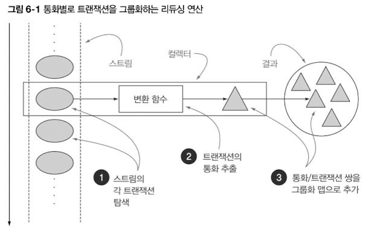

collect 역시 다양한 요소 누적 방식을 인수로 받아서 스트림을 최종 결과로 도출하는 리듀싱 연산 수행

컬렉션 vs 컬렉터 vs collect

- 명령형 vs 함수형

    ```java
    // 명령형
    Map<Currency, List<Transaction>> transactionsByCurrencies = new HashMap<>();
    for (Transaction transaction : transactions) {
      Currency currency = transaction.getCurrency();
      List<Transaction> transactionsForCurrency = transactionsByCurrencies.get(currency);
      if (transactionsForCurrency == null) {
        transactionsForCurrency = new ArrayList<>();
        transactionsByCurrencies.put(currency, transactionsForCurrency);
      }
      transactionsForCurrency.add(transaction);
    }
    
    // 함수형
    Map<Currency, List<Transaction>> transactionsByCurrencies = transactions.stream()
        .collect(groupingBy(Transaction::getCurrency));
    ```


# 6.1 컬렉터란 무엇인가?

- 스트림에 collect를 호출하면 스트림의 요소에 리듀싱 연산을 수행
    - 인터페이스 메서드에 따라 어떤 리듀싱 연산을 하는지 결정
- 함수를 요소로 변환할 때 컬렉터 적용



Collectors에서 제공하는 메서드 기능

1. 스트림 요소를 하나의 값으로 리듀스하고 요약
2. 요소 그룹화
3. 요소 분할

# 6.2 리듀싱과 요약

컬렉터로 스트림의 항목을 컬렉션으로 재구성

```java
long howManyDishes = menu.stream().collect(counting());
long howManyDishes = menu.stream().count();
```

## 6.2.1 스트림값에서 최댓값과 최솟값 검색

```java
// 스트림값에서 최댓값과 최솟값 검색
Comparator<Dish> dishCaloriesComparator = Comparator
																							.comparingInt(Dish::getCalories);
Optional<Dish> mostCalorieDish = menu.stream()
																	.collect(maxBy(dishCaloreisComparator));
```

## 6.2.2 요약 연산

- averagingInt, averagingLong, averagingDouble
- 팩토리 메서드 summarizingInt
- summarizingLong, summarizingDouble, LongSummaryStatistics, DoubleSummaryStatistics

```java
double totalCalories = menu.stream().collect(summingInt(Dish::getCalories));
double avgCaloreis = menu.stream().collect(averagingInt(Dish::getCalories));

IntSummaryStatistics menuStatics = 
										menu.stream().collect(summarizingInt(Dish::getCalories));
```

## 6.2.3 문자열 연결

- 스트림의 각 객체에 toString 메서드를 호출해서 추출한 모든 문자열을 하나의 문자열로 연결해서 반환

```java
// 모든 요리명 반환
String shortMenu1 = menu.stream().map(Dish::getName).collect(joining());
String shortMenu2 = menu.stream().map(Dish::getName).collect(joining(", "));
```

## 6.2.4 범용 리듀싱 요약 연산

- reducing을 쓸 수도 있긴 있지만 가독성도 중요함

```java
int totalCalories = menu.stream()
			.collect(reducing(0, Dish::getCalories, (Integer i, Integer j) -> i + j));

// 가장 칼로리가 높은 음식
Optional<Dish> mostCaloriesDish = 
				menu.stream().collect(reducing(
											(d1,d2)->d1.getCaloreis() > d2.getCalories() ? d1 : d2));
```

|  | 인자 1개 | 인자 3개 |
| --- | --- | --- |
| param1 | 없어서 Optional 반환 | 초기값 |
| param2 | 자기자신 (항등 함수) | 변환함수 |
| param3 | BinaryOperator | BinaryOperator |


>💡 **collect와 reduce**
>- collect : 도출하려는 결과를 누적하는 컨테이너를 바꾸도록 설계된 메서드
>- reduce : 두 값을 하나로 도출하는 불변형 연산


- 컬렉션 프레임워크를 통해 같은 연산도 다양하게 수행 가능

```java
int totalCalories = menu.stream().collect(reducing(0, //초기값
																		Dish::getCalories, //합계함수
																		Integer::sum); //변환함수
```

- Quiz 6-1) 리듀싱으로 문자열 연결하기

    ```java
    String shortMenu = menu.stream().map(Dish::getName).collect(joining());
    
    String shortMenu = menu.stream().map(Dish::getName)
    											.collect(reducing((s1,s2)->s1+s2)).get();
    
    String shortMenu = menu.stream()
    											.collect(reducing("", Dish::getName, (s1,s2)->s1+s2));
    ```


# 6.3 그룹화

- 분류함수
- Collectors.groupingBy


## 6.3.1 그룹화된 요소 조작

```java
Map<Dish.Type, List<String>> caloricDishesByType = 
			menu.stream().filter(dish -> dish.getCalories() > 500)
									.collect(groupingBy(Dish::getType));

// 요리가 없어도 맵에 키 유지
Map<Dish.Type, List<String>> caloricDishesByType = 
			menu.stream()
					.collect(groupingBy(Dish::getType,
            filtering(dish -> dish.getCalories() > 500, toList())));
```

## 6.3.2 다수준 그룹화

- Collectors.groupingBy

```java
Map<Dish.Type, Map<CaloricLevel, List<Dish>>> dishesByTypeCaloricLevel = 
		menu.stream().collect(
        groupingBy(Dish::getType,
            groupingBy((Dish dish) -> {
              if (dish.getCalories() <= 400) {
                return CaloricLevel.DIET;
              }
              else if (dish.getCalories() <= 700) {
                return CaloricLevel.NORMAL;
              }
              else {
                return CaloricLevel.FAT;
              }
            })
        )
    );
```

## 6.3.3 서브그룹으로 데이터 수집

```java
// 메뉴에서 요리의 수를 종류별로 계산
Map<Dish.Type, Long> typesCount = 
											menu.stream()
													.collect(groupingBy(Dish::getType, counting()));
```

```java
// 종류 구분하는 컬렉터
Map<Dish.Type, Optional<Dish>> mostCaloricByType = 
					menu.stream()
							.collect(groupingBy(Dish::getType,
											            reducing((Dish d1, Dish d2) -> d1.getCalories() > d2.getCalories() ? d1 : d2)));

Map<Dish.Type, Optional<Dish>> mostCaloricByType = 
					menu.stream()
							.collect(groupingBy(Dish::getType,
											           **maxBy**(comparingInt(Dish::getCalories)));
```

컬렉터 중첩하여 optional 추출

```java
Map<Dish.Type, Dish> mostCaloreisByType = 
		menu.stream().collect(
        groupingBy(Dish::getType, //분류함수
            collectingAndThen( //감싸인 컬렉터
                reducing((d1, d2) -> d1.getCalories() > d2.getCalories() ? d1 : d2),
                Optional::get))); //변환함수
```

groupingBy와 함께 사용하는 다른 컬렉터 예제

```java
Map<Dish.Type, Integer> totalCaloriesByType = 
		menu.stream().collect(groupingBy(Dish::getType,
        summingInt(Dish::getCalories)));

Map<Dish.Type, Set<CaloricLevel>> caloricLevelsByType = 
		menu.stream().collect(
        groupingBy(Dish::getType, mapping(
            dish -> {
              if (dish.getCalories() <= 400) {
                return CaloricLevel.DIET;
              }
              else if (dish.getCalories() <= 700) {
                return CaloricLevel.NORMAL;
              }
              else {
                return CaloricLevel.FAT;
              }
            },
            toSet() 
						//toCollection도 가능
						//toCollection(HashSet::new)
        ))
    );
```

# 6.4 분할

- 프레디케이트를 분류 함수로 사용하는 특수한 그룹화 기능
- 참, 거짓 두 가지 요소의 스트림 리스트를 모두 유지함

```java
Map<Boolean, Map<Dish.Type, List<Dish>>> vegetarianDishesByType = 
		menu.stream()
				.collect(partitioningBy(Dish::isVegetarian, //분할함수
																groupingBy(Dish::getType))); //두번째 컬렉터
```

```java
Map<Boolean, Dish> mostCaloricPartitionedByVegetarian = 
		menu.stream().collect(
        partitioningBy(Dish::isVegetarian,
            collectingAndThen(
                maxBy(comparingInt(Dish::getCalories)),
                Optional::get)));
```

- 6.4.2 숫자를 소수와 비소수로 분할하기

    ```java
    public boolean isPrime(int candidate) {
      return IntStream.rangeClosed(2, candidate-1)
          .limit((long) Math.floor(Math.sqrt(candidate)) - 1)
          .noneMatch(i -> candidate % i == 0);
    }
    ```


# 6.5 Collector 인터페이스

1. supplier : 새로운 결과 컨테이너 만들기
2. accumulator : 결과 컨테이너에 요소 추가하기
3. finisher : 최종 변환값을 결과 컨테이너로 적용하기
4. combiner : 두 결과 컨테이너 병합
5. Characteristics : 컬렉터의 연산을 정의하는 불변집합 반환
    1. UNORDERED : 리듀싱 결과는 스트림 요소의 방문 순서나 누적 순서에 영향을 받지 않음
    2. CONCURRENT : 다중 스레드에서 accumulator 동시 호출
    3. IDENTITY_FINISH : 리듀싱 과정의 최종 결과로 누적자 객체를 바로 사용
- ToListCollector 구현

    ```java
    public class ToListCollector<T> implements Collector<T, List<T>, List<T>> {
    
      @Override
      public Supplier<List<T>> supplier() {
        return () -> new ArrayList<T>();
      }
    
      @Override
      public BiConsumer<List<T>, T> accumulator() {
        return (list, item) -> list.add(item);
      }
    
      @Override
      public Function<List<T>, List<T>> finisher() {
        return i -> i;
      }
    
      @Override
      public BinaryOperator<List<T>> combiner() {
        return (list1, list2) -> {
          list1.addAll(list2);
          return list1;
        };
      }
    
      @Override
      public Set<Characteristics> characteristics() {
        return Collections.unmodifiableSet(EnumSet.of(IDENTITY_FINISH, CONCURRENT));
      }
    
    }
    ```


# 6.6 커스텀 컬렉터를 구현해서 성능 개선하기

## 6.6.1 소수로만 나누기

```java
public class PrimeNumbersCollector implements Collector<Integer, 
												Map<Boolean, List<Integer>>, 
												Map<Boolean, List<Integer>> {

  @Override
  public Supplier<Map<Boolean, List<Integer>>> supplier() {
    return () -> new HashMap<Boolean, List<Integer>>(){{
				put(true, new ArrayList<Integer>());
				put(false, new ArrayList<Integer>());
		}};
  }

  @Override
  public BiConsumer<Map<Boolean, List<Integer>>, Integer> accumulator() {
    return (Map<Boolean, List<Integer>> acc, Integer candidate) -> {
				acc.get(isPrime(acc.get(true),candidate)).add(candiadate);	
		};
  }

  @Override
  public BinaryOperator<List<T>> combiner() {
    return (list1, list2) -> {
      list1.addAll(list2);
      return list1;
    };
  }

  @Override
  public Set<Characteristics> characteristics() {
    return Collections.unmodifiableSet(EnumSet.of(IDENTITY_FINISH, CONCURRENT));
  }

}
```

## 6.6.2 컬렉터 성능 비교

```java
package modernjavainaction.chap06;

import java.util.function.Consumer;

public class CollectorHarness {

  public static void main(String[] args) {
    //System.out.println("Partitioning done in: " + execute(PartitionPrimeNumbers::partitionPrimes) + " msecs");
    System.out.println("Partitioning done in: " + execute(PartitionPrimeNumbers::partitionPrimesWithCustomCollector) + " msecs");
  }

  private static long execute(Consumer<Integer> primePartitioner) {
    long fastest = Long.MAX_VALUE;
    for (int i = 0; i < 10; i++) {
      long start = System.nanoTime();
      primePartitioner.accept(1_000_000);
      long duration = (System.nanoTime() - start) / 1_000_000;
      if (duration < fastest) {
        fastest = duration;
      }
      System.out.println("done in " + duration);
    }
    return fastest;
  }

}
```

코드 결과는 간결하지만 가독성과 재사용성이 떨어짐

# 6.7 마치며

- collect는 스트림의 요소를 요약 결과로 누적하는 최종연산
- 리듀스, 요약, 최솟값, 최댓값, 평균값 계산 가능
- groupingBy로 스트림 요소를 그룹화하거나 partitioningBy로 분할 가능
- 커스텀 컬렉터 개발 가능