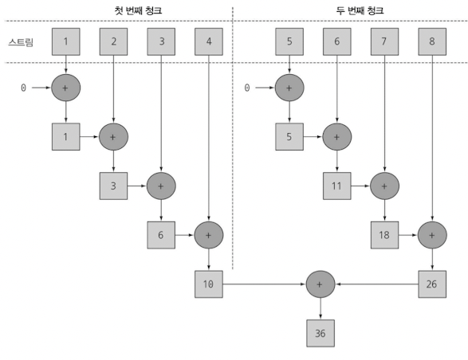

- 자바7 이전에는 데이터 컬렉션을 병렬로 처리하기 어려움
    - 데이터 서브파트로 분할 → 각각 스레드로 할당 → 적절한 동기화 추가 → 결과 합치기
- 스트림으로 데이터 컬렉션 관련 동작을 쉽게 병렬로 실행 가능

# 7.1 병렬 스트림

- 각각의 스레드에서 처리할 수 있도록 스트림 요소를 여러 청크로 분할한 스트림
- 내부적으로 ForkJoinPool 사용
- parallelStream
- 1부터 n까지 합 (반복형)

    ```java
    public static long iterativeSum(long n) {
    	long result = 0;
    	for (long i = 0; i <= n; i++) {
    	  result += i;
    	}
    	return result;
    }
    ```

- 1부터 n까지 합 (순차 리듀싱)

    ```java
    public static long sequentialSum(long n) {
    	return Stream.iterate(1L, i -> i + 1)
    							.limit(n)
    							.reduce(Long::sum)
    							.get();
    }
    ```

- 1부터 n까지 합 (병렬 리듀싱)

    ```java
    public static long sequentialSum(long n) {
    	return Stream.iterate(1L, i -> i + 1)
    							.limit(n)
    							.parallel()
    							.reduce(Long::sum)
    							.get();
    }
    ```




- parallel을 호출하면 병렬 여부 불리언 플래그가 설정
- parallel() ↔ sequential() 왔다갔다 할 수 있음 → 마지막에 실행된게 유효함


>💡 **병렬 스트림에서 사용하는 스레드 풀 설정**
>- 병렬 과정이 어떻게 실행되는지
>- 내부적으로 ForkJoinPool을 사용함 (Runtime.getRuntime(), availableProcessors())
>- 하나의 병렬 스트림에 사용할 수 있는 특정 값을 지정할 수 없다
>- 대체로 기본값을 그대로 사용할 것을 권장


## 7.1.2 스트림 성능 측정

- JMH(자바 마이크로벤치마크 하니스) 라이브러리로 벤치마크 구현

- 순차 스트림 < 반복문 << 병렬 스트림
    - 반복 결과로 박싱된 객체가 만들어지므로 숫자를 더하려면 언박싱을 해야 한다
    - 반복 작업은 병렬로 수행할 수 있는 독립 단위로 나누기가 어렵다
- iterate 연산은 본질적으로 순차적이기 때문에 청크로 분할하기 어렵다
- 즉, 리듀싱과 iterate는 병렬로 실행이 불가하고 스레드를 할당하는 오버헤드만 증가하게 되었다.

⇒ 잘못알고 병렬 처리하면 오히려 성능이 저하될 수 있다

### 더 특화된 메서드 사용

- LongStream.rangeClosed
    - 박싱과 언박싱 오버헤드가 사라짐
    - 쉽게 청크로 분할할 수 있는 숫자 범위를 생산
- 상황에 따라서는 병렬화보다 적절한 자료구조를 선택하는 것이 더 중요함
- **멀티코어 간의 데이터 이동은 우리 생각보다 비싸기 때문에 병렬화를 올바르게 사용해야 한다**

## 7.1.3 병렬 스트림의 올바른 사용법

- 공유된 누적자를 바꾸는 코드 ← 병렬로 실행하면 대참사🎇

    ```java
    public static long sideEffectSum(long n) {
      Accumulator accumulator = new Accumulator();
      LongStream.rangeClosed(1, n)
    						.forEach(accumulator::add);
      return accumulator.total;
    }
    
    public static class Accumulator {
      private long total = 0;
      public void add(long value) {
        total += value; // 아토믹 연산이 아님
      }
    }
    ```

- 데이터 레이스 문제 발생
    - 다수의 스레드에서 동시에 데이터에 접근
- 공유된 가변 상태는 피해야한다


>💡 **아토믹 연산 Atomic Operation**
>- 중단되지 않는 연산
>- int count = 0 vs count++
>[https://mygumi.tistory.com/111](https://mygumi.tistory.com/111)


### 병렬화 스트림을 쓸 때 고려 사항

- 확신이 서지 않으면 직접 측정하라 (w/ 벤치마크)
- 박싱에 주의하라
    - IntStream, LongStream, DoubleStream (기본형 특화 스트림)
- 순차 스트림보다 병렬 스트림에서 성능이 떨어지는 연산이 있다
    - findFirst 등 순서에 의존하는 연산
- 전체 파이프라인 연산 비용을 고려하라 (하나의 요소를 처리하는데 드는 비용이 높아질 수록, 병렬 스트림으로 성능을 개선할 수 있다)
- 소량의 데이터에서 병렬 스트림은 도움이 되지 않는다
- 자료구조를 확인하라 (ArrayList, LinkedList)
- 스트림의 특성과 파이프라인 중간 연산이 스트림의 특성을 어떻게 바꾸냐에 따라 분해 과정 성능이 달라질 수 있다
- 최종 연산 병합 과정의 비용을 고려하라
    - 병합 과정이 비싸면 합칠 때 성능 이익이 상쇄될 수 있다
- 내부 구조 인프라구조도 살펴봐야 한다


# 7.2 포크/조인 프레임워크

- 병렬화할 수 있는 작업을 재귀적으로 작은 작업으로 분할한 다음에 서브태스크 각각의 결과를 합쳐서 전체 결과를 만들도록 설계됨
- 서브 타스크를 스레드풀의 작업자 스레드에 분산 할당

## 7.2.1 Recursive Task 활용

- RecursiveTask<R>의 서브클래스 comput


```java
if(태스크가 충분히 작거나 더 이상 분할할 수 없으면){
	순차적으로 태스크 계산
}else{
	태스크를 두 서브태스크로 분할
	태스크가 다시 서브태스크로 분할되도록 이 매서드를 재귀적으로 호출함
	모든 서브태스크의 연산이 완료될 때까지 기다림
	각 서브태스크의 결과를 합침
}
```

⇒ divide-and-conquer

```java
public class ForkJoinSumCalculator 
	// 상속받아 포크/조인 프레임워크에서 사용할 태스크 생성
	extends java.util.concurrent.RecursiveTask<Long> { 

  private final long[] numbers;
  private final int start; // 서브태스크에서 처리할 배열의 초기 위치와 최종 위치
  private final int end;
	public static final long THRESHOLD = 10_000; // 이 이하의 서브태스크는 분할할 수 없다

	// 메인 테스크 생성하는 공개 생성자
  public ForkJoinSumCalculator(long[] numbers) { 
    this(numbers, 0, numbers.length);
  }

	// 메인 테스크의 서브 테스크를 재귀적으로 만들때 사용할 비공개 생성자
  private ForkJoinSumCalculator(long[] numbers, int start, int end) {
    this.numbers = numbers;
    this.start = start;
    this.end = end;
  }

  @Override
  protected Long compute() { // Recursive Task의 추상 메서드 오버라이드
    int length = end - start;
    if (length <= THRESHOLD) {
      return computeSequentially(); //기준값과 같거나 작으면 순차적으로 결과 계산
    }

		// 첫번째 절반
    ForkJoinSumCalculator leftTask = 
			new ForkJoinSumCalculator(numbers, start, start + length / 2);

    leftTask.fork(); // ForkJoinPool의 다른 스레드로 새로 생성한 태스크를 비동기로 실행함

		// 나머지 절반
    ForkJoinSumCalculator rightTask = 
			new ForkJoinSumCalculator(numbers, start + length / 2, end);

    Long rightResult = rightTask.compute(); // 두번째 서브태스크를 동기 실행
    Long leftResult = leftTask.join(); // 첫번째 서브태스크의 결과를 읽거나 없으면 기다림
    return leftResult + rightResult; // 조합한 값이 이 태스크의 결과
  }

  private long computeSequentially() {
    long sum = 0;
    for (int i = start; i < end; i++) {
      sum += numbers[i];
    }
    return sum;
  }

}
```

```java
public static long forkJoinSum(long n) {
  long[] numbers = LongStream.rangeClosed(1, n).toArray();
  ForkJoinTask<Long> task = new ForkJoinSumCalculator(numbers);
  return FORK_JOIN_POOL.invoke(task);
}
```

- ForkJoinPool을 한 번만 인스턴스화해서 정적 필드에 싱글턴으로 저장


- 각 서브 테스크는 순차적으로 처리되며
- 포킹 프로세스로 만들어진 이진트리의 태스크를 루트에서 역순으로 방문

## 7.2.2 포크/조인 프레임워크를 제대로 사용하는 방법

- 두 서브태스크가 모두 시작된 다음에 join 호출
- recursiveTask 내에서는 ForkJoinPool의 invoke 메서드를 사용하지 말아야함
- 서브테스크에 fork메서드를 호출해서 ForkJoinPool의 일정을 조절할 수 있다
- 스택 트레이스로 디버깅 불가

## 7.2.3 작업 훔치기


- 적절한 크기로 분할된 많은 태스크를 포킹하는 것이 바람직
- cpu 코어만큼 분할한다고 능사는 아니다

⇒ 작업 훔치기를 통해 스레드를 거의 공정하게 분할함

- 유휴 상태가 있으면 작업을 훔쳐옴

# 7.3 Spliterator 인터페이스

스트림을 자동으로 분할

소스의 요소 탐색 기능을 제공하지만 병렬 작업에 특화되어있음


- T : 탐색하는 요소의 형식
- tryAdvance : Spliterator의 요소를 하나씩 순차적으로 소비하면서 탐색해야할 요소가 남아있으면 return True (= Iterator)
- trySplit : 일부 요소를 분할해서 두 번째 Spliterator를 생성
- estimateSize : 탐색해야 할 요소 수 정보를 제공

## 7.3.1 분할 과정


## 7.3.2 커스텀 Spliterator 구현하기

- 단어 수를 세는 메서드 (반복형)

    ```java
    public static int countWordsIteratively(String s) {
      int counter = 0;
      boolean lastSpace = true;
      for (char c : s.toCharArray()) {
        if (Character.isWhitespace(c)) {
          lastSpace = true;
        }
        else {
          if (lastSpace) counter++;
          lastSpace = false;
        }
      }
      return counter;
    }
    ```

- 단어 수를 세는 메서드 (함수형)

  변수 상태를 캡슐화 하는 새로운 클래스

    ```java
    private static class WordCounter {
    
      private final int counter;
      private final boolean lastSpace;
    
      public WordCounter(int counter, boolean lastSpace) {
        this.counter = counter;
        this.lastSpace = lastSpace;
      }
    
      public WordCounter accumulate(Character c) {
        if (Character.isWhitespace(c)) {
          return lastSpace ? this : new WordCounter(counter, true);
        }
        else {
          return lastSpace ? new WordCounter(counter + 1, false) : this;
        }
      }
    
    public WordCounter combine(WordCounter wordCounter) {
      return new WordCounter(counter + wordCounter.counter, wordCounter.lastSpace);
    }
    ```

    ```java
    private static int countWords(Stream<Character> stream) {
      WordCounter wordCounter = stream.reduce(new WordCounter(0, true), 
    					ordCounter::accumulate, 
    					WordCounter::combine);
      return wordCounter.getCounter();
    }
    
    System.out.println("Found" + countWords(stream.parallel()) + " words"); //망함
    ```

- 단어 수를 세는 메서드 (Spliterator - 단어가 끝나는 위치에서만 분할)

    ```java
    private static class WordCounterSpliterator implements Spliterator<Character> {
    
      private final String string;
      private int currentChar = 0;
    
      private WordCounterSpliterator(String string) {
        this.string = string;
      }
    
      @Override
      public boolean tryAdvance(Consumer<? super Character> action) {
        action.accept(string.charAt(currentChar++)); //현재 문자를 소비
        return currentChar < string.length(); //소비할 문자가 남으면 true
      }
    
      @Override
      public Spliterator<Character> trySplit() {
        int currentSize = string.length() - currentChar;
        if (currentSize < 10) {
          return null;
        }
        for (int splitPos = currentSize / 2 + currentChar; splitPos < string.length(); splitPos++) {
          if (Character.isWhitespace(string.charAt(splitPos))) {
            Spliterator<Character> spliterator = new WordCounterSpliterator(string.substring(currentChar, splitPos));
            currentChar = splitPos; //WordCountSpliterator의 시작 위치를 분할 위치로 설정
            return spliterator;
          }
        }
        return null;
      }
    
      @Override
      public long estimateSize() {
        return string.length() - currentChar;
      }
    
      @Override
      public int characteristics() {
        return ORDERED + SIZED + SUBSIZED + NONNULL + IMMUTABLE;
      }
    
    }
    ```

    ```java
    Spliterator<Character> spliterator = new WordCounterSpliterator(s);
    Stream<Character> stream = StreamSupport.stream(spliterator, true);
    ```


# 7.4 마치며

- 내부 반복을 이용하면 스트림을 병렬로 처리 가능
- 병렬 처리가 항상 더 좋은건 아니고 성능 측정을 해봐야 한다
    - 특히 데이터 합칠 때 오래 걸리면 안됨
    - 자료구조가 더 중요할수도 있다
- 포크/조인 프레임워크에서 병렬화할 수 있는 테스크를 작은 테스크로 분할하고 분할된 테스크를 각각 스레드로 실행하며 서브 테스크로 합쳐서 최종 결과 생산
- Spliterator는 탐색하려는 데이터를 포함하는 스트림을 어떻게 병렬화 할 것인지 정의함