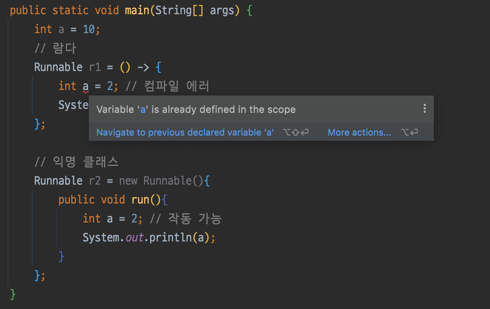

전략, 템플릿 메서드, 옵저버, 의무 체인, 팩토리 등의 객체지향 디자인 패턴

# 9.1 가동성과 유연성을 개선하는 리팩터링

람다 표현식은 익명 클래스보다 코드를 좀더 간결하게 만듦

## 9.1.1 코드 가독성 개선

가독성은 추상적 개념이긴 하지만, 다른 사람이 쉽게 읽을 수 있고 유지보수 할 수 있음을 뜻함

## 9.1.2 익명 클래스를 람다 표현식으로 리팩터링하기

- 모든 익명 클래스를 람다 표현식으로 변환은 불가
1. 익명 클래스에서 사용한 this와 super는 람다 표현식에서 다른 의미를 가짐
    - 익명 클래스의 this : 익명 클래스 자기자신
    - 람다의 this : 람다를 감싸는 클래스
2. 익명 클래스는 감싸고 있는 클래스의 변수를 가릴 수 있음 (섀도 변수 shadow variable)

   람다는 가릴 수 없음

    ```java
    int a = 10;
    
    // 람다
    Runnable r1 = () -> {
        int a = 2; // 컴파일 에러
        System.out.println(a);
    };
    
    // 익명 클래스
    Runnable r2 = new Runnable(){
        public void run(){
            int a = 2; // 작동 가능
            System.out.println(a);
        }
    };
    ```

    - IDE출력

      밑에 익명클래스로 작성된건 2 나옴

      

3. 콘텍스트 오버로딩에 따른 모호함 초래
    - 익명 클래스 : 인스턴스 형식이 정해짐
    - 람다 : 콘텍스트에 따라 달라짐
    - **문제상황 예시**

      Runnable

        ```java
        public interface Runnable {
            public abstract void run();
        }
        ```

      Runnable과 같은 시그니처(형식)의 함수형 인터페이스 선언

        ```java
        interface Task {
            public void execute();
        }
        ```

        ```java
        public static void doSomething(Runnable r){ 
        	r.run(); 
        }
        public static void doSomething(Task a){ 
        	a.execute(); 
        }
        ```

      Task를 구현하는 익명 클래스 (오버로딩ing)

        ```java
        doSomething(new Task() {
            public void execute() {
                System.out.println("Danger danger!!");
            }
        });
        ```

      람다로 바꾸면 메서드 호출 시 Runnable과 Task모두 대상 형식이 될 수 있어 안됨

        ```java
        doSomething(() -> System.out.println("Danger danger!!"));
        ```

      명시적 형변환으로 해결

        ```java
        doSomething((Task)() -> System.out.println("Danger danger!!"));
        ```

    - **IDE쓰면 IDE가 해결해줌**

      

        ```java
        package modernjavainaction.chap09;
        
        public class RunnableOverloading {
            public static void main(String[] args) {
                // 1.익명함수 오버로딩
                doSomething(new Task() {
                    public void execute() {
                        System.out.println("Danger danger!!");
                    }
                });
                // 2. 람다 오버로딩
                doSomething(() -> System.out.println("Danger danger!!"));
                // 3. 명시적 형변환 오버로딩
                doSomething((Task)() -> System.out.println("Danger danger!!"));
            }
        
            interface Task {
                public void execute();
            }
        
            public static void doSomething(Runnable r){
                r.run();
            }
            public static void doSomething(Task a){
                a.execute();
            }
        }
        ```


## 9.1.3 람다 표현식을 메서드 참조로 리팩터링하기

칼로리 수준으로 요리 그룹화 (람다 표현식)

```java
Map<CaloricLevel, List<Dish>> dishesByCaloricLevel =
  menu.stream()
      .collect(
          groupingBy(dish -> {
            if (dish.getCalories() <= 400) return CaloricLevel.DIET;
            else if (dish.getCalories() <= 700) return CaloricLevel.NORMAL;
            else return CaloricLevel.FAT;
          }));
```

1. 람다로 추출 후 groupingBy에 인수로 전달 (메소드 참조)

    ```java
    Map<CaloricLevel, List<Dish>> dishesByCaloricLevel =
        menu.stream().collect(groupingBy(Dish::getCaloricLevel));
    ```

2. Dish에 getCaloricLevel추가 (참조할 메소드 작성)

    ```java
    public class Dish{
        ...
        public CaloricLevel getCaloricLevel() {
            if (this.getCalories() <= 400) return CaloricLevel.DIET;
            else if (this.getCalories() <= 700) return CaloricLevel.NORMAL;
            else return CaloricLevel.FAT;
        }
    }
    ```

- 정적 헬퍼 메서드 사용
    - comparing, maxBy...

    ```java
    // 헬퍼 메서드 쓰기 전
    inventory.sort(
      (Apple a1, Apple a2) -> a1.getWeight().compareTo(a2.getWeight()));
    
    // comparing 사용
    inventory.sort(comparing(Apple::getWeight));
    ```


sum, maximum 등 자주 쓰는 리듀싱 연산은 메서드 참조와 함께 사용하는 내장 헬퍼 제공

- 저수준 리듀싱 연산 조합

    ```java
    //람다 + 저수준 리듀싱 사용
    int totalCalories =
        menu.stream().map(Dish::getCalories)
                     .reduce(0, (c1, c2) -> c1 + c2);
    //내장 컬렉터 사용
    int totalCalories = menu.stream().collect(summingInt(Dish::getCalories));
    ```


## 9.1.4 명령형 데이터 처리를 스트림으로 리팩터링하기

```java
List<String> dishNames = new ArrayList<>();
for(Dish dish: menu) {
    if(dish.getCalories() > 300){
        dishNames.add(dish.getName());
    }

//스트림 API로 변환하면 더 직접적으로 기술 & 쉽게 병렬화 가능
menu.parallelStream()
    .filter(d -> d.getCalories() > 300)
    .map(Dish::getName)
    .collect(toList());
```

반복자는 스트림으로 바꾸는게 이론적으론 나음 (게으름, 병렬성, 멀티코어 아키텍처, 쇼트서킷)

## 9.1.5 코드 유연성 개선

- 동작 파라미터화 (ex. 프로디케이트로 다양한 필터링 기능 구현)
- 함수형 인터페이스를 코드에 구현

### 조건부 연기 실행

```java
// 전
if (logger.isLoggable(Log.FINER)) {
    logger.finer("Problem: " + generateDiagnostic());
}
```

- logger의 상태가 isLoggable로 노출
- 메시지 로깅때마다 logger객체 확인이 번거로움

```java
// 후
logger.log(Level.FINER, "Problem: " + generateDiagnostic());
```

- 인수로 전달된 메시지 수준에서 logger가 활성화되어있지 않아도 항상 로깅 메시지 평가

특정 조건에서만 메시지가 생성되도록 메시지 생성 과정 연기

```java
// log 메서드 시그니처
public void log(Level level, Supplier<String> msgSupplier)

// 호출
logger.log(Level.FINER, () -> "Problem: " + generateDiagnostic());

// log 메서드 내부 구현 코드
public void log(Level level, Supplier<String> msgSupplier) {
    if(logger.isLoggable(level)){
        log(level, msgSupplier.get()); // 람다 실행
    }
}
```

- 객체 상태를 자주 확인하거나 객체 일부 메서드를 호출하면 객체 상태를 확인한 다음에 메서드를 호출함
- 캡슐화 강화 (객체 상태가 클라이언트 코드로 노출되지 않음)

### 실행 어라운드

매번 같은 준비, 종료 과정을 반복적으로 수행하면 람다로 변환 가능

- 함수형 인터페이스 `BufferedReaderProcessor`

```java
String oneLine =
    processFile((BufferedReader b) -> b.readLine());
String twoLines =
    processFile((BufferedReader b) -> b.readLine() + b.readLine());

public static String processFile(BufferedReaderProcessor p) throws IOException {
    try(BufferedReader br = new BufferedReader(new FileReader("ModernJavaInAction/chap9/data.txt"))) {
        return p.process(br); // 인수로 전달된 BufferedReaderProcessor 실행
    }
} // IOException을 던질 수 있는 람다의 함수형 인터페이스

public interface BufferedReaderProcessor {
    String process(BufferedReader b) throws IOException;
}
```

# 9.2 람다로 객체지향 디자인 패턴 리팩터링하기

디자인 패턴 : 공통적인 소프트웨어 문제를 설계할 때 재사용할 수 있는 검증된 청사진

ex. 싱글톤 패턴을 이용해서 클래스 인스턴스화를 하나의 객체로 제한 가능

- 전략
- 템플릿 메서드
- 옵저버
- 의무 체인
- 팩토리

## 9.2.1 전략

전략 패턴 : 한 유형의 알고리즘을 보유한 상태에서 런타임에 적절한 알고리즘을 선택하는 기법

- 다양한 기준을 갖는 입력값을 검증
- 다양한 파싱 방법을 사용
- 입력 형식을 설정 등등...


- Ex. 오직 소문자 또는 숫자로 이루어져야 하는 등 텍스트 입력 포맷팅
    1. 인터페이스 구현

        ```java
        interface ValidationStrategy {
          boolean execute(String s);
        }
        ```

    2. 인터페이스 구현 클래스 정의

        ```java
        static private class IsAllLowerCase implements ValidationStrategy {
          @Override
          public boolean execute(String s) {
            return s.matches("[a-z]+");
          }
        }
        
        static private class IsNumeric implements ValidationStrategy {
          @Override
          public boolean execute(String s) {
            return s.matches("\\d+");
          }
        }
        ```

    3. 구현한 클래스를 활용한 다양한 검증 전략

        ```java
        static private class Validator {
        	// interface
          private final ValidationStrategy strategy;
        	// constructor
          public Validator(ValidationStrategy v) {
            strategy = v;
          }
        
        	// method
          public boolean validate(String s) {
            return strategy.execute(s);
          }
        }
        ```

        ```java
        public static void main(String[] args) {
          // old school
          Validator v1 = new Validator(new IsNumeric());
          System.out.println(v1.validate("aaaa"));
          Validator v2 = new Validator(new IsAllLowerCase());
          System.out.println(v2.validate("bbbb"));
        
          // with lambdas
          Validator v3 = new Validator((String s) -> s.matches("\\d+"));
          System.out.println(v3.validate("aaaa"));
          Validator v4 = new Validator((String s) -> s.matches("[a-z]+"));
          System.out.println(v4.validate("bbbb"));
        }
        ```

- 람다 표현식을 직접 전달하면 새로운 구현 클래스를 만들 필요가 없다.
- 전략 디자인 패턴에서 발생하는 자잘한 코드 제거 가능

## 9.2.2 템플릿 메서드

- 이 알고리즘을 사용하고 싶은데 그대로는 안 되고 조금 고쳐야 하는 상황
- Ex. 온라인 뱅킹 어플리케이션
    - 각 지점은 `OnlineBanking` 클래스를 상속받아 `makeCustomerHappy` 메서드가 원하는 동작을 수행하도록 구현

    ```java
    abstract class OnlineBanking {
    
      public void processCustomer(int id) {
        Customer c = Database.getCustomerWithId(id);
        makeCustomerHappy(c); // 고객만족
      }
    
      abstract void makeCustomerHappy(Customer c);
    
      // 더미 Customer 클래스
      static private class Customer {}
    
      // 더미 Database 클래스
      static private class Database {
        static Customer getCustomerWithId(int id) {
          return new Customer();
        }
      }
    }
    ```

    - `makeCustomerHappy` 메서드 시그니처와 일치하도록 `Consumer<Customer>` 형식을 갖는 두 번째 인수를 `processCustomer`에 추가
        - 🤔consumer가 뭐였지
            - 1개의 Type T 인자를 받고 리턴 값이 없는 함수형 인터페이스
            - 참고 : [https://codechacha.com/ko/java8-consumer-example/](https://codechacha.com/ko/java8-consumer-example/)

        ```java
        public void processCustomer(int id, Consumer<Customer> makeCustomerHappy) {
          Customer c = Database.getCustomerWithId(id);
          makeCustomerHappy.accept(c);
        }
        ```

    - 직접 람다 표현식을 전달해서 다양한 동작 추가 가능

      `Customer` class 객체를 전달 받아서 뭘 하는데 return void 임

        ```java
        public static void main(String[] args) {
            new OnlineBankingLambda()
        				.processCustomer(1337, (Customer c) -> System.out.println("Hello!"));
          }
        ```

        - 전체 코드

            ```java
            public class OnlineBankingLambda {
            
              public static void main(String[] args) {
                new OnlineBankingLambda().processCustomer(1337, (Customer c) -> System.out.println("Hello!"));
              }
            
              public void processCustomer(int id, Consumer<Customer> makeCustomerHappy) {
                Customer c = Database.getCustomerWithId(id);
                makeCustomerHappy.accept(c);
              }
            
              // 더미 Customer 클래스
              static private class Customer {}
            
              // 더미 Database 클래스
              static private class Database {
            
                static Customer getCustomerWithId(int id) {
                  return new Customer();
                }
            
              }
            
            }
            ```


## 9.2.3 옵저버

- 어떤 이벤트가 발생했을 때 한 객체(주제)가 다른 객체 리스트(옵저버)에 자동으로 알림을 보내야하는 상황
- 객체의 상태 변화를 관찰하는 관찰자들, 즉 옵저버들의 목록을 객체에 등록하여 상태 변화가 있을 때마다 메서드 등을 통해 객체가 직접 목록의 각 옵저버에게 통지하도록 하는 디자인 패턴 ([https://pjh3749.tistory.com/266](https://pjh3749.tistory.com/266))
- 분산 이벤트 핸들링 시스템을 구현, 발행/구독 모델


- Ex. 특정 키워드를 포함하는 트윗이 등록되면 알림
    1. 인터페이스 생성

        ```java
        interface Observer {
          void inform(String tweet);
        }
        ```

    2. 여러 옵저버 정의

        ```java
        static private class NYTimes implements Observer {
          @Override
          public void inform(String tweet) {
            if (tweet != null && tweet.contains("money")) {
              System.out.println("Breaking news in NY!" + tweet);
            }
          }
        }
        
        static private class Guardian implements Observer {
          @Override
          public void inform(String tweet) {
            if (tweet != null && tweet.contains("queen")) {
              System.out.println("Yet another news in London... " + tweet);
            }
          }
        }
        
        static private class LeMonde implements Observer {
          @Override
          public void inform(String tweet) {
            if (tweet != null && tweet.contains("wine")) {
              System.out.println("Today cheese, wine and news! " + tweet);
            }
          }
        }
        ```

    3. 주제 구현

        ```java
        interface Subject {
          void registerObserver(Observer o);
          void notifyObservers(String tweet);
        }
        ```

    4. 주제는 `registerObserver` 메서드로 새로운 옵저버를 등록한 다음 `notifyObservers` 메서드로 트윗의 옵저버에 이를 알린다

        ```java
        static private class Feed implements Subject {
          private final List<Observer> observers = new ArrayList<>();
        
          @Override
          public void registerObserver(Observer o) {
            observers.add(o);
          }
        
          @Override
          public void notifyObservers(String tweet) {
            observers.forEach(o -> o.inform(tweet));
          }
        }
        ```

    5. 주제와 옵저버 연결

        ```java
        // oldSchool
        Feed f = new Feed();
        f.registerObserver(new NYTimes());
        f.registerObserver(new Guardian());
        f.registerObserver(new LeMonde());
        f.notifyObservers("The queen said her favourite book is Java 8 & 9 in Action!");
        ```

        ```java
        // lambda
        Feed feedLambda = new Feed();
        
        feedLambda.registerObserver((String tweet) -> {
          if (tweet != null && tweet.contains("money")) {
            System.out.println("Breaking news in NY! " + tweet);
          }
        });
        feedLambda.registerObserver((String tweet) -> {
          if (tweet != null && tweet.contains("queen")) {
            System.out.println("Yet another news in London... " + tweet);
          }
        });
        
        feedLambda.notifyObservers("Money money money, give me money!");
        ```

    - 전체 코드

        ```java
        package modernjavainaction.chap09;
        
        import java.util.ArrayList;
        import java.util.List;
        
        public class ObserverMain {
        
          public static void main(String[] args) {
            Feed f = new Feed();
            f.registerObserver(new NYTimes());
            f.registerObserver(new Guardian());
            f.registerObserver(new LeMonde());
            f.notifyObservers("The queen said her favourite book is Java 8 & 9 in Action!");
        
            Feed feedLambda = new Feed();
        
            feedLambda.registerObserver((String tweet) -> {
              if (tweet != null && tweet.contains("money")) {
                System.out.println("Breaking news in NY! " + tweet);
              }
            });
            feedLambda.registerObserver((String tweet) -> {
              if (tweet != null && tweet.contains("queen")) {
                System.out.println("Yet another news in London... " + tweet);
              }
            });
        
            feedLambda.notifyObservers("Money money money, give me money!");
          }
        
          interface Observer {
            void inform(String tweet);
          }
        
          interface Subject {
            void registerObserver(Observer o);
            void notifyObservers(String tweet);
          }
        
          static private class NYTimes implements Observer {
        
            @Override
            public void inform(String tweet) {
              if (tweet != null && tweet.contains("money")) {
                System.out.println("Breaking news in NY!" + tweet);
              }
            }
        
          }
        
          static private class Guardian implements Observer {
        
            @Override
            public void inform(String tweet) {
              if (tweet != null && tweet.contains("queen")) {
                System.out.println("Yet another news in London... " + tweet);
              }
            }
        
          }
        
          static private class LeMonde implements Observer {
        
            @Override
            public void inform(String tweet) {
              if (tweet != null && tweet.contains("wine")) {
                System.out.println("Today cheese, wine and news! " + tweet);
              }
            }
        
          }
        
          static private class Feed implements Subject {
        
            private final List<Observer> observers = new ArrayList<>();
        
            @Override
            public void registerObserver(Observer o) {
              observers.add(o);
            }
        
            @Override
            public void notifyObservers(String tweet) {
              observers.forEach(o -> o.inform(tweet));
            }
          }
        
        }
        ```


꼭 람다를 쓰라는건 아니고, 불필요한 코드를 제거할 수 있는 경우만!

## 9.2.4 의무 체인

- 작업 처리 객체의 체인을 만들 때
- 한 객체가 어떤 작업을 처리한 다음 다른 객체로 전달하고 다음 객체도 또 다른 객체로 전달하는 방식


- 템플릿 메서드 디자인 패턴이 사용됨

```java
private static abstract class ProcessingObject<T> {
  protected ProcessingObject<T> successor;

  public void setSuccessor(ProcessingObject<T> successor) {
    this.successor = successor;
  }

  public T handle(T input) {
    T r = handleWork(input);
    if (successor != null) {
      return successor.handle(r);
    }
    return r;
  }

  abstract protected T handleWork(T input);
}
```

- Ex. 텍스트를 처리하는 예제

    ```java
    private static class HeaderTextProcessing extends ProcessingObject<String> {
      @Override
      public String handleWork(String text) {
        return "From Raoul, Mario and Alan: " + text;
      }
    }
    
    private static class SpellCheckerProcessing extends ProcessingObject<String> {
      @Override
      public String handleWork(String text) {
        return text.replaceAll("labda", "lambda");
      }
    }
    ```

    ```java
    // 작업 체인 생성
    ProcessingObject<String> p1 = new HeaderTextProcessing();
    ProcessingObject<String> p2 = new SpellCheckerProcessing();
    
    p1.setSuccessor(p2);
    String result1 = p1.handle("Aren't labdas really sexy?!!");
    System.out.println(result1);
    ```

    ```java
    // 람다 사용
    UnaryOperator<String> headerProcessing = (String text) -> "From Raoul, Mario and Alan: " + text;
    UnaryOperator<String> spellCheckerProcessing = (String text) -> text.replaceAll("labda", "lambda");
    
    Function<String, String> pipeline = headerProcessing.andThen(spellCheckerProcessing);
    String result2 = pipeline.apply("Aren't labdas really sexy?!!");
    System.out.println(result2);
    ```


함수 체인(함수 조합 Chap3에 나왔었음)이랑 비슷함!

- andThen : 동작 체인

## 9.2.5 팩토리

- 인스턴스화 로직을 클라이언트에 노출하지 않고 객체를 만들 때 사용하는 패턴
- Ex. 은행에서 다양한 상품 생성
    1. 다양한 상품을 만드는 Factory 클래스 생성
        - loan, stock, bond는 모두 product의 서브형식
        - 생성자와 설정을 외부에 노출하지 않음으로써 클라이언트가 단순하게 상품을 생산

    ```java
    static private class ProductFactory {
    	public static Product createProduct(String name) {
        switch (name) {
          case "loan":
            return new Loan();
          case "stock":
            return new Stock();
          case "bond":
            return new Bond();
          default:
            throw new RuntimeException("No such product " + name);
        }
      }
    }
    
    // main에서 호
    Product p1 = ProductFactory.createProduct("loan");
    ```

    1. 람다로 구현
        - 생성자도 메소드 참조처럼 접근 가능

    ```java
    // map을 통한 다양한 상품의 인스턴스화
    final static private Map<String, Supplier<Product>> map = new HashMap<>();
    static {
      map.put("loan", Loan::new);
      map.put("stock", Stock::new);
      map.put("bond", Bond::new);
    }
    
    static private class ProductFactory {
      public static Product createProductLambda(String name) {
        Supplier<Product> p = map.get(name);
        if (p != null) {
          return p.get();
        }
        throw new RuntimeException("No such product " + name);
      }
    }
    
    // main에서 호출
    Supplier<Product> loanSupplier = Loan::new;
    Product p3 = ProductFactory.createProductLambda("loan");
    ```


# 9.3 람다 테스팅

- 단위 테스팅

## 9.3.1 보이는 람다 표현식의 동작 테스팅

- 람다는 익명이기때문에 테스트 코드 이름을 호출할 수 없음
- 필요하다면 람다를 필드에 저장해서 재사용 가능

```java
public class Point{
	public final static Comparator<Point> comparedByXAndThenY = 
		comparing(Point::getX).thenComparing(Point::getY)
}
```

```java
@Test
public void testComparingTwoPoints() throws Exception{
	Point p1 = new Point(10,15);
	Point p2 = new Point(10,20);
	int result = Point.comparedByXAndThenY.compare(p1, p2);
	assertTrue(result < 0);
}
```

## 9.3.2 람다를 사용하는 메서드의 동작에 집중하라

```java
public static List<Point> moveAllPointsRightBy(List<Point> points, int x){
	return points.stream()
								.map(p -> new Point(p.getX() + x, p.getY()))
								.collect(toList());
}
```

```java
@Test
public void testMoveAllPointsRightBy() throws Exception{
	List<Point> points = Arrays.asList(new Point(5,5), new Point(10,5));
	List<Point> expectedPoints = Arrays.asList(new Point(15,5), new Point(20,5));
	List<Point> newPoints = Point.moveAllPointsRightBy(points. 10);
	assertEquals(expectedPoints,newPoints);
}
```

## 9.3.3 복잡한 람다를 개별 메서드로 분할하기

람다 → 메서드 참조 (8.1.3)

새로운 일반 메서드 선언

## 9.3.4 고차원 함수 테스팅

- 고차원 함수 : 함수를 인수로 받거나 다른 함수를 반환하는 메서드
- 메서드가 람다를 인수로 받는다면 다른 람다로 메서드의 동작 테스트 가능

```java
@Test
public void testFilter() throws Exception{
	List<Integer> numbers = Arrays.asList(1,2,3,4);
	List<Integer> even = filter(numbers, i->i%2 == 0);
	List<Integer> smalleerThanThree = filter(numbers, i->i<3);
	assertEquals(Arrays.asList(2,4), even);
	assertEquals(Arrays.asList(1,2), smallerThanThree);
}
```

# 9.4 디버깅

람다 표현식과 스트림은 기존의 디버깅 기법을 무력화함

## 9.4.1 스택 트레이스 확인

- 스택 프레임 : 프로그램이 메서드를 호출할 때마다 프로그램에서의 호출 위치, 호출할 때의 인수값, 호출된 메서드의 지역 변수 등을 포함한 호출 정보가 저장되는 곳
- 스택 트레이스 : 프로그램이 어떻게 멈추게 되었는지 프레임별로 보여줌
- Ex. 문제가 발생한 예시

    ```java
    public static void main(String[] args) {
        List<Point> points = Arrays.asList(new Point(12, 2), null);
        points.stream().map(p -> p.getX()).forEach(System.out::println);
      }
    ```

  

- 람다 표현식은 이름이 없기에 컴파일러가 이름을 만들어냄 → 이해하기 어려울 수 있음

## 9.4.2 정보 로깅

- 스트림 파이프라인 각각 어떤 결과를 확인하려면? → peek


```java
List<Integer> result = Stream.of(2, 3, 4, 5)
        .peek(x -> System.out.println("taking from stream: " + x))
        .map(x -> x + 17)
        .peek(x -> System.out.println("after map: " + x))
        .filter(x -> x % 2 == 0)
        .peek(x -> System.out.println("after filter: " + x))
        .limit(3)
        .peek(x -> System.out.println("after limit: " + x))
        .collect(toList());
```

# 9.5 마치며

- 람다 표현식을 사용하면 가독성이 좋아짐
- 반복적으로 컬렉션을 처리한다면 스트림 API로 대체 가능
- 전략, 템플릿 메서드, 옵저버, 의무 체인, 펙토리 등 객체지향 디자인 패턴에서 발생하는 불필요한 코드 제거
- 단위테스트를 수행할 수는 있지만 표현식 자체를 테스트하는 것보다는 메서드의 동작을 테스트해야함
- peek으로 스트림 파이프라인의 중간요소를 확인할 수 있음