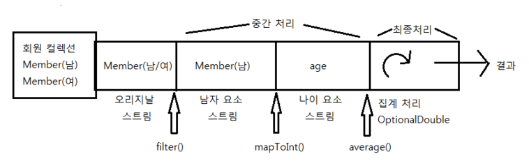
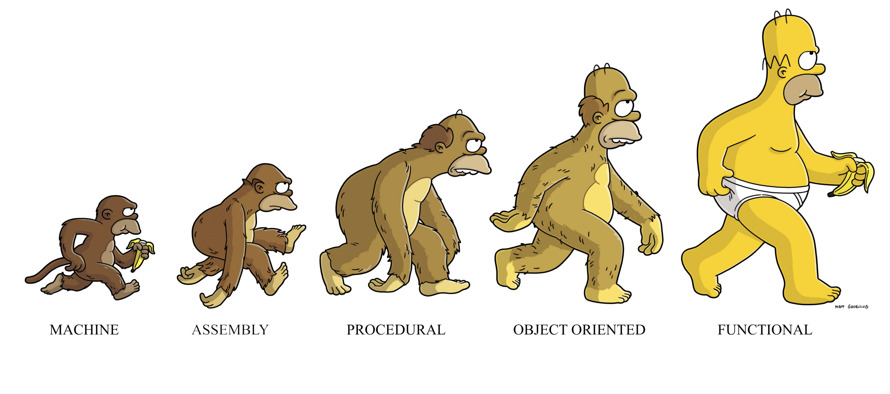
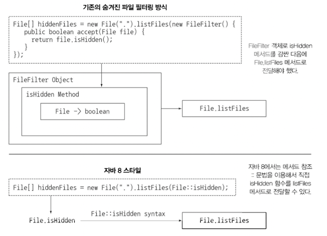
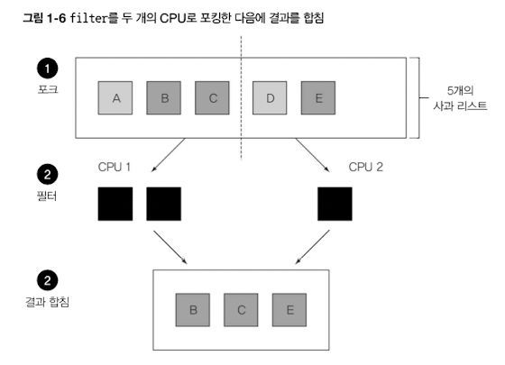
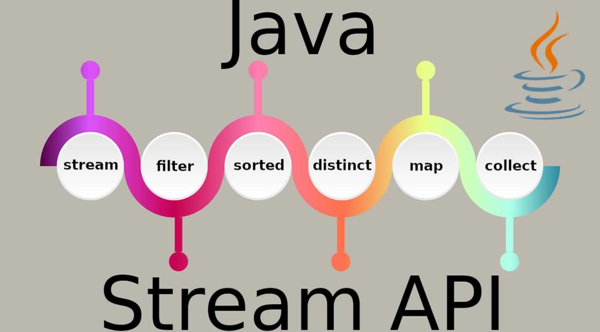

# Chapter 1 - 자바 8, 9, 10, 11 : 무슨 일이 일어나고 있는가

## 1.1 역사의 흐름은 무엇인가?

### Java8의 특징

- 간결한 코드
- 멀티코어 프로세서의 쉬운 활용

```java
//java8 이전
Collections.sort(inventory, new Comparator<Apple>() {
	public int compare(Apple a1, Apple a2){
		return a1.getWeight().compareTo(a2.getWeight());
	}
});

//java8
inventory.sort(comparing(Apple::getWeight));
```

지금까지의 자바 프로그램은 코어 중 하나만을 사용 (그 외의 코어를 사용하려면 스레드를 사용)  

자바8에서는 병렬 실행을 단순하게 할 수 있는 방법 제공 ⇒ 리액티브 프로그래밍

- 스트림API
    - SQL 쿼리문에서 처리하는 것처럼 병렬 연산을 지원
    - 최적의 저수준 실행 방법 선택
    - 에러를 자주 일으키며 멀티코어 CPU를 이용하는 것보다 비용이 훨씬 비싼 키워드 synchronized를 사용하지 않아도 됨
- 메서드에 코드를 전달하는 기법
- 인터페이스의 디폴트 메서드

>
>💡 동작의 파라미터화 : 익명 클래스를 이용해서 동작 파라미터화 구현
>

## 1.2 왜 아직도 자바는 변화하는가?

자바는 공개 후 경쟁 언어를 제치고 성공적인 생태계를 구축하는 중

### 1.2.1 프로그래밍 언어 생태계에서 자바의 위치

잘 설계된 객체지향 언어

- 스레드와 락을 이용한 소소한 동시성 지원(멀티코어 프로세서에서 병렬적으로 수행되는 스레드는 싱글코어와 달리 문제를 일으킬 수 있음)
- JVM(자바 가상 머신) 바이트 코드로 컴파일

병렬 프로세싱이 중요해지면서 자바는 이에 대응하기 힘들어짐

### 1.2.2 스트림 처리

스트림 : 한 번에 한 개씩 만들어지는 연속적인 데이터 항목들의 모임

조립 라인처럼 어떤 항목을 연속으로 제공하는 어떤 기능



기존에는 한 번에 한 항목을 처리했지만, 자바8부터는 하려는 작업을 고 수준으로 추상화해서 일련의 스트림으로 만들어 처리함

스레드를 사용하지 않으면서도 병렬성을 얻을 수 있음

### 1.2.3 동작 파라미터화로 메서드에 코드 전달하기

자바8 이전에는 메서드를 다른 메서드로 전달 불가

> ex. sort함수에 추가적인 파라미터를 전달하고 싶을 때
>

스트림API는 연산의 동작을 파라미터화 할 수 있는 코드를 전달

### 1.2.4. 병렬성과 공유 가변 데이터

병렬성을 공짜로 얻을 수 있다

스트림 메서드로 전달하는 코드는 다른 코드와 동시에 실행하더라도 안전하게 실행될 수 있어야 한다

⇒ 공유된 가변 데이터에 접근하지 않아야함

> ex. synchronized
>
> - 다중 프로세싱 코어에서 synchronized를 사용하면  생각보다 훨신 비싼 대가를 치러야 할 수 있다.
> - 다중 처리 코어에서는 코드가 순차적으로 실행되어야함
> - 병렬이라는 목적을 무력화

함수형 프로그래밍 패러다임의 핵심적인 사항




>💡 **함수형 프로그래밍 vs 명령형 프로그래밍**  
>함수형은 무엇을, 명령형은 어떻게
>
> 명령형 프로그래밍에서 상태를 바꾸는 것을 강조하는 것과는 달리, 함수형 프로그래밍은 함수의 응용을 강조한다.  
> 또한 함수형 프로그래밍은, 프로그래밍이 문이 아닌 식이나 선언으로 수행되는 선언형 프로그래밍 패러다임을 따르고 있다.  
> 함수형의 예시 : React  
>[https://velog.io/@kyusung/함수형-프로그래밍-요약](https://velog.io/@kyusung/%ED%95%A8%EC%88%98%ED%98%95-%ED%94%84%EB%A1%9C%EA%B7%B8%EB%9E%98%EB%B0%8D-%EC%9A%94%EC%95%BD)
>[https://yeongseungjeong.tistory.com/37](https://yeongseungjeong.tistory.com/37)
>

공유되지 않은 가변 데이터 요구사항 ← 인수를 결과로 변환하는 기능

### 1.2.5 자바가 진화해야 하는 이유

객체지향에서 벗어나 함수형 프로그래밍으로

## 1.3 자바 함수

함수를 새로운 값의 형식으로 추가

- 변경 가능한 값 → 일급시민
- 전달 불가한 구조체(메서드, 클래스) → 이급시민

### 1.3.1 메서드와 람다를 일급 시민으로

⇒ 메서드를 값으로 취급하겠다

```java
//java8 이전
File[] hiddenFiles = new File(".").listFiles(new FileFilter() {
    public boolean accept(File file) {
        return file.isHidden();
    }
});

//java8
File[] hiddenFiles = new File(".").listFiles(File::isHidden); 
																	//isHidden함수를 listFiles에 직접 전달
```



>💡 람다 : 익명 함수  
>편리한 클래스나 메서드가 없을 때 새로운 람다 문법 이용
>

### 1.3.2 코드 넘겨주기 : 예제

필터 : 특정 항목을 선택해서 반환하는 동작

```java
//java8 이전
public static List<Apple> filterGreenApples(List<Apple> inventory){
    List<Apple> result = new ArrayList<>();
    for(Apple apple:inventory){
        if(GREEN.equals(apple.getColor())){ //if조건을 변경해야할수도 있음
            result.add(apple);
        }
    }return result;
}

//java8
public static boolean isGreenApple(Apple apple){
	return GREEN.equals(apple.getColor());
}
public static boolean isHeavyApple(Apple apple){
		return apple.getWeight() > 150;
}
//중략//
filterApples(inventory, Apple::isGreenApple);
filterApples(inventory, Apple::isHeavyApple);
```

### 1.3.3 메서드 전달에서 람다로

한 번만 사용할 메서드는 따로 정의할 필요 없음

```java
filterApples(inventory, (Apple a) -> GREEN.equals(a.getColor()) );
filterApples(inventory, (Apple a) -> a.getWeight() > 150 );
filterApples(inventory, (Apple a) -> a.getWeight()<80 || 
																		RED.equals(a.getColor()) );
```

멀티코어 CPU가 아니었다면 라이브러리 메서드를 추가하고 끝이었을지도...

라이브러리 메서드 filter를 사용하면 filterApples도 구현 안해도 된다

but 병렬성 때문에 이렇게 안하고 새로운 스트림 API를 만들었다

## 1.4 스트림

컬렉션!!

- ex. 리스트에서 고가의 Transaction만 필터링하고 Currency로 결과를 그룹화

    ```java
    //java8 이전
    
    //그룹화된 트랜잭션을 더할 Map생성
    Map<Currency, List<Transaction>> transactionsByCurrencies = new HashMap<>(); 
    
    for(Transaction transaction : transactions){ //트랜잭션의 리스트 반복
    	if (transaction.getPrice() > 10000){ //고가의 트랜잭션 필터링
    		Currency currency = transaction.getCurrency(); //통화 추출
    		List<Transaction> transactionsForCurrency = transactionsByCurrencies.get(currency);
    		if (transactionsForCurrency == null){ //현재 통화의 그룹화된 맵에 항목이 없으면 새로 만든다
    			transactionsForCurrency = new ArrayList<>();
    			transactionsByCurrencies.put(currency, transactionsForCurrency);
    		}
    		transactionsForCurrency.add(transaction); //있으면 같은 통화의 트랜잭션 리스트에 추가한다
    	}
    }
    ```

    ```java
    //java8
    import static java.util.stream.Collectors.groupingBy;
    Map<Currency, List<Transaction>> transactionsByCurrencies = transactions.stream()
    			.filter((Transaction t)->t.getPrice()>1000) //고가의 트랜잭션 필터링
    			.collect(groupingBy(Transaction::getCurrency)); //통화로 그룹화
    ```

- 외부반복 : for-each
- 내부반복 : 스트림API 라이브러리 내부에서 데이터 처리

엄청나게 큰 collection이 들어왔을 때, 멀티코어CPU를 활용하면 좋을텐데

전통적인 Java는 싱글코어로만 동작했다.

### 1.4.1 멀티스레딩은 어렵다

- 멀티스레딩 환경에서는 각각 스레드는 동시에 공유된 데이터에 접근하고, 데이터를 갱신할 수 있다
- 스레드를 잘 제어하지 못하면 원치 않는 방식으로 데이터가 변경될 수 있다
- 전통적인 멀티스레드 환경에서는 synchronized를 자주 사용했지만 자바8에서는 함수형 프로그래밍 형식의 스트림 기반 병렬성을 이용하도록 권장함
- 접근방식이 아닌 분할 방법의 차이

- 주로 반복되는 패턴

  
    - 필터링
    - 추출
    - 그룹화

⇒ **스트림은 스트림 내의 요소를 쉽게 병렬로 처리할 수 있는 환경을 제공**

- 순차처리 vs 병렬처리

  **(TODO: NUCR에서 parrel처리되었는지 확인)**

    ```java
    import static java.util.stream.Collectors.toList;
    //순차처리
    List<Apple> heavyApples = inventory.stream()
    													.filter((Apple a) -> a.getWeight() > 150)
    													.collect(toList());
    										
    //병렬처리
    List<Apple> heavyApples = inventory.parrelStream()
    													.filter((Apple a) -> a.getWeight() > 150)
    													.collect(toList());
    ```


함수형 → 프로그램이 실행되는 동안 컴포넌트 간에 상호작용이 일어나지 않는다

## 1.5 디폴트 메서드와 자바 모듈

> Collection.list(list, comparator)
vs
>
>
> list.sort(comparator)
>
> list에서만 제공되는 메서드를 collection에서 쓰고싶다면?
>

인터페이스를 쉽게 바꿀 수 있도록 함

> java8이전에는 List<T>가 stream이나 parallelStream을 지원하지 않았다.
>
>
> → 고로 개발자가 한땀한땀 구현해야했음
>
> → 고통
>

구현 클래스에서 구현하지 않아도 되는 메서드를 인터페이스에 추가할 수 있음

다이아몬드 상속 문제와 연관


>💡 다이아몬드 상속 문제  
>[https://youngjinmo.github.io/2021/03/diamond-problem/#:~:text=이 애플리케이션을 실행해야하는,를 다이아몬드 문제라고한다](https://youngjinmo.github.io/2021/03/diamond-problem/#:~:text=%EC%9D%B4%20%EC%95%A0%ED%94%8C%EB%A6%AC%EC%BC%80%EC%9D%B4%EC%85%98%EC%9D%84%20%EC%8B%A4%ED%96%89%ED%95%B4%EC%95%BC%ED%95%98%EB%8A%94,%EB%A5%BC%20%EB%8B%A4%EC%9D%B4%EC%95%84%EB%AA%AC%EB%93%9C%20%EB%AC%B8%EC%A0%9C%EB%9D%BC%EA%B3%A0%ED%95%9C%EB%8B%A4).
>

## 1.6 함수형 프로그래밍에서 가져온 다른 유용한 아이디어

- null처리 활용
    - Optional<T> 클래스를 통해 NullPointerException을 피할 수 있음
- 패턴 매칭
    - java에선 switch문에 문자열과 기본값만 사용 가능
    - 함수형 언어에서는 다양한 데이터 형식을 switch문에 사용 가능

스칼라와 자바 비교

## 1.7 마치며

- 기존의 자바 프로그래밍 기법으로는 멀티코어 프로세서를 온전히 활용하기 어려움
- 함수형 프로그래밍의 일부 아이디어를 빌려서 자바의 성능을 향상
    - 함수는 일급값 (익명함수 람다)
    - 스트림 처리에서 스트림과 컬렉션을 적절히 활용 → 병렬처리 가능
    - null처리 방법
    - 패턴 매칭 활용
- 기존 java기능으로는 대규모 컴포넌트 기반 프로그래밍과 변화하는 인터페이스에 적절하게 대응하지 못함

  → 디폴트 메소드를 통해 기존 인터페이스를 구현하는 클래스를 바꾸지 않고 인터페이스 변경 가능