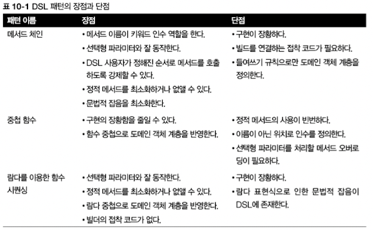

> 프로그램은 사람들이 이해할 수 있도록 작성되어야 하는 것이 중요하며 기기가 실행하는 부분은 부차적일 뿐
>- 하롤드 아벨슨
>

- 이해하기 쉬운 코드는 도메인 전용 언어(DSL)로 표현 가능
- 애플리케이션 수준이 아니라 시스템 수준에서 개념을 다뤄야함
- 플루언트 스타일 : 메서드 체인을 보통 자바의 루프의 복잡한 제어와 비교하여 표현한 것

# 10.1 도메인 전용 언어

- DSL : 특정 비즈니스 도메인을 인터페이스로 만든 API
    - 범용 프로그래밍 언어가 아니기에 특정 도메인에 동작과 용어가 국한됨
    - 특정 도메인에 대해 복잡성을 더 잘 다룰 수 있음
- DSL의 필요성
    1. 의사 소통의 왕 : 의도대로 코드가 전달되어야함
    2. 한 번 코드를 구현하지만 여러 번 읽는다 : 가독성은 유지보수의 핵심


>💡 **우리 주변에 있는 DSL**
>
>- java
>    - ANT, Maven, struts-config.xml, Seasar2 S2DAO, HQL(Hibernate Query Language), JMock
>- Ruby
>    - Rails Validations, Rails ActiveRecord, Rake, RSpec, Capistrano, Cucumber
>- 기타
>    - SQL, CSS, Regular Expression(정규식), Make, graphviz
>

## 10.1.1 DSL의 장점과 단점

- 가독성을 높이지만 구현 코드이므로 올바르게 검증하고 유지보수 해야함
- 장점
    - 간결함 : API 캡슐화
    - 가독성 : 도메인 영역의 용어를 사용하여 비 전문가에게도 공유 가능
    - 유지보수
    - 높은 수준의 추상화 : 도메인과 같은 추상화 수준에서 동작하므로 세부 사항을 숨긴다
    - 집중 : 규칙을 표현하여 코드에 집중
    - 관심사분리
- 단점
    - DSL 설계의 어려움
    - 개발 비용
    - 추가 우회 계층
    - 새로 배워야 하는 언어
    - 호스팅 언어 한계 ← 자바 8의 람다 표현식이 이 문제 해결

## 10.1.2 JVM에서 이용할 수 있는 다른 DSL 해결책

- 내부 DSL(임베디드 DSL) : 순수 자바 코드 같은 호스팅 언어를 기반으로 구현
- 외부 DSL(standalone) : 호스팅 언어와는 독립적으로 자체의 문법을 가짐

JVM으로 인해 내부 DSL과 외부 DSL의 중간에 해당하는 다중 DSL이 만들어짐

### 내부 DSL

- 자바로 구현한 DSL
- 람다를 적극적으로 활용하면 익명 내부 클래스를 사용해 DSL을 구현하는 것보다 장황함을 크게 줄여 신호 대비 잡음 비율을 적정 수준으로 유지하는 DSL을 만들 수 있다


>💡 **신호 대비 잡음 비율**  
>- 로직에 필수적이지 않은 코드 부분 (저수준 코드)
>

### 다중 DSL

- JVM에서 실행되는 언어는 100개 이상 (ex. 스칼라, 루비, 코틀린, 실론 등등...)
- **ex. 스칼라 내장 DSL 구현**

    ```scala
    def times(i: Int, f: => Unit): Unit = {
    	f //f 함수 실행
    	if (i>1) times(i-1, f) // 횟수가 양수면 횟수를 감소시켜 재귀적으로 times를 실행함
    }
    ```

    ```scala
    3 times {
    	println("Hello world")
    }
    ```


### 외부 DSL

- 자신만의 문법으로 새 언어 설계
- 무한한 유연성이 장점

# 10.2 최신 자바 API의 작은 DSL

- 람다는 네이티브 자바 API의 재사용성과 메서드 결합도를 높임
- 람다와 메서드 참조를 이용한 DSL이 코드의 가독성, 재사용성, 결합성을 높일 수 있음

## 10.2.1 스트림 API는 컬렉션을 조작하는 DSL

- stream 그 자체가 작지만 강한 DSL
- **ex. 반복 형식으로 예제 로그 파일에서 에러 행을 읽는 코드**

    ```java
    List<String> errors = new ArrayList<>();
    int errorCount = 0;
    BufferReader bufferReader = new BufferedReader(new FileReader(fileName));
    String line = bufferReader.readLine();
    
    while(errorCount < 40 && line != null){
    	if(line.startsWith("Error")){
    		errors.add(line);
    		errorCount++;
    	}
    	line = bufferedReader.readLine();
    }
    ```

    ```java
    List<String> errors = Files.lines(Paths.get(fileName)) // 파일을 열어서 문자열 스트림을 만듦
    													// "Error"로 시작하는 행을 필터링
    													.filter(line -> line.startsWith("Error") 
    													// 결과를 첫 40행으로 제한
    													.limit(40) 
    													// 결과 문자열을 리스트로 수집
    													.collect(toList()); 
    }
    ```

- 스트림 API의 플루언트 형식은 잘 설계된 DSL의 또 다른 특징

## 10.2.2 데이터를 수집하는 DSL인 Collectors

- 데이터 수집을 수행하는 DSL
- **ex. 자동차를 브랜드별, 색상별로 그룹화**

    ```java
    Map<String, Map<Color, List<Car>>> carsByBrandAndColor = 
    				cars.stream().collect(groupingBy(Car::getBrand,
    															groupingBy(Car::getColor)));
    ```

    ```java
    Comparator<Person> comparator = comparing(Person::getAge)
    																		.thenComparing(Person::getName);
    ```

    ```java
    Collector<? super Car, ?, Map<Brand, Map<Color, List<Car>>>> carGroupCollector 
    		= groupingBy(Car::getBrand, groupingBy(Car::getColor));
    ```

- 셋 이상의 컴포넌트를 조합할 때는 보통 플루언트 형식이 중첩 형식에 비해 가독성이 좋음
- **ex. GroupingBuilder**

    ```java
    import static java.util.stream.Collectors.groupingBy;
    
    public class GroupingBuilder<T, D, K> {
    
    	private final Collector<? super T, ?, Map<K,D>> collector;
    	
    	private final GroupingBuilder(Collector<? super T, ?, Map<K,D>> collector){
    		this.collector = collector;
    	}
    
    	public Collector<? super T, ?, Map<K,D>> get(){
    		return collector;
    	}
    
    	public <J> GroupingBuilder<T, Map<K,D>, J>
    			after(Function<? super T, ? extends J> classifier){
    		return new GroupingBuilder<>(groupingBy(classifier, collector));
    	}
    
    	public static<T, D, K> GroupingBuilder<T, List<T>, K>
    			groupOn(Function<? super T, ? extends K> classifier){
    		return new GroupingBuilder<>(groupingBy(classifier));
    	}
    
    }
    ```

    ```java
    Collector<? super Car, ?, Map<Brand, Map<Color, List<Car>>>>
    	carGroupingCollector = 
    				groupingOn(Car::getColor).after(Car::getBrand).get()
    ```

    - 중첩된 그룹화 수준에 반대로 그룹화 함수를 구현해야 하므로 유틸리티 사용 코드가 직관적이지 않음

# 10.3 자바로 DSL을 만드는 패턴과 기법

- DSL은 도메인 모델에 적용할 친화적이고 가독성 높은 API를 제공함
- **ex. 도메인 객체의 API를 직접 이용한 주식 거래 주문 생성**

    ```java
    Order order = new Order();
    order.setCustomer("BigBank");
    
    Trade trade1 = new Trade();
    trade1.setType(Trade.Type.BUY);
    
    Stock stock1 = new Stock();
    stock1.setSymbol("IBM");
    stock1.setMarket("NYSE");
    
    trade1.setStock(stock1);
    trade1.setPrice(125.00);
    trade1.setQuantity(80);
    order.addTrade(trade1);
    
    Trade trade2 = new Trade();
    trade2.setType(Trade.Type.BUY);
    
    Stock stock2 = new Stock();
    stock2.setSymbol("GOOGLE");
    stock2.setMarket("NASDAQ");
    
    trade2.setStock(stock2);
    trade2.setPrice(375.00);
    trade2.setQuantity(50);
    order.addTrade(trade2);
    
    System.out.println("Plain:");
    System.out.println(order);
    ```


## 10.3.1 메서드 체인

- DSL에서 가장 흔한 방식

```java
Order order = forCustomer("BigBank")
    .buy(80).stock("IBM").on("NYSE").at(125.00)
    .sell(50).stock("GOOGLE").on("NASDAQ").at(375.00)
    .end();
```

- **ex. MethodChainOrderBuilder**

    ```java
    public class MethodChainingOrderBuilder {
    
    	// 빌더로 감싼 주문
      public final Order order = new Order();
    
      private MethodChainingOrderBuilder(String customer) {
        order.setCustomer(customer);
      }
    
    	// 고객의 주문을 만드는 정적 팩토리 메서드
      public static MethodChainingOrderBuilder forCustomer(String customer) {
        return new MethodChainingOrderBuilder(customer);
      }
    
    	// 주식을 사는 TradeBuilder 만들기
      public TradeBuilder buy(int quantity) {
        return new TradeBuilder(this, Trade.Type.BUY, quantity);
      }
    
    	// 주식을 파는 TradeBuilder 만들기
      public TradeBuilder sell(int quantity) {
        return new TradeBuilder(this, Trade.Type.SELL, quantity);
      }
    
      private MethodChainingOrderBuilder addTrade(Trade trade) {
        order.addTrade(trade); // 주문에 주식 추가
        return this; // 유연하게 추가 주문을 만들어 추가할 수 있도록 주문 빌더 자체를 반환
      }
    
    	// 주문 만들기를 종료하고 반환
      public Order end() {
        return order;
      }
    
    }
    ```

    ```java
    public static class TradeBuilder {
    
      private final MethodChainingOrderBuilder builder;
      public final Trade trade = new Trade();
    
      private TradeBuilder(MethodChainingOrderBuilder builder, Trade.Type type, int quantity) {
        this.builder = builder;
        trade.setType(type);
        trade.setQuantity(quantity);
      }
    
      public StockBuilder stock(String symbol) {
        return new StockBuilder(builder, trade, symbol);
      }
    
    }
    ```

  빌더를 계속 이어가려면 Stock 클래스의 인스턴스를 만드는 TradeBuilder의 공개 메서드를 이용

    ```java
    public static class StockBuilder {
    
      private final MethodChainingOrderBuilder builder;
      private final Trade trade;
      private final Stock stock = new Stock();
    
      private StockBuilder(MethodChainingOrderBuilder builder, Trade trade, String symbol) {
        this.builder = builder;
        this.trade = trade;
        stock.setSymbol(symbol);
      }
    
      public TradeBuilderWithStock on(String market) {
        stock.setMarket(market);
        trade.setStock(stock);
        return new TradeBuilderWithStock(builder, trade);
      }
    
    }
    ```

    ```java
    public static class TradeBuilderWithStock {
    
      private final MethodChainingOrderBuilder builder;
      private final Trade trade;
    
    	// 거래되는 주식의 단위 가격을 설정한 다음 원래 주문 빌더를 반환
      public TradeBuilderWithStock(MethodChainingOrderBuilder builder, Trade trade) {
        this.builder = builder;
        this.trade = trade;
      }
    
    	// 다른 거래를 플루언트 방식으로 추가 가능
      public MethodChainingOrderBuilder at(double price) {
        trade.setPrice(price);
        return builder.addTrade(trade);
      }
    
    }
    ```

- 여러 빌드 클래스를 따로 만듦으로써 사용자가 미리 지정된 절차에 따라 플루언트 API의 메서드를 호출
- 빌더를 구현해야 한다는 점이 단점

## 10.3.2 중첩된 함수 이용

- 다른 함수 안에 함수를 이용해 도메인 모델을 생성

```java
Order order = order("BigBank",
    buy(80,
        stock("IBM", on("NYSE")),
        at(125.00)),
    sell(50,
        stock("GOOGLE", on("NASDAQ")),
        at(375.00))
);
```

- **ex. NestedFunctionOrderBuilder**

    ```java
    public class NestedFunctionOrderBuilder {
    
      public static Order order(String customer, Trade... trades) {
        Order order = new Order(); // 해당 고객의 주문 만들기
        order.setCustomer(customer);
        Stream.of(trades).forEach(order::addTrade); // 주문에 모든 거래 추가
        return order;
      }
    
    	// 주식 매수 거래 만들기
      public static Trade buy(int quantity, Stock stock, double price) {
        return buildTrade(quantity, stock, price, Trade.Type.BUY);
      }
    
    	// 주식 매도 거래 만들기
      public static Trade sell(int quantity, Stock stock, double price) {
        return buildTrade(quantity, stock, price, Trade.Type.SELL);
      }
    
      private static Trade buildTrade(int quantity, Stock stock, double price, Trade.Type buy) {
        Trade trade = new Trade();
        trade.setQuantity(quantity);
        trade.setType(buy);
        trade.setStock(stock);
        trade.setPrice(price);
        return trade;
      }
    
    	// 거래된 주식의 단가를 정의하는 더미 메서드
      public static double at(double price) {
        return price;
      }
    
    	// 거래된 주식 만들기
      public static Stock stock(String symbol, String market) {
        Stock stock = new Stock();
        stock.setSymbol(symbol);
        stock.setMarket(market);
        return stock;
      }
    
    	// 주식이 거래된 시장을 정의하는 더미 메서드 정의
      public static String on(String market) {
        return market;
      }
    
    }
    ```

- 도메인 객체 계층 구조에 그대로 반영됨
- 결과 DSL에 더 많은 괄호를 사용해야함

## 10.3.3 람다 표현식을 이용한 함수 시퀀싱

```java
Order order = LambdaOrderBuilder.order( o -> {
  o.forCustomer( "BigBank" );
  o.buy( t -> {
    t.quantity(80);
    t.price(125.00);
    t.stock(s -> {
      s.symbol("IBM");
      s.market("NYSE");
    });
  });
  o.sell( t -> {
    t.quantity(50);
    t.price(375.00);
    t.stock(s -> {
      s.symbol("GOOGLE");
      s.market("NASDAQ");
    });
  });
});
```

- 람다 표현식을 받아 실행해 도메인 모델을 만들어 내는 여러 빌더를 구현해야함
- 메서드 체인 패턴에는 주문을 만드는 최상위 수준의 빌더를 가졌지만 이번에는 Consumer 객체를 빌더가 인수로 받음으로 DSL 사용자가 람다 표현식으로 인수를 구현할 수 있음
- **ex. 함수 시퀀싱 DSL을 제공하는 주문 빌더**

    ```java
    public class LambdaOrderBuilder {
    
    	// 빌더로 주문을 감쌈
      private Order order = new Order(); 
    
      public static Order order(Consumer<LambdaOrderBuilder> consumer) {
        LambdaOrderBuilder builder = new LambdaOrderBuilder();
        consumer.accept(builder); // 주문 빌더로 전달된 람다 표현식 실행
        return builder.order; // OrderBuilder의 Consumer를 실행해 만들어진 주문을 반환
      }
    
    	// 주문을 요청한 고객 설정
      public void forCustomer(String customer) {
        order.setCustomer(customer);
      }
    
    	// 주식 매수 주문을 만들도록 TradeBuilder 소비
      public void buy(Consumer<TradeBuilder> consumer) {
        trade(consumer, Trade.Type.BUY);
      }
    
    	// 주식 매도 주문을 만들도록 TradeBuilder 소비
      public void sell(Consumer<TradeBuilder> consumer) {
        trade(consumer, Trade.Type.SELL);
      }
    
      private void trade(Consumer<TradeBuilder> consumer, Trade.Type type) {
        TradeBuilder builder = new TradeBuilder();
        builder.trade.setType(type);
        consumer.accept(builder); // TradeBuilder로 전달할 람다 표현식 실행
        order.addTrade(builder.trade); // TradeBuilder의 Consumer를 실행해 만든 거래를 주문에 추가
      }
    
    }
    ```

    ```java
    public static class TradeBuilder {
    
      private Trade trade = new Trade();
    
      public void quantity(int quantity) {
        trade.setQuantity(quantity);
      }
    
      public void price(double price) {
        trade.setPrice(price);
      }
    
      public void stock(Consumer<StockBuilder> consumer) {
        StockBuilder builder = new StockBuilder();
        consumer.accept(builder);
        trade.setStock(builder.stock);
      }
    
    }
    ```

    ```java
    public static class StockBuilder {
    
      private Stock stock = new Stock();
    
      public void symbol(String symbol) {
        stock.setSymbol(symbol);
      }
    
      public void market(String market) {
        stock.setMarket(market);
      }
    
    }
    ```

- 두 가지 DSL 형식의 장점을 모두 취함
    - 메서드 체인 장점 : 플루언트 방식으로 거래 주문 정의
    - 중첩 함수 장점 : 다양한 람다 표현식의 중첩 수준과 비슷하게 도메인 객체의 계층 구조를 유지

## 10.3.4 조합하기

- 중첩된 함수 패턴을 람다 기법과 혼용

```java
Order order =
    forCustomer("BigBank",
        buy(t -> t.quantity(80)
            .stock("IBM")
            .on("NYSE")
            .at(125.00)),
        sell(t -> t.quantity(50)
            .stock("GOOGLE")
            .on("NASDAQ")
            .at(375.00)));
```

- **ex. MixedBuilder**

    ```java
    public class MixedBuilder {
    
      public static Order forCustomer(String customer, TradeBuilder... builders) {
        Order order = new Order();
        order.setCustomer(customer);
        Stream.of(builders).forEach(b -> order.addTrade(b.trade));
        return order;
      }
    
      public static TradeBuilder buy(Consumer<TradeBuilder> consumer) {
        return buildTrade(consumer, Trade.Type.BUY);
      }
    
      public static TradeBuilder sell(Consumer<TradeBuilder> consumer) {
        return buildTrade(consumer, Trade.Type.SELL);
      }
    
      private static TradeBuilder buildTrade(Consumer<TradeBuilder> consumer, Trade.Type buy) {
        TradeBuilder builder = new TradeBuilder();
        builder.trade.setType(buy);
        consumer.accept(builder);
        return builder;
      }
    }
    ```

    - `TradeBuilder`와 `StockBuilder`는 내부적으로 메서드 체인 패턴을 구현해 플루언트 API로 제공

    ```java
    public static class TradeBuilder {
    
      private Trade trade = new Trade();
    
      public TradeBuilder quantity(int quantity) {
        trade.setQuantity(quantity);
        return this;
      }
    
      public TradeBuilder at(double price) {
        trade.setPrice(price);
        return this;
      }
    
      public StockBuilder stock(String symbol) {
        return new StockBuilder(this, trade, symbol);
      }
    
    }
    ```

    ```java
    public static class StockBuilder {
    
      private final TradeBuilder builder;
      private final Trade trade;
      private final Stock stock = new Stock();
    
      private StockBuilder(TradeBuilder builder, Trade trade, String symbol) {
        this.builder = builder;
        this.trade = trade;
        stock.setSymbol(symbol);
      }
    
      public TradeBuilder on(String market) {
        stock.setMarket(market);
        trade.setStock(stock);
        return builder;
      }
    
    }
    ```


## 10.3.5 DSL에 메서드 참조 사용하기

주식 거래 도메인에 세금 기능 추가

- **ex1. 세금을 적용할 것인지 결정하는 불리언 플래그를 받는 정적 메서드 추가**

    ```java
    public static double calculate(Order order, boolean useRegional, boolean useGeneral, boolean useSurcharge) {
      double value = order.getValue();
      if (useRegional) {
        value = Tax.regional(value);
      }
      if (useGeneral) {
        value = Tax.general(value);
      }
      if (useSurcharge) {
        value = Tax.surcharge(value);
      }
      return value;
    }
    ```


→ 가독성이 떨어짐

- **ex2. 유창하게 불리언 플래그를 설정하는 최소 DSL을 제공하는 TaxCalculator**

    ```java
    public class TaxCalculator {
    	private boolean useRegional;
      private boolean useGeneral;
      private boolean useSurcharge;
    
      public TaxCalculator withTaxRegional() {
        useRegional = true;
        return this;
      }
    
      public TaxCalculator withTaxGeneral() {
        useGeneral= true;
        return this;
      }
    
      public TaxCalculator withTaxSurcharge() {
        useSurcharge = true;
        return this;
      }
    
      public double calculate(Order order) {
        return calculate(order, useRegional, useGeneral, useSurcharge);
      }
    }
    ```

  지역 세금과 추가 요금을 주문에 추가하고 싶다는 점이 명확하게 드러남

    ```java
    value = new TaxCalculator().withTaxRegional()
            .withTaxSurcharge()
            .calculate(order);
    ```


→ 코드가 장황하고 확장성도 제한적이다(각 세금에 해당하는 불리언 필드가 필요해짐)

- **ex3. 자바의 함수형 기능을 이용하여 더 간결하게 가독성 달성**

    ```java
    public class TaxCalculator{
    	// 주문값에 적용된 모든 세금을 계산하는 함수
    	public DoubleUnaryOperator taxFunction = d -> d;
    
      public TaxCalculator with(DoubleUnaryOperator f) {
    		// 새로운 세금 계산 함수를 얻어서 인수로 전달된 현재 함수를 합침
        taxFunction = taxFunction.andThen(f); 
        return this; // 유창하게 세금 함수가 연결될 수 있도록 결과를 반환
      }
    
      public double calculateF(Order order) {
    		// 주문의 총 합에 세금 계산 함수를 적용해 최종 주문값을 계산
        return taxFunction.applyAsDouble(order.getValue());
      }
    }
    ```

    - `with()` 메서드로 새 세금이 추가되면 현재 세금 계산 함수에 이 세금이 조합되는 방식으로 한 함수에 모든 추가된 세금이 적용됨
    - `calculate()` 메서드에 전달하면 다양한 세금 설정의 결과로 만들어진 세금 계산 함수가 주문의 합계에 적용됨

    ```java
    value = new TaxCalculator().with(Tax::regional)
            .with(Tax::surcharge)
            .calculateF(order);
    ```


→ 메서드 참조를 통해 코드를 읽기 쉽고 간결하게 만듦

이러한 메서드 참조가 자바 도구와 프레임워크에 다양하게 적용될 수 있음

# 10.4 실생활의 자바 8 DSL



자바 라이브러리

## 10.4.1 jOOQ

- SQL 매핑 도구
- SQL을 구현하는 내부적 DSL로 자바에 직접 내장된 형식 안전 언어

```java
create.selectFrom(BOOK)
			.where(BOOK.PUBLISHED_IN.eq(2016))
			.orderBy(BOOK.TITLE)
```

- **ex. jOOQ DSL을 이용해 데이터베이스에서 책 선택**

    ```java
    Class.forName("org.h2.Driver");
    
    // SQL 데이터베이스 연결 만들기
    try(Connection c = getConnection("jdbc:h2~/sql-goodies-with-mapping", "sa", "")){
    	DSL.using(c)
    			// 만들어진 데이터베이스 연결을 이용해 jOOQ SQL문 시작
    			.select(BOOK.AUTHOR, BOOK.TITLE) 
    			.where(BOOK.PUBLISHED_IN.eq(2016))
    		.fetch() // jOOQ DSL로 SQL문 정의
    		.stream() // 데이터베이스에서 데이터 가져오기 jOOQ문은 여기서 종료
    		.collect(groupingBy(
    				r->r.getValue(BOOK.AUTHOR),
    				LinkedHashMap::new.
    				mapping(r->r.getValue(BOOK.TITLE), toList())))
    				.forEach((author, titles) -> // 저자의 이름 목록과 각 저자가 집필한 책들을 출력
    			System.out.println(author + "is author of " + titles));
    }
    ```


## 10.4.2 큐컴버

- 동작 주도 개발(BDD) 프레임워크
- 테스트 주도 개발의 확장으로 다양한 비즈니스 시나리오를 구조적으로 서술하는 간단한 도메인 전용 스크립팅 언어를 사용함
    - 전제 조건 정의(Given)
    - 시험하려는 도메인 객체의 실질 호출(When)
    - 테스트 케이스의 결과를 확인하는 어설션(Then)

```java
Feature: Buy stock
  Scenario: Buy 10 IBM stocks
    Given the price of a "IBM" stock is 125$
    When I buy 10 "IBM"
    Then the order value should be 1250$
```

- **ex. 큐컴버 어노테이션을 이용해 테스트 시나리오 구현**

    ```java
    public class BuyStocksSteps {
        private Map<String, Integer> stockUnitPrices = new HashMap<>();
        private Order order = new Order();
    	
    		// 시나리오의 전체 조건인 주식 단가 정의
        @Given("^the price of a \"(.*?)\" stock is (\\d+)\\$$")
        public void setUnitPrice(String stockName, int unitPrice) {
            stockUnitValues.put(stockName, unitPrice); // 주식 단가 저장
        }
    
    		// 테스트 대상인 도메인 모델에 행할 액션 정의
        @When("^I buy (\\d+) \"(.*?)\"$")
        public void buyStocks(int quantity, String stockName) {
            Trade trade = new Trade();
            trade.setType(Trade.Type.BUY);
    
            Stock stock = new Stock();
            stock.setSymbol(stockName);
    
            trade.setStock(stock);
            trade.setPrice(stockUnitPrices.get(stockName));
            trade.setQuantity(quantity);
            order.addTrade(trade);
        }
    
    		// 예상되는 시나리오 결과 정의
        @Then("^the order value should be (\\d+)\\$$")
        public void checkOrderValue(int expectedValue) { 
            assertEquals(expectedValue, order.getValue()); // 테스트 어설션 확인
        }
    }
    ```

- 람다 표현식이 가능해지면서 두 개의 인수 메서드(기존에 어노테이션 값을 포함한 정규 표현식과 테스트 메서드를 구현하는 람다)를 이용해 어노테이션을 제거하는 다른 문법을 큐컴버로 개발 가능

  → 코드가 간단해짐


## 10.4.3 스프링 통합

- 엔터프라이즈 통합 패턴을 구현하는 도구
- 복잡한 엔터프라이즈 통합 솔루션을 구현하는 단순한 모델을 제공하고 비동기, 메시지 주도 아키텍처를 쉽게 적용하도록 도움
- **ex. 스프링 통합 DSL을 이용해 스프링 통합 흐름 설정하기**

    ```java
    @Configuration
    @EnableIntegration
    public class MyConfiguration {
    
        @Bean
        public MessageSource<?> integerMessageSource() {
            MethodInvokingMessageSource source =
    								// 호출 시 AtomicInteger를 증가시키는 새 MessageSource를 생성
                    new MethodInvokingMessageSource(); 
            source.setObject(new AtomicInteger());
            source.setMethodName("getAndIncrement");
            return source;
        }
    
        @Bean
        public DirectChannel inputChannel() {
            return new DirectChannel(); // MessageSource에서 도착하는 데이터를 나르는 채널
        }
    
        @Bean
        public IntegrationFlow myFlow() {
            return IntegrationFlows
    									// 기존에 정의한 MessageSource를 IntegrationFlow의 입력으로 사용
                       .from(this.integerMessageSource(),
    									// MessageSource를 폴링하면서 MessageSource가 나르는 데이터를 가져옴
                             c -> c.poller(Pollers.fixedRate(10)))
                       .channel(this.inputChannel())
                       .filter((Integer p) -> p % 2 == 0) // 짝수만 거름
    									// MessageSource에서 가져온 정수를 문자열로 변환
                       .transform(Object::toString)
    									// queueChannel을 IntegrationFlow의 결과로 설정
                       .channel(MessageChannels.queue("queueChannel"))
                       .get();
        }
    }
    
    @Bean
    public IntegrationFlow myFlow() {
        return flow -> flow.filter((Integer p) -> p % 2 == 0)
                           .transform(Object::toString)
                           .handle(System.out::println);
    }
    ```

- 스프링 통합 DSL에서 가장 널리 사용하는 패턴은 메서드 체인
- 최상위 수준의 객체를 만들 때는 함수 시퀀싱과 람다 표현식을 사용한다.

# 10.5 마치며

- DSL에는 크게 내부적, 외부적 DSL이 있다
- JVM에서 이용 가능한 스칼라, 그루비 등 다른 언어로 다중 DSL도 개발 가능함
- 자바의 장황함과 문법적 엄격함 때문에 자바는 보통 내부적 DSL을 개발하는 언어로는 잘 안쓰나, 자바 8의 람다 표현식과 메서드 참조 덕분에 상황이 많이 개선됨
- 최신 자바는 자체 API에 작은 DSL을 제공함
    - Stream, Collectors
    - 컬렉션 데이터의 정렬, 필터링, 변환, 그룹화에 유용함
- 자바로 DSL을 구현하면 보통 메서드 체인, 중첩 함수, 함수 시퀀싱 세 가지 패턴이 사용됨
- 많은 자바 프레임워크와 라이브러리를 DSL을 통해 이용할 수 있음 (ex. jOOQ, 큐컴버, 스프링 통합)