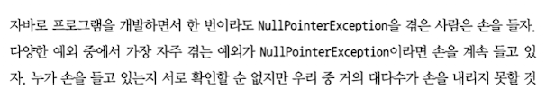

🙋‍♀️ 🙋‍♀️ 🙋‍♀️ 🙋‍♀️ 🙋‍♀️

# 11.1 값이 없는 상황을 어떻게 처리할까?

## 11.1.1 보수적인 자세로 NullPointerException 줄이기

- **반복 패턴 코드 (2가지 방법 다 별로임)**

    ```java
    public String getCarInsuranceNameNullSafeV1(PersonV1 person) {
      if (person != null) {
        CarV1 car = person.getCar();
        if (car != null) {
          Insurance insurance = car.getInsurance();
          if (insurance != null) {
            return insurance.getName();
          }
        }
      }
      return "Unknown";
    }
    ```

    ```java
    public String getCarInsuranceNameNullSafeV2(PersonV1 person) {
      if (person == null) {
        return "Unknown";
      }
      CarV1 car = person.getCar();
      if (car == null) {
        return "Unknown";
      }
      Insurance insurance = car.getInsurance();
      if (insurance == null) {
        return "Unknown";
      }
      return insurance.getName();
    }
    ```

- null로 값이 없음을 표현하는 것은 좋지 않으며 새로운 방법이 필요함

## 11.1.2 null 때문에 발생하는 문제

- 에러의 근원이다
- 코드를 어지럽힌다
    - null 확인 로직때문에 코드 가독성이 떨어짐
- 아무 의미가 없다
- 자바 철학에 위배된다
    - 모든 포인터를 숨겼는데 예외가 null 포인터!
- 형식 시스템에 구멍을 만든다

## 11.1.3 다른 언어는 null 대신 무얼 사용하나?

- 그루비 : 안전 내비게이션 연산자 safe navigation operator
- 하스켈 : 선택형값을 저장하는 Maybe 형식 제공
- 스칼라 : T형식 값을 갖거나 아무 값도 갖지 않을 수 있는 Option[T] 구조 제공

⇒ Java8에서는 ‘선택형값’ Optional을 제공함

⇒ 선택형값에 접근하는 방법도 달라져야함

⇒ 메서드의 시그니처만 보고도 선택형값을 기대해야 하는지 판단할 수 있음

# 11.2 Optional 클래스 소개

`java.util.Optional<T>`


- `Optional.empty()` : Optional의 특별한 싱글턴 인스턴스를 반환하는 정적 팩토리 메서드

```java
public class Person {

	// 사람이 차를 소유했을 수도 소유하지 않았을 수도 있으므로 Optional로 정의함
  private Optional<Car> car; 
  private int age;

  public Optional<Car> getCar() {
    return car;
  }

  public int getAge() {
    return age;
  }

}
```

- 오히려 `Optional`을 안씀으로써 반드시 해당 값을 가져야 함을 보여줄 수 있음
- 모든 null 참조를 Optional로 대치하는 것은 바람직하지 않음

# 11.3 Optional 적용 패턴

## 11.3.1 Optional 객체 만들기

```java
// 빈 Optional
Optional<Car> optCar = Optional.empty();

// null이 아닌 값으로 Optional 만들기
Optional<Car> optCar = Optional.of(car);

// null값으로 Optional 만들기
Optional<Car> optCar = Optional.ofNullable(car);
```

- `Optional.of`로 만들 때, 파라미터도 null이 들어오면 즉시 `NullPointException` 발생
- `Optional`도 결국 잘못 사용하면 `NullPointException`를 겪을 수 있음

## 11.3.2 맵으로 Optional의 값을 추출하고 변환하기

- 객체의 정보를 추출할 때 사용


```java
Optional<Insurance> optInsurance = Optional.ofNullable(insurance);
Optional<String> name = optInsurance.map(Insurance::getName);
```

## 11.3.3 flatMap으로 Optional 객체 연결

- 아래 코드는 컴파일 불가

  (1) `Person::getCar`가 `Optional<Car>`를 반환 → `Optional<Optional<Car>>`

  (2) `Car::getInsurance`는 또 다른 Optional을 반환 → 중첩 Optional 객체 구조


```java
Optional<Person> optPerson = Optional.of(person);
Optional<String> name = optPerson.map(Person::getCar) // (1)
    .map(Car::getInsurance) // (2)
    .map(Insurance::getName);
return name.orElse("Unknown");
```

- `flatMap` : 함수를 인수로 받아서 다른 스트림을 반환하는 메서드
    - 2차원 Optional을 1차원 Optional로 평준화 해야함


- **Optional로 자동차의 보험회사 이름 찾기**
    - null을 확인하기 위한 조건 분기문을 추가하지 않아도 됨!

  

    ```java
    public String getCarInsuranceName(Optional<Person> person) {
      return person.flatMap(Person::getCar)
          .flatMap(Car::getInsurance)
          .map(Insurance::getName)
          .orElse("Unknown");
    }
    ```

- **Optional을 이용한 Person/Car/Insurance 참조 체인**
    - `flatMap` 연산으로 `Optional`을 평준화함
        - 평준화란? 이론적으로 두 `Optional`을 합치는 기능을 수행하면서 둘 중 하나라도 null이면 빈 `Optional`을 생성하는 연산
    - 호출 체인 중 어떤 메서드가 빈 `Optional`을 반환한다면 전체 결과로 빈 `Optional`을 반환하고 아니면 관련 보험회사의 이름을 포함하는 `Optional`을 반환함
    - `Optional`이 비었을 때 `orElse` 메서드가 기본값을 제공함 (언랩)

    ```java
    public Set<String> getCarInsuranceNames(List<Person> persons) {
      return persons.stream()
          .map(Person::getCar)
          .map(optCar -> optCar.flatMap(Car::getInsurance))
          .map(optInsurance -> optInsurance.map(Insurance::getName)) //Optional<Insurance> -> Optional<String>
          .flatMap(Optional::stream)
          .collect(toSet());
    }
    ```


>💡 **도메인 모델에 Optional을 사용했을 때 데이터를 직렬화할 수 없는 이유**
>- `Optional`의 용도는 선택형 반환값을 지원하는 것!
>- 따라서 `Optional` 클래스는 필드 형식으로 사용할 것을 가정하지 않았으므로 `Serializable` 인터페이스를 구현하지 않는다
>- 직렬화가 필요하다면 `Optional`로 값을 반환받을 수 있는 메서드를 추가해야함


## 11.3.4 Optional 스트림 조작

```java
public Set<String> getCarInsuranceNames(List<Person> persons) {
  return persons.stream()
      .map(Person::getCar)
      .map(optCar -> optCar.flatMap(Car::getInsurance))
      .map(optInsurance -> optInsurance.map(Insurance::getName))
      .flatMap(Optional::stream)
      .collect(toSet());
}
```

- `Optional::stream`
    - 아래 코드랑 같은 효과

        ```java
        Set<String> result = stream.filter(Optional::isPresent)
        														.map(Optional::get)
        														.collect(toSet());
        ```

    - `Optional`이 비었는지 아닌지에 따라 `Optional`을 0개 이상의 항목을 포함하는 스트림으로 변환

## 11.3.5 디폴트 액션과 Optional 언랩

1. `get()`
    - 래핑된 값이 있으면 해당 값을 반환
    - 없으면 `NoSuchElementException` 발생
2. `orElse(T other)`
    - `Optional`이 값을 포함하지 않을 때 기본값 제공 가능
3. `orElseGet (Supplier<? extends T> other)`
    - `orElse`의 게으른 버전
    - `Optional`이 비어있을 때만 기본값을 생성하고 싶다면 이것을 사용
4. `ifPresent (Consumer<? super T> consumer)`
    - 값이 존재할 때 인수로 넘겨준 동작을 실행할 수 있음
    - 값이 없으면 아무 일도 일어나지 않음
5. `ifPresent (Consumer<? super T> action, Runnable emptyAction)`
    - `Optional`이 비었을 때 실행할 수 있는 `Runnable`을 인수로 받음
    - 그 외는 4번이랑 같음

## 11.3.6 두 Optional 합치기

- 인수로 전달한 값 중 하나라도 비어있으면 빈 `Optional<Insurance>`를 반환함

```java
public Optional<Insurance> nullSafeFindCheapestInsurance(Optional<Person> person, Optional<Car> car) {
  if (person.isPresent() && car.isPresent()) {
    return Optional.of(findCheapestInsurance(person.get(), car.get()));
  } else {
    return Optional.empty();
  }
}

public Insurance findCheapestInsurance(Person person, Car car) {
  // 다른 보험사에서 제공한 질의 서비스
  // 모든 데이터 비교
  Insurance cheapestCompany = new Insurance();
  return cheapestCompany;
}
```

- **Quiz11-1) Optional 언랩하지 않고 두 Optional 합치기**

    ```java
    public Optional<Insurance> nullSafeFindCheapestInsuranceQuiz(Optional<Person> person, Optional<Car> car) {
      return person.flatMap(p -> car.map(c -> findCheapestInsurance(p, c)));
    }
    ```


## 11.3.7 필터로 특정값 거르기

```java
Optional<Insurance> optInsurance = ...;
optInsurance.filter(insurance -> "CambridgeInsurance".equals(insurance.getName())
						.ifPresent(x -> System.out.println("ok"));
```

- **Quiz11-2) Optional 필터링**

  인수 person이 minAge 이상의 나이일 때만 보험회사 이름을 반환한다

    ```java
    public String getCarInsuranceName(Optional<Person> person, int minAge) {
      return person.filter(p -> p.getAge() >= minAge)
       .flatMap(Person::getCar)
       .flatMap(Car::getInsurance)
       .map(Insurance::getName)
       .orElse("Unknown");
    }
    ```

- Optional 클래스 메소드


# 11.4 Optional을 사용한 실용 예제

- 잠재적으로 존재하지 않는 값의 처리 방법을 바꿔야함
- 네이티브 자바 API와 상호작용하는 방식을 바꿔야함

## 11.4.1 잠재적으로 null이 될 수 있는 대상을 Optional로 감싸기

```java
// Map<String, Object>
Object value = map.get("key");

Optional<Object> vlaue = Optional.ofNullable(map.get("key"));
```

## 11.4.2 예외와 Optional 클래스

- 값을 제공할 수 없을 때 null을 반환하는 대신 예외를 발생시킬 때도 있음
    - ex. Integer.parseInt(String) → NumberFormatException

```java
public static Optional<Integer> stringToInt(String s){
	try{
		// 문자열을 정수로 변환할 수 있으면 정수로 변환된 값을 포함하는 Optional을 반환함
		return Optional.of(Integer.parseInt(s));
	} catch(NumberFormatException e){
		// 그렇지 않으면 빈 Optional을 반환함
		return Optional.empty();
	}
}
```

## 11.4.3 기본형 Optional을 사용하지 말아야 하는 이유

OptionalInt, OptionalLong, OptionalDouble 등등

- 기본형 특화 Optional은 Optional 클래스의 유용한 메서드 map, filterMap, filter 등을 지원하지 않음
- 기본형 특화 Optional로 생성한 결과는 다른 일반 Optional과 혼용할 수 없음
    - ex. `OptionalInt`를 반환하면 이를 다른 `Optional`의 `flatMap`에 메서드 참조로 전달할 수 없음

## 11.4.4 응용

- **Quiz11-3) Optional로 프로퍼티에서 지속 시간 읽기**

    ```java
    // Before
    public static int readDurationImperative(Properties props, String name) {
      String value = props.getProperty(name); // null 반환
      if (value != null) {
        try {
          int i = Integer.parseInt(value);
          if (i > 0) {
            return i;
          }
        } catch (NumberFormatException nfe) { }
      }
      return 0;
    }
    ```

    ```java
    // After
    public static int readDurationWithOptional(Properties props, String name) {
      return ofNullable(props.getProperty(name))
          .flatMap(ReadPositiveIntParam::s2i)
          .filter(i -> i > 0).orElse(0);
    }
    
    // Optional<String> -> Optional<Integer>
    public static Optional<Integer> s2i(String s) {
      try {
        return of(Integer.parseInt(s));
      } catch (NumberFormatException e) {
        return empty();
      }
    }
    ```


# 11.5 마치며

- null 참조로 값이 없는 상황을 표현해옴
- 자바8에서는 java.util.Optional<T>를 제공함
- 팩토리 메서드 `Optional.empty`, `Optional.of`, `Optional.ofNullable` 등을 사용해서 Optional 객체를 만들 수 있음
- Optional로 값이 없는 상황을 적절하게 처리할 수 있다.
- Optional을 통해 더 좋은 API를 설계할 수 있으며 메서드 시그니처만 보고도 null 반환 여부를 알 수 있음
- **Optional은 반환 타입으로서만 사용**해야한다!

---
###참고

[https://mangkyu.tistory.com/203](https://mangkyu.tistory.com/203)