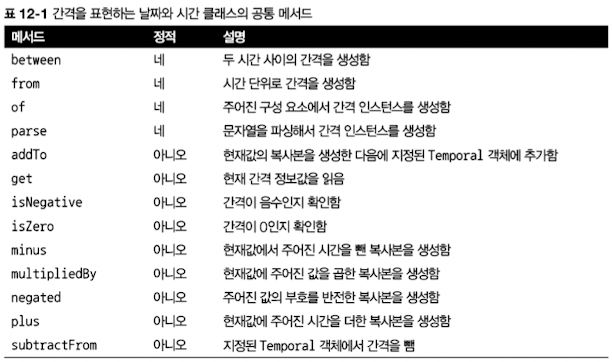

- Java8부터 등장한 새로운 날짜와 시간 API
- Java1의 `java.util.Date`와  `java.util.Calendar`는 문제가 많았음 (둘 다 가변 mutable 클래스)
- `DateFormat` 도 문제가 많았음 (ex. 스레드에 안전하지 않음)
- 자바8에서 `java.time` 패키지가 추가됨

# 12.1 LocalDate, LocalTime, Instant, Duration, Period 클래스


>💡 `java.time` 패키지는 `LocalDate`, `LocalTime`, `LocalDateTime`, `Instant`, `Duration`, `Period` 등 새로운 클래스를 제공함


## 12.1.1 LocalDate와 LocalTime 사용

> 시간을 제외한 날짜를 표현하는 불변 객체
>

```java
LocalDate date = LocalDate.of(2014, 3, 18);
int year = date.getYear(); // 2014
Month month = date.getMonth(); // MARCH
int day = date.getDayOfMonth(); // 18
DayOfWeek dow = date.getDayOfWeek(); // TUESDAY
int len = date.lengthOfMonth(); // 31 (3월의 길이)
boolean leap = date.isLeapYear(); // false (윤년이 아님)

// 현재 날짜 정보
LocalDate today = LocalDate.now();
```

- `TemporalField` : 시간 관련 객체에서 어떤 필드의 값에 접근할지 정의하는 인터페이스
- `ChronoField` : TemporalField 인터페이스를 정의함. 열거자 요소

```java
int y = date.get(ChronoField.YEAR);
int m = date.get(ChronoField.MONTH_OF_YEAR);
int d = date.get(ChronoField.DAY_OF_MONTH);

// get어쩌구로 가독성 높인 버전
LocalTime time = LocalTime.of(13, 45, 20); // 13:45:20
int hour = time.getHour(); // 13
int minute = time.getMinute(); // 45
int second = time.getSecond(); // 20
```

- `DateTimeFormatter` : 뒤에 사용법 자세히 다룸!
    - 문자열을 `LocalDate`나 `LocalTime`으로 파싱할 수 없을 때 parse 메서드는 `DateTimeParseException`(`RuntimeExcpetion`을 상속받는 예외)를 일으킴

## 12.1.2 날짜와 시간 조합

```java
// 2014-03-18T13:45
Date date = new Date(114, 2, 18);
LocalTime time = LocalTime.of(13, 45, 20);

LocalDateTime dt1 = LocalDateTime.of(2014, Month.MARCH, 18, 13, 45, 20);
LocalDateTime dt2 = LocalDateTime.of(date, time);
LocalDateTime dt3 = date.atTime(13, 45, 20);
LocalDateTime dt4 = date.atTime(time);
LocalDateTime dt5 = time.atDate(date);
```

## 12.1.3 Instant 클래스 : 기계와 날짜와 시간

- 기계의 관점에서는 연속된 시간에서 특정 지점을 하나의 큰 수로 표현하는 것이 가장 자연스러운 시간 표현 방법임
- `java.time.Instant` 클래스에서는 유닉스 에포크 시간을 기준으로 특정 지점까지의 시간을 초로 표현함
- 팩토리 메서드 `ofEpochSecond`

```java
// 밑에 4개 다 같은 거
Instant.ofEpochSecond(3);
Instant.ofEpochSecond(3,0);
Instant.ofEpochSecond(2, 1_000_000_000);
Instant.ofEpochSecond(4, -1_000_000_000);

Instant now = Instant.now();
int day = Instant.now().get(ChronoField.DAY_OF_MONTH); // 에러남
```

- `Instant` 는 사람이 읽을 수 있는 시간 정보를 제공하지 않음

## 12.1.4 Duration과 Period 정의

- 지금까지의 모든 클래스는 `Temporal` 인터페이스를 구현하는데, `Temporal` 인터페이스는 특정 시간을 모델링하는 객체의 값을 어떻게 읽고 조작할지 정의함

```java
Duration d1 = Duration.between(LocalTime.of(13, 45, 10), time);
Duration d2 = Duration.between(instant, now);
```

- LocalDateTime은 사람이 사용하도록, Instant는 기계가 사용하도록 만들어진 클래스 → 혼합 불가능

```java
Duration threeMinutes = Duration.ofMinutes(3);
Duration threeMinutes = Duration.of(3, ChronoUnit.MINUTES);
```



# 12.2 날짜 조정, 파싱, 포매팅

- `withAttribute` : Temporal 객체를 바꾸는 것이 아니라 필드를 갱신한 복사본을 만든다.

```java
// 절대적인 방식으로 LocalDate의 속성 바꾸기
LocalDate date1 = LocalDate.of(2014, 3, 18);
LocalDate date2 = date1.withYear(2011);
LocalDate date3 = date2.withDayOfMonth(25);
LocalDate date4 = date3.with(ChronoField.MONTH_OF_YEAR, 2);

// 상대적인 방식으로 LocalDate의 속성 바꾸기
LocalDate date1 = LocalDate.of(2014, 3, 18);
LocalDate date2 = date1.plusWeeks(1);
LocalDate date3 = date2.minusYears(6);
LocalDate date4 = date3.plus(6, ChronoUnit.MONTHS);
```


## 12.2.1 TemporalAdjusters 사용하기

- 조금 더 복잡한 날짜 조정 기능


```java
LocalDate date = LocalDate.of(2014, 3, 18);
date = date.with(nextOrSame(DayOfWeek.SUNDAY));
date = date.with(lastDayOfMonth());
```

- TemporalAdjuster 인터페이스에 대한 구현을 만들 수 있음

```java
@Override
public Temporal adjustInto(Temporal temporal) {
DayOfWeek dow = DayOfWeek.of(temporal.get(ChronoField.DAY_OF_WEEK));
  int dayToAdd = 1;
  if(dow == DayOfWeek.FRIDAY) {
dayToAdd = 3;
}
if(dow == DayOfWeek.SATURDAY) {
dayToAdd = 2;
}
return temporal.plus(dayToAdd, ChronoUnit.DAYS);
}
```

```java
date = date.with(temporal ->{
DayOfWeek dow = DayOfWeek.of(temporal.get(ChronoField.DAY_OF_WEEK));
  int dayToAdd = 1;
  if(dow == DayOfWeek.FRIDAY) {
dayToAdd = 3;
}
if(dow == DayOfWeek.SATURDAY) {
dayToAdd = 2;
}
return temporal.plus(dayToAdd, ChronoUnit.DAYS);
});
```

## 12.2.2 날짜와 시간 객체 출력과 파싱

- `java.time.format`
- `DateTimeFormatter` : 날짜나 시간을 특정 형식의 문자열로 만들 수 있음

```java
LocalDate date = LocalDate.of(2014, 3, 18);
DateTimeFormatter formatter = DateTimeFormatter.ofPattern("dd/MM/yyyy");
DateTimeFormatter italianFormatter = DateTimeFormatter.ofPattern("d. MMMM yyyy", Locale.ITALIAN);
```

- 반대로 날짜나 시간을 표현하는 문자열을 파싱해서 날짜 객체를 다시 만들 수 있음


- DateTimeFormatter 클래스는 특정 패턴으로 포매터를 만들 수 있는 정적 팩토리 메서드 제공

  

  

- `DateTimeFormatterBuilder` : 복합적인 포매터를 정의해서 좀 더 세부적으로 포메터를 제어할 수 있음

```java
DateTimeFormatter complexFormatter = new DateTimeFormatterBuilder()
	.appendText(ChronoField.DAY_OF_MONTH)
	.appendLiteral(". ")
	.appendText(ChronoField.MONTH_OF_YEAR)
	.appendLiteral(" ")
	.appendText(ChronoField.YEAR)
	.parseCaseInsensitive()
	.toFormatter(Locale.ITALIAN);
```

# 12.3 다양한 시간대와 캘린더 활용 방법

- 기존 `java.util.Timezone` 을 대체하는 `java.time.ZoneId` 클래스가 새로 등장함 (불변 클래스)

## 12.3.1 시간대 사용하기

- 표준 시간이 같은 지역을 묶어서 시간대 규칙 집합 정의

```java
// 지역 집합정보 활용
ZoneId roomZone = ZoneId.of("Europe/Rome");

// 기존 timeZone객체를 zoneId로 변한
ZoneId zoneId = TimeZone.getDefault().toZoneId();

LocalDateTime dateTime = LocalDateTime.of(2014, Month.MARCH, 18, 13, 45);
OffsetDateTime dateTimeInNewYork = OffsetDateTime.of(date, newYorkOffset);
```


- `ZoneId`를 이용해서 `LocalDateTime`을 `Instant`로 바꿀 수 있음
- 폐기된 API와 새 날짜와 시간 API 간의 동작에 도움이 되는 `toInstant()`, 정적 메서드 `fromInstant()` 두 개의 메서드가 있음

## 12.3.2 UTC/Greenwich 기준의 고정 오프셋

```java
// 런던의 그리니치 0도 자오선과 시간값의 차이 표현
ZoneOffSet newYorkOffset = ZoneOffset.of("-05.00");
```

## 12.3.3 대안 캘린더 시스템 사용하기


>💡 대표적인 캘린더 시스템
>- ThaiBuddhistDate, MinguoDate, JapaneseDate, HijrahDate
>- `ChronoLocalDate` 인터페이스 : 임의의 연대기에서 특정 날짜를 표현할 수 있는 기능을 제공하는 인터페이스


- `ChronoLocalDate` 보다는 `LocalDate`를 사용할 것을 권고함 (기존 캘린더에 대해 이해하고있는 바가 멀티캘린더 시스템에서는 적용되지 않음)
- 프로그램의 입출력을 지역화하는 상황을 제외하고는 모든 데이터 저장, 조작, 비즈니스 규칙 해석 등의 작업에서 `LocalDate`를 써야한다.
- 이슬람력(HijrahDate)은 복잡하다!

# 12.4 마치며

- 자바8 이전의 버전에서 제공하는 기존 [java.util.Date](http://java.util.Date) 클래스는 설계 결함이 존재했었다
- 새로운 날짜와 시간 API에서 날짜와 시간 객체는 모두 불변이다
- 날짜와 시간 객체를 절대적인 방법과 상대적인 방법으로 처리할 수 있으며 기존 인스턴스를 변환하지 않도록 처리 결과로 새로운 인스턴스가 생성됨
- TemporalAdjuster를 이용하면 단순히 값을 바꾸는 것 이상의 복잡한 동작을 수행하며 자신만의 커스텀 날짜 변환 기능을 정의할 수 있음
- 특정 포맷으로 출력하고 파싱하는 포매터를 정의할 수 있으며, 패턴을 이용하거나 프로그램으로 포매터를 만들 수 있고 포매터는 스레드 안정성을 보장함
- 특정 지역/장소에 상대적인 시간대 또는 UTC/GMT 기준의 오프셋을 이용해서 시간대를 정의할 수 있으며 이 시간대를 날짜와 시간 객체에 적용해서 지역화할 수 있음
- ISO-8601 표준 시스템을 준수하지 않는 캘린더 시스템도 사용할 수 있음