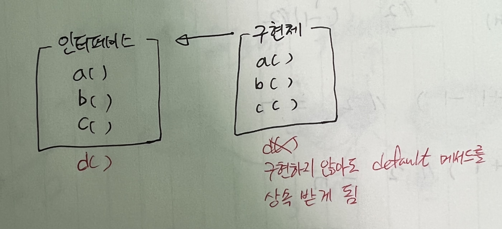
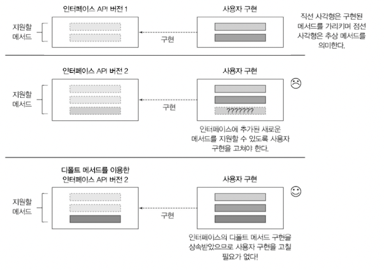

- 인터페이스를 구현하는 클래스는 인터페이스에서 정의하는 모든 메서드 구현을 제공하거나 아니면 슈퍼클래스의 구현을 상속받아야 한다

⇒ 그렇담 인터페이스가 변화하게 된다면?!

⇒ 다 뜯고 고쳐야함!

- 자바8에서 기본 구현을 포함하는 인터페이스 정의 방법
    1. 정적 메서드 static method
    2. 디폴트 메서드 default method
    3. 추상 메서드
    4. 상수

**⇒ 자바8에서는 구현을 포함하는 인터페이스를 정의할 수 있음**

⇒ 기존 인터페이스를 구현하는 클래스는 자동으로 인터페이스에 추가된 새로운 메서드의 디폴트 메서드를 상속받게됨 (코드 구현을 변경하지 않아도 인터페이스 변경 가능)



- **ex. List 인터페이스의 sort**

  List 인터페이스의 sort는 자바8에서 새로 추가된 메서드

    ```java
    default void sort(Comparator<? super E> c){
    	Collections.sort(this, c);
    }
    ```

  새로운 default 메서드 덕분에 리스트에 직접 sort 호출 가능

    ```java
    List<Integer> numbers = Arrays.asList(3, 5, 1, 2, 6);
    // 여기서 sort는 Collections.sort를 호출하는 디폴트 메서드
    numbers.sort(Comparator.naturalOrder()); // naturalOrder는 정적 메서드
    ```

- **ex. Collection 인터페이스의 stream**

  stream 메서드 정의 코드

    ```java
    default Stream<E> stream(){
    	return StreamSupport.stream(spliterator(), false);
    }
    ```

  내부적으로 `StreamSupport.stream`를 호출해서 스트림 반환

  그리고 그 안에서 또 다른 디폴트 메서드 `spliterator`도 호출함


>💡 인터페이스? 추상클래스? → 나중에,,,
>디폴트 메서드 왜써? → 나중에,,,


- 자바 API의 호환성을 유지하면서 라이브러리 변경 가능



- 인터페이스를 대중에게 공개했을 때는 구현체를 바로바로 수정하기 어려움
- 디폴트 메서드를 이용하면 인터페이스의 기본 구현을 그대로 상속하므로 인터페이스에 자유롭게 새로운 메서드 추가 가능
- 라이브러리 설계와 유관함
- 다중 상속 동작이라는 유연성을 제공하면서 프로그램 구성에도 도움을 줌

>💡 **정적 메서드와 인터페이스**
>- 보통 자바에서는 인터페이스, 인터페이스의 인스턴스를 활용할 수 있는 다양한 정적 메서드를 정의하는 유틸리티 클래스 제공 (ex. Collections는 Collection 객체를 활용할 수 있는 유틸리티 클래스임)
>- 자바8에서는 유틸리티 클래스를 없에고 직접 인터페이스 내부에 정적 메서드 구현
>- 호환성을 위해 자바 API에는 유틸리티 클래스가 남아있음


# 13.1 변화하는 API

- 자바 라이브러리 설계자가 라이브러리를 바꾸고 싶을 때 문제 발생
    - 이전에 배포한 버전의 인터페이스를 구현한 사용자는 어떻게함..?

## 13.1.1 API 버전 1

```java
public interface Resizable extends Drawable{
	int getWidth();
  int getHeight();
  void setWidth(int width);
  void setHeight(int height);
  void setAbsoluteSize(int width, int height);
}
```

```java
public class Game{
	public static void main(String... args) {
		List<Resizable>resizableShapes = Arrays.asList(
									new Square(), new Triangle(), new Ellipse());
	  Utils.paint(resizableShapes);
	}
}
```

```java
public class Utils{
	public static void paint(List<Resizable>l) {
		l.forEach(r ->{
		r.setAbsoluteSize(42, 42);
		r.draw();
		});
	}
}
```

## 13.1.2 API 버전 2


```java
public interface Resizable extends Drawable{
	int getWidth();
  int getHeight();
  void setWidth(int width);
  void setHeight(int height);
  void setAbsoluteSize(int width, int height);
	void setRelativeSize(int widthFactor, int heightFactor){}
///
; //추가된 메서드

}
```

수정 됐을 때 발생하는 문제

1. `Resizable`을 구현하는 모든 클래스는 `setRelativeSize` 메서드를 구현해야함
    - 하지만 라이브러리 사용자가 직접 구현한 `Ellipse`는 `setRelativeSize`메서드를 구현하지 않는다
    - 바이너리 호환성은 유지됨
    
    >💡 **바이너리 호환성**
    >- 새로 추가된 메서드를 호출하지만 않으면 새로운 메서드 구현 없이도 기존 클래스 파일 구현이 잘 동작함


- 하지만 누가 호출한다면 런타임 에러가 발생함

  

2. 사용자가 `Ellipse`를 포함하는 전체 애플리케이션을 재빌드할 때 컴파일 에러가 발생함

   


```java
public class Utils{
	public static void paint(List<Resizable>l) {
		l.forEach(r ->{
			r.setAbsoluteSize(42, 42);
			r.draw();
		});
		
		//l.forEach(r -> { r.setRelativeSize(2, 2); });
	}
}
```

- 공개 API를 수정하면 기존 버전과의 호환성 문제가 발생하기에 기존 API를 수정하는 것은 어렵다
- 자신만의 API를 별도로 만들고 예전 버전과 새로운 버전을 직접 관리하는건?
    - 라이브러리를 관리하기 복잡함
    - 사용자는 같은 코드에 예전 버전과 새로운 버전 두 가지 라이브러리를 모두 사용해야함
    - 프로젝트에서 로딩해야 할 클래스 파일이 많아지면서 메모리 사용과 로딩 시간 문제가 발생함

**⇒ 디폴트 메서드를 통해 API를 변경하면 새롭게 바뀐 인터페이스에서 자동으로 기본 구현을 제공하므로 기존 코드를 변경하지 않아도 됨**


>💡 **자바 프로그램 관련 호환성**
>- 바이너리 호환성 : 뭔가를 바꾼 이후에도 에러없이 기존 바이너리가 실행
>- 소스 호환성 : 코드를 고쳐도 기존 프로그램을 성공적으로 재컴파일
>- 동작 호환성 : 코드를 바꾼 다음에도 같은 입력값이 주어지면 프로그램이 같은 동작을 실행


# 13.2 디폴트 메서드란 무엇인가?

- 호환성을 유지하면서 API를 바꿀 수 있도록 함
- 인터페이스는 자신을 구현하는 클래스에서 메서드를 구현하지 않을 수 있는 새로운 메서드 시그니처를 제공
- 디폴트는 누가 만들어?? 인터페이스를 구현하는 클래스에서 구현하지 않은 메서드는 인터페이스 자체에서 기본으로 제공

```java
public interface Sized(){
	int size();
	default boolean isEmpty(){
		return size() == 0;
	}
}
```

**⇒ 소스 호환성 유지됨**

- 다중 상속, 오버라이드 관련된 문제는 뒤에서 알아본다!
- 자바8에는 디폴트 메소드가 상당히 많을 것이다
- 함수형 인터페이스는 오직 하나의 추상 메서드를 포함하는데 디폴트 메서드는 추상메서드에 해당하지 않음


>💡 **추상 클래스와 자바8의 인터페이스**
>- 둘 다 추상메서드와 바디를 포함하는 메서드를 정의할 수 있음
>1. 클래스는 하나의 추상 클래스만 상속받을 수 있지만 인터페이스를 여러 개 구현할 수 있다
>2. 추상 클래스는 인스턴스 변수(필드)로 공통 상태를 가질 수 있다. 하지만 인터페이스는 인스턴스 변수를 가질 수 없다


- Quiz 13-1) removeIf

  ArrayList, TreeSet, LinkedList 및 모든 컬렉션에서 사용 가능한 `removeIf` 추가 요청

    - 모든 클래스에 `removeIf` 복붙은 하지 말자
    - `java.util.Collection` 인터페이스를 구현하고 디폴트 메서드를 인터페이스에 추가함

    ```java
    default boolean removeIf(Predicate<? super E> filter){
    	boolean removed = false;
    	Iterator<E> each = iterator();
    	while(each.hasNext()){
    		if(filter.test(each.next())){
    			each.remove();
    			removed = true;
    		}
    	}
    	return removed;
    }
    ```


# 13.3 디폴트 메서드 활용 패턴

- 디폴트 메서드를 활용하면 라이브러리를 바꿔도 호환성을 유지할 수 있음
- 디폴트 메서드를 활용하는 방식

## 13.3.1 선택형 메서드

- 구현하는 클래스에서 메서드의 내용이 비어있다?!
- ex. `Iterator` 인터페이스

  `hasNext`, `next`, `remove`메서드도 정의했지만 사람들이 `remove`는 잘 쓰지 않음d

  그래서 `remove`는 빈 구현을 제공하는 구현 클래스가 많았다

- Java8 이후로는 기본 구현이 제공되므로 `Iterator` 등을 구현할 때 빈 메서드 구현을 안해도 됨

**⇒ 불필요한 코드를 줄일 수 있음**

## 13.3.2 동작 다중 상속


- 클래스는 단 하나의 클래스만 상속 가능하지만 인터페이스는 실질적인 구현이 이루어지지 않고 메소드에 대한 정의만 하고있기 때문에 다중 상속이 가능함
- **ex. ArrayList 클래스**

    ```java
    public class ArrayList<E> extends AbstractList<E> // 한 개의 클래스를 상속
    	implements List<E>, RandomAccess, Cloneable, Serializable{
    	// 네 개의 인터페이스를 구현함
    }
    ```

- ArrayList는 `AbstractList`, `List`, `RadomAccess`, `Cloneable`, `Serializable`, `Iterable`, `Collection`의 서브형식이 됨
- 자바8에서는 인터페이스가 구현을 포함할 수 있으므로 클래스는 여러 인터페이스에서 동작(구현 코드)를 상속받을 수 있음

- 기존 코드를 재사용하여 default 메소드 구현
    - **ex. 회전과 크기조절**

        ```java
        public interface Rotatable{
        
        	void setRoatationAngle(int angleDegrees);
        
        	int getRotationAngle();
        
        	default void rotateBy(int angleDegrees){
        		setRotationAngle((getRotationAngle() + angleInDegrees)%360);
        	}
        
        }
        ```

- 인터페이스를 조합하여 다양한 클래스 구현 가능
    - **ex. 이동, 회전, 크기조절 가능한 괴물 클래스**

        ```java
        public interface Moveable{
        	int getX();
        	int getY();
        	void setX(int x);
        	void setY(int y);
        	
        	default void moveHorizontally(int distance){
        		setX(getX() + distance);
        	}
        	default void moveVertiaclly(int distance){
        		setY(getY() + distance);
        	}
        }
        
        public interface Resizable{
        	int getWidth();
        	int getHeight();
        	void setWidth(int width);
        	void setHeight(int height);
        	void setAbsoluteSize(int width, int height);
        		
        	default void setRelativeSize(int wFactor, int hFactor){
        		setAbsoluteSize(getWidth() /wFactor, getHeight() /hFactor);
        	}
        }
        ```

        ```java
        public class Monsert implements Rotatable, Moveable, Resizable {
        	//...
        	// 모든 추상 메서드의 구현은 제공해야하지만 디폴트 메서드의 구현은 제공할 필요가 없음
        	// 구현할 인터페이스에 default 메서드 말고는 다 getter,setter임
        }
        
        public class Sun implements Rotatable, Moveable {
        	//...
        	// 모든 추상 메서드의 구현은 제공해야하지만 디폴트 메서드의 구현은 제공할 필요가 없음
        	// 구현할 인터페이스에 default 메서드 말고는 다 getter,setter임
        }
        ```

        - `Rotatable`, `Moveable`, `Resizable` 인터페이스의 디폴트 메서드를 자동으로 상속받음
        - 변경이 생기면 default 메서드만 고쳐도 자동으로 변경한 코드를 상속받음 (구현 클래스에서 메서드를 정의하지 않은 상황에서!)


>💡 **옳지 못한 상속**
>- 상속으로 코드 재사용 문제를 모두 해결할 수 있는 것은 아님
>- 한 개의 메서드를 재사용하려고 100개의 메서드와 필드가 정의된 클래스를 상속받는건 별로임
>- 델리게이션(deligation) : 멤버 변수를 이용해서 클래스에서 필요한 메서드를 직접 호출
>- 핵심 기능을 바꾸지 못하도록 하려면 final로 클래스 선언


- 필요한 기능만 포함하도록 인터페이스를 최소한으로 유지한다면 필요한 기능만 선택할 수 있음

# 13.4 해석 규칙

- 자바의 클래스는 하나의 부모 클래스만 상속 받을 수 있지만 여러 인터페이스를 동시에 구현할 수 있음
- 같은 시그니처를 갖는 디폴트 메서드를 상속받는 상황이 생길 수 있음 *(cf. 다이아몬드 문제)*

[다이아몬드 문제](https://www.notion.so/f318c4370e894931aab2d2c79b912eef)

⇒ 자바 컴파일러가 충돌을 해결한다!

- 예를 들자면 이런 상황..!

    ```java
    public interface A {
      default void hello() {
        System.out.println("Hello from A");
      }
    }
    
    public interface B extends A {
      default void hello() {
        System.out.println("Hello from B");
      }
    }
    
    public static class C implements B,A {
      public static void main(String... args) {
        new C().hello(); // 뭐가 출력될까?
      }
    }
    ```


## 13.4.1 알아야 할 세 가지 해결 규칙

다른 클래스나 인터페이스로부터 같은 시그니처를 갖는 메서드를 상속받을 때 따라야하는 3가지 규칙

1. 클래스가 항상 이긴다.
    - 클래스나 슈퍼클래스에서 정의한 메서드가 디폴트 메서드보다 우선권을 갖는다
2. 1번 규칙 외의 상황에서는 서브인터페이스가 이긴다.
    - 상속관계를 갖는 인터페이스에서 같은 시그니처를 갖는 메서드를 정의할 때는 서브인터페이스가 이긴다.
    - ex. B가 A를 상속받는다면 B가 A를 이긴다
3. 여전히 디폴트 메서드의 우선순위가 정해지지 않았다면 여러 인터페이스를 상속받는 클래스가 명시적으로 디폴트 메서드를 오버라이드하고 호출해야한다

## 13.4.2 디폴트 메서드를 제공하는 서브인터페이스가 이긴다


- 예를 들자면 이런 상황..!

    ```java
    public interface A {
      default void hello() {
        System.out.println("Hello from A");
      }
    }
    
    public interface B extends A {
      default void hello() {
        System.out.println("Hello from B");
      }
    }
    
    public static class C implements B,A {
      public static void main(String... args) {
        new C().hello(); // 뭐가 출력될까?
      }
    }
    ```


⇒ 서브인터페이스 B


- 예를 들자면 이런 상황..!

    ```java
    public interface A {
      default void hello() {
        System.out.println("Hello from A");
      }
    }
    
    public interface B extends A {
      default void hello() {
        System.out.println("Hello from B");
      }
    }
    
    public class C extends D implements B, A{
    	public static void main(String... args){
    		new C().hello();
    	}
    }
    
    public class D implements A{
    	// 단순히 인터페이스 A 구현
    }
    ```


⇒ D가 구현한 A의 서브인터페이스인 B

- Quiz 13-2) 해석 규칙을 기억하라

    ```java
    public interface A {
      default void hello() {
        System.out.println("Hello from A");
      }
    }
    
    public interface B extends A {
      default void hello() {
        System.out.println("Hello from B");
      }
    }
    
    //----추가조건-----//
    public class D implements A{
    	void hello(){
    		System.out.println("Hello from D");
    	}
    }
    
    public class C extends D implements B, A{
    	public static void main(String... args){
    		new C().hello();
    	}
    }
    ```

  ⇒ "Hello from D"

    - 슈퍼 클래스가 우선이라서
    - D가 추상 클래스였다면, A에서 디폴트 메서드를 제공함에도 C는 hello를 구현해야함
        - 슈퍼 클래스도 없고 서브 인터페이스도 아니라서 우선순위가 안정해짐
        - 명시적으로 구현해줘야함

        ```java
        public abstract class D implements A {
        	public abstract void hello();
        }
        ```

        ```java
        public class C implements A implements B, A{
        	public static void main(String... args){
        		new C().hello();
        	}
        }
        // 일단 클래스는 없음 (1번 규칙 X)
        // C는 A의 서브 인터페이스, B는 A의 서브인터페이스
        // C도 서브고 B도 서브다 (2번 규칙 X)
        ```


## 13.4.3 충돌 그리고 명시적인 문제 해결


```java
// 에러나는 코드
public interface A {
  default void hello() {
    System.out.println("Hello from A");
  }
}

public interface B {
  default void hello() {
    System.out.println("Hello from B");
  }
}

public class C implements B,A { 
/////
}
```

- 상속관계가 없어서 서브 인터페이스 규칙을 적용할 수 없음
- 에러남!!!! ⇒ 직접 C에서 명시해줘야함

```java
public class C implements B,A {
	void hello(){
		B.super.hello(); // 명시적으로 인터페이스 B의 메서드를 선택함
	}
}
```

- Quiz 13-1) 거의 비슷한 시그니처

    ```java
    public interface A {
      default Number getNumber() {
        return 10;
      }
    }
    
    public interface B {
      default Number getNumber() {
        return 42;
      }
    }
    
    public class C implements B,A {
    	public static void main(String... args){
    		System.out.println(new C().getNumber());
    	}
    }
    ```

  ⇒ 컴파일 에러


## 13.4.4 다이아몬드 문제


```java
static interface A {
  public default void hello() {
    System.out.println("Hello from A");
  }
}

static interface B extends A {}

static interface C extends A {}

static class D implements B, C {
	public static void main(String... args) {
	  new D().hello();
	}
}
```

⇒ 위 코드는 결국 선택가능한게 "Hello from A" 하나이긴 함

- B에도 같은 시그니처의 디폴트 메서드 hello가 있다면?
    - B가 서브 인터페이스라 "Hello from B"

    ```java
    static interface B extends A {
    	public default void hello(){
    		System.out.println("Hello from B");
    	}
    }
    ```

- B,C 둘다에 시그니처의 디폴트 메서드 hello가 있다면?
    - B, C 다 서브 인터페이스라 충돌남

    ```java
    static interface C extends A {
    	public default void hello(){ 
    		System.out.println("Hello from C");
    	}
    }
    ```

- C에 추상 메서드 hello가 있다면?
    - C가 A를 상속받으므로  C의 추상메서드 hello가 A의 디폴트 메서드 hello보다 우선권을 갖는다
    - 암튼 충돌나서 컴파일 에러남

    ```java
    static interface C extends A {
    	void hello(){ // 디폴트 메소드 아님!!
    		System.out.println("Hello from C");
    	}
    }
    ```


>💡 **C++의 다이아몬드 문제**
>- 이것보다 더 복잡함 (다중 상속을 지원)
>- 복사본에 접근할 수 있어서 명시적으로 해결해야함
>- 클래스는 상태를 가질 수 있으므로 B의 멤버 변수를 고쳐도 C의 객체의 복사본에는 반영되지 않음


# 마치며

