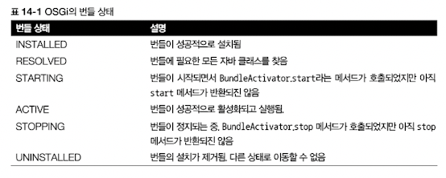

- 자바가 진화해야해서 모듈 시스템을 지원하기 시작함
- 모듈
    - 모듈 declarations, requires, exports 지시어
    - 기존 자바 아카이브(JAR)에 적용되는 자동 모듈, JDK 라이브러리
    - 모듈과 메이븐 빌드
    

# 14.1 압력 : 소프트웨어 유추

- 이런걸 왜 했니? 모듈화가 뭐니? 모듈 시스템은 어떤 문제를 해결하니?
- 궁극적으로 소프트웨어 아키텍처 (즉, 고수준에서는 기반 코드를 바꿔야 할 때) 유추하기 쉬우므로 생산성을 높일 수 있는 소프트웨어 프로젝트가 필요함

**⇒ 추론하기 쉬운 소프트웨어가 필요함**

## 14.1.1 관심사 분리

> 컴퓨터 프로그램을 고유의 기능으로 나누는 동작을 권장하는 원칙 (SoC, Separation of concerns)
>
- 클래스를 그룹화한 모듈을 이용해 애플리케이션의 클래스 간의 관계를 시작적으로 보여줄 수 있음
- 자바 패키지는 모듈성을 지원하지 않음
- 모델-뷰-컨트롤러 같은 아키텍처 관점 그리고 복구 기법을 비즈니스 로직과 분리하는 등의 하위 수준 접근 등의 상황에 유용함

장점

- 개별 기능을 따로 작업할 수 있으므로 팀이 쉽게 협업할 수 있다
- 개별 부분을 재사용하기 쉽다
- 전체 시스템을 쉽게 유지보수할 수 있다

## 14.1.2 정보 은닉

> 세부 구현을 숨기도록 장려하는 원칙
>
- 프로그램의 어떤 부분을 바꿨을 때 다른 부분까지 영향을 미칠 가능성을 줄일 수 있음
- **캡슐화**
    - 특정 코드 조각이 애플리케이션의 다른 부분과 고립되어 있음
    - 자바에서는 `private` 키워드를 기준으로 컴파일러를 이용해 캡슐화를 확인할 수 있음
- 자바9 이전까지는 클래스와 패키지가 의도된 대로 공개되었는지를 컴파일러로 확인할 수 있는 기능이 없었음


## 14.1.3 자바 소프트웨어

- 코드 자체를 보고 구조를 파악하기는 어려워서 UML다이어그램 같은 도구를 이용한다
    - 코드 간의 의존성 시각화
- 이전까지의 접근 제어는 접근제한자로 메서드, 필드 클래스의 접근을 제어했지만, 자바 애플리케이션이 커지면서 문제가 부각됨

# 14.2 자바 모듈 시스템을 설계한 이유

- 자바 언어와 컴파일러에 새로운 모듈 시스템이 추가된 이유
- 자바9 이전의 모듈화의 한계
- JDK 라이브러리와 관련된 배경지식

## 14.2.1 모듈화의 한계

- 자바의 코드 그룹화 수준
    1. 클래스 - 접근 제한자와 캡슐화 지원
    2. 패키지 - X
    3. JAR - X
- 다양한 클래스 그룹이 정의된 패키지들이 있는데 패키지의 가시성 제어 기능은 거의 유명무실
- `public`으로 선언하면 한 패키지의 인터페이스와 클래스가 다른 패키지로 공개되는데 “impl” 구현체 클래스에서 이런 문제가 두드러짐

**⇒ 기존의 애플리케이션을 망가뜨리지 않고 라이브러리 코드를 바꾸기 어려워짐**

- 자바는 태생적으로 번들 실행에 대해 약점이 있음
    - 클래스를 모두 컴파일 → 한개의 JAR 파일 생성 → 클래스 경로에 이 JAR 파일 추가 사용
    - JVM이 동적으로 클래스 경로에 정의된 클래스를 필요할 때 읽음

### 클래스 경로와 JAR 조합의 약점

1. 클래스 경로에 같은 클래스를 구분하는 버전 개념이 없음
    - 클래스 경로에 두 가지 버전의 같은 라이브러리가 존재하면…?
2. 클래스 경로는 명시적인 의존성을 지원하지 않음
    - 한 JAR가 다른 JAR에 포함된 클래스 집합을 사용하라고 명시적으로 의존성을 정의하는 기능을 제공하지 않음
    - 클래스 경로때매 어떤 일이 발생할지 모름

Maven이나 Gradle 같은 빌드 도구가 이런 문제 해결에 도움을 주긴함

명시적인 의존성 정의는 지원되지 않았음

**⇒ JAR 지옥, 클래스 경로 지옥**

**⇒ 자바9 모듈 시스템을 이용하면 컴파일 타임에 이런 종류의 에러를 모두 검출할 수 있음**

## 14.2.2 거대한 JDK

- JDK : 자바 개발 키트, 자바 프로그램을 만들고 실행하는 데 도움을 주는 도구의 집합
    - javac, java, JDK 라이브러리(입출력을 포함해 런타임 지원을 제공), 컬렉션, 스트림


>💡 **컴팩트 프로파일**
>- 관련 분야에 따라 JDK 라이브러리가 세 가지 프로파일로 나뉘어 각각 다른 메모리 풋프린트를 제공
>- 땜질식 처방이다!


- 자바 언어의 낮은 캡슐화 지원 때문에 내부 API가 외부에 공개됨 (ex. 스프링, 네티, 모키토..)

**⇒ 관련 API를 바꾸기 아주 어려워짐**

**⇒ JDK 자체도 모듈화할 수 있는 자바 모듈 시스템이 필요하다!**

**⇒ JDK에서 필요한 부분만 골라 사용하고 클래스 경로를 쉽게 유추할 수 있으며 플랫폼을 진화시킬 수 있는 강력한 캡술화!**

## 14.2.3 OSGi와 비교

- OSGi를 들어본 적 없는 독자는 스킵해도 된다
- 원래 있던 자바의 모듈 시스템
- OSGi 프레임워크 내에서만 실행됨



- 프로그램을 재시작하지 않고도 애플리케이션의 다른 하위 부분을 핫스왑할 수 있다는 점이 강점임

# 14.3 자바 모듈 : 큰 그림

- 모듈
    - 이름과 바디를 추가해서 정의함
    - 모듈 디스크립터는 `module-info.java`라는 특별한 파일에 저장됨


- 직소 퍼즐 형식 예제

  

    - exports - 돌출부 / requires - 패인 부분
    - `모듈A`는 `모듈B`와 `모듈C`를 필요로함
    - 이들은 패키지 `모듈B`와 `모듈C`를 이용해 각각 `pkgB`와 `pkgC`에 접근할 수 있음
    - `모듈C`는 비슷한 방법으로 `pkgD`를 사용하는데 `pkgD`는 `모듈C`에서 필요로 하지만 `모듈B`에서는 `pkgD`를 사용할 수 없음
- Maven 같은 빌드툴을 사용할 때 모듈의 많은 세부 사항을 IDE가 처리하며 사용자에게는 잘 드러나지 않음

# 14.4 자바 모듈 시스템으로 애플리케이션 개발하기

- 작은 모듈화 애플리케이션을 구조화하고, 패키지하고, 실행하는 방법을 배움

## 14.4.1 애플리케이션 셋업


## 14.4.2 세부적인 모듈화와 거친 모듈화

- 모듈화 할 때 모듈 크기를 결정해야함
    - 세부적인 모듈화 : 모든 패키지가 자신의 모듈을 갖는다 (이득에 비해 설계 비용이 증가함)
    - 거친 모듈화 : 한 모듈이 시스템의 모든 패키지를 포함함 (모듈화의 장점을 잃음)

## 14.4.3 자바 모듈 시스템 기초

- 메인 애플리케이션을 지원하는 한 개의 모듈만 갖는 기본적인 모듈화 애플리케이션부터 시작하자


- `module-info.java`
    - 모듈 디스크립터로 모듈의 소스 코드 파일 루트에 위치해야함
    - 모듈의 의존성 그리고 어떤 기능을 외부로 노출할지를 정의함
    - 아직 다른 모듈에 의존하거나 외부로 노출하는 기능이 없으므로 이름만 정의 되어있고 내용은 비어있음

    ```java
    module expenses.appliction{
    
    }
    ```


### 모듈화 애플리케이션 실행 명령어

1. 명령 실행

    ```
    javac module-info.java
         com/example/expenses/application/ExpensesApplication.java -d target
    
    jar cvfe expenses-application.jar
         com.example.expenses.application.ExpensesApplication -C target
    ```

2. 어떤 폴더와 클래스 파일이 생성된 JAR(`expenses-application.jar`)에 포함되어 있는지를 보여주는 결과 출력

    ```
    added manifest
    added module-info: module-info.class
    adding: com/(in = 0) (out= 0)(stored 0%)
    adding: com/example/(in = 0) (out= 0)(stored 0%)
    adding: com/example/expenses/(in = 0) (out= 0)(stored 0%)
    adding: com/example/expenses/application/(in = 0) (out= 0)(stored 0%)
    adding: com/example/expenses/application/ExpensesApplication.class(in = 456)
         (out= 306)(deflated 32%)
    ```

3. 생성된 JAR를 모듈화 애플리케이션으로 실행

    ```
    java --module-path expenses-application.jar \
         --module expenses/com.example.expenses.application.ExpensesApplication
    ```

- java 프로그램으로 자바 `.class` 파일을 실행할 때 다음과 같은 두 가지 옵션이 새로 추가됨
    - `—-module-path`
        - 어떤 모듈을 로드할 수 있는지 지정함
        - 클래스 파일을 지정하는 `—classpath` 인수와는 다름
    - `—-module`
        - 실행할 메인 모듈과 클래스를 지정함
- 모듈 정의는 버전 문자열을 포함하지 않음
- 대신 버전 문제는 빌드 도구나 컨테이너 애플리케이션에서 해결할 문제로 넘김

# 14.5 여러 모듈 활용하기

- 기능을 캡슐화한 `expense.reader`라는 새 모듈 생성
- `export.requeire`를 통해 `expenses.application`과 `expenses.readers` 두 모듈간 상호작용이 이뤄짐

## 14.5.1 exports 구문

- `exports` : 다른 모듈에서 사용할 수 있도록 특정 패키지를 공개 형식으로 만듦


- 기본적으로 모듈 내의 모든 것은 캡슐화됨
- 화이트 리스트 기법
    - 강력한 캡슐화를 제공하므로 다른 모듈에서 사용할 수 잇는 기능이 무엇인지 명시적으로 결정해야함
    - 이 접근법은 실수로 어떤 기능을 외부로 노출함으로 몇 년이 지난 뒤에 해커가 시스템을 남용할 여지를 방지함


## 14.5.2 requires 구분

- `requires` : 의존하고 있는 모듈을 지정함
    - 기본적으로 모든 모듈은 `java.base`라는 플랫폼 모듈에 의존함
    - 이 플랫폼 모듈은 `net`, `io`, `util` 등의 자바 메인 패키지를 포함함
    - `java.base`외의 모듈을 임포트할 때 `requires`를 사용함

```java
module expenses.readers{
	requires java.base; // 패키지명이 아니라 모듈명임
	
	exports com.example.expenses.readers;
	exports com.example.expenses.readers.file;
	exports com.example.expenses.readers.http; // 전부 모듈명이 아니라 패키지명임
}
```


## 14.5.3 이름 정하기

- 오라클은 패키지명처럼 인터넷 도메인명을 역순(ex. `com.iteratrlearning.training`)으로 모듈의 이름을 정하도록 권고함
- 모듈명은 노출된 주요 API 패키지와 이름이 같아야함
- 모듈이 패키지를 포함하지 않거나 어떤 다른 이유로 노출된 패키지 중 하나와 이름이 일치하지 않는 상황을 제외하면 모듈명은 작성자의 인터넷 도메인 명을 역순으로 시작해야함

# 14.6 컴파일과 패키징

프로젝트를 설정하고 모듈을 정의하는 방법을 이해했으므로 Maven 등의 빌드 도구를 이용해 프로젝트를 컴파일 할 수 있음

- `pom.xml` 추가
    - 각 모듈은 독립적으로 컴파일되므로 자체적으로 각각이 한 개의 프로젝트
    - 전체 구조

        ```
        |─ pom.xml
        |─ expenses.application
          |─ pom.xml
          |─ src
            |─ main
              |─ java
                |─ module-info.java
                |─ com
                  |─ example
                    |─ expenses
                      |─ application
                        |─ ExpensesApplication.java
        |─ expenses.readers
          |─ pom.xml
          |─ src
            |─ main
              |─ java
                |─ module-info.java
                |─ com
                  |─ example
                    |─ expenses
                      |─ readers
                        |─ Reader.java
                      |─ file
                        |─ FileReader.java
                      |─ http
                        |─ HttpReader.java
        ```

    - 총 3개의 `pom.xml`을 추가함
    - 모듈 디스크립터(`module-info.java`)는 `src/main/java` 디렉토리에 위치
- 올바른 모듈 소스 경로를 이용하도록 Maven이 javac를 설정함
- `expenses.readers` 프로젝트의 `pom.xml`

    ```xml
    <?xml version="1.0" encoding="UTF-8"?>
    <project xmlns="http://maven.apache.org/POM/4.0.0"
             xmlns:xsi="http://www.w3.org/2001/XMLSchema-instance"
             xsi:schemaLocation="http://maven.apache.org/POM/4.0.0
         http://maven.apache.org/xsd/maven-4.0.0.xsd">
        <modelVersion>4.0.0</modelVersion>
    
        <groupId>com.example</groupId>
        <artifactId>expenses.readers</artifactId>
        <version>1.0</version>
        <packaging>jar</packaging>
        <parent>
            <groupId>com.example</groupId>
            <artifactId>expenses</artifactId>
            <version>1.0</version>
        </parent>
    </project>
    ```

    - 순조롭게 빌드될 수 있도록 명시적으로 부모 모듈을 지정함
    - 부모는 ID `expenses`를 포함하는 부산물
    - `pom.xml` 에 부모를 정의해야함
- `expenses.application` 모듈의 `pom.xml`

    ```xml
    <?xml version="1.0" encoding="UTF-8"?>
    <project xmlns="http://maven.apache.org/POM/4.0.0"
             xmlns:xsi="http://www.w3.org/2001/XMLSchema-instance"
             xsi:schemaLocation="http://maven.apache.org/POM/4.0.0
         http://maven.apache.org/xsd/maven-4.0.0.xsd">
        <modelVersion>4.0.0</modelVersion>
    
        <groupId>com.example</groupId>
        <artifactId>expenses.application</artifactId>
        <version>1.0</version>
        <packaging>jar</packaging>
    
        <parent>
            <groupId>com.example</groupId>
            <artifactId>expenses</artifactId>
            <version>1.0</version>
        </parent>
    
        <dependencies>
            <dependency>
                    <groupId>com.example</groupId>
                    <artifactId>expenses.readers</artifactId>
                    <version>1.0</version>
            </dependency>
        </dependencies>
    
    </project>
    ```

    - 이전과 비슷하지만 `ExpenseApplication`이 필요로 하는 클래스와 인터페이스가 있으므로 `expenses.readers`를 의존성으로 추가해야함
- 빌드 과정을 가이드할 전역 `pom.xml` 설정

    ```xml
    <?xml version="1.0" encoding="UTF-8"?>
    <project xmlns="http://maven.apache.org/POM/4.0.0"
             xmlns:xsi="http://www.w3.org/2001/XMLSchema-instance"
             xsi:schemaLocation="http://maven.apache.org/POM/4.0.0
         http://maven.apache.org/xsd/maven-4.0.0.xsd">
        <modelVersion>4.0.0</modelVersion>
    
        <groupId>com.example</groupId>
        <artifactId>expenses</artifactId>
        <packaging>pom</packaging>
        <version>1.0</version>
    
        <modules>
        <module>expenses.application</module>
            <module>expenses.readers</module>
        </modules>
    
        <build>
            <pluginManagement>
                <plugins>
                <plugin>
                        <groupId>org.apache.maven.plugins</groupId>
                    <artifactId>maven-compiler-plugin</artifactId>
                        <version>3.7.0</version>
                    <configuration>
                            <source>9</source>
                            <target>9</target>
                    </configuration>
                </plugin>
                </plugins>
            </pluginManagement>
        </build>
    </project>
    ```

    - Maven은 특별한 xml 요소 `<module>`(자식의 부산물 ID를 참조)을 가진 여러 Maven 모듈을 가진 프로젝트를 지원함
    - 두 개의 자식 모듈 `expenses.applicaiton`와 `expenses.readers`를 참조하도록 완성함
- `mvn clean package` 명령을 실행해서 프로젝트의 모듈을 JAR로 만들 수 있음

    ```
    ./expenses.application/target/expenses.application-1.0.jar
    ./expenses.readers/target/expenses.readers-1.0.jar
    ```

- 두 JAR를 모듈 경로에 포함해서 모듈 애플리케이션을 실행할 수 있음

    ```
    java --module-path \
     ./expenses.application/target/expenses.application-1.0.jar:\
     ./expenses.readers/target/expenses.readers-1.0.jar \
        --module \
     expenses.application/com.example.expenses.application.ExpensesApplication
    ```

- 실세계에서는 `java.base` 대신 외부 모듈과 라이브러리를 참조해야함

# 14.7 자동 모듈

>💡 Maven 컴파일러 플러그인은 빌드 과정  
>`module-info.java`를 포함하는 프로젝트를 빌드할 때 모든 의존성 모듈을 경로에 놓아 적절한 JAR를 내려받고 이들이 프로젝트에 인식되도록 함


- 특정 라이브러리를 어떻게 프로젝트에 추가할 수 있을까?
- 의존성을 기술하도록 `pom.xml`도 갱신해야하므로 `requires` 구문으로 `expenses.readers` 프로젝트이 `module-info.java`에 구문을 추가한다고 해결되는 것이 아니다.
- `pom.xml`에 의존성 추가

    ```xml
    <dependencies>
        <dependency>
            <groupId>org.apache.httpcomponents</groupId>
            <artifactId>httpclient</artifactId>
            <version>4.5.3</version>
        </dependency>
    </dependencies>
    ```

- 자바는 JAR를 자동 모듈이라는 형태로 적절하게 변환함
    - 모듈 경로 상에 있으나 `module-info` 파일을 가지지 않은 모든 JAR는 자동 모듈이 됨
    - 자동 모듈은 암묵적으로 자신의 모든 패키지를 노출시킴
- jar 도구의 `—describe-module` 인수를 이용해 자동으로 정해지는 이름을 바꿀 수 있음

    ```
    jar --file=./expenses.readers/target/dependency/httpclient-4.5.3.jar \
        --describe-module
    httpclient@4.5.3 automatic
    ```

    - httpclient 라는 이름으로 정의됨
- 마지막으로 httpclient JAR를 모듈 경로에 추가한 다음 애플리케이션을 실행함

    ```
    java --module-path \
     ./expenses.application/target/expenses.application-1.0.jar:\
     ./expenses.readers/target/expenses.readers-1.0.jar \
     ./expenses.readers/target/dependency/httpclient-4.5.3.jar \
       --module \
     expenses.application/com.example.expenses.application.ExpensesApplication
    ```


> Maven에는 자바9 모듈 시스템을 더 잘 지원하는 프로젝트([https://github.com/moditect/moditect](https://github.com/moditect/moditect)%EA%B0%80)) 가 있다. 이 프로젝트는 `module-info` 파일을 자동으로 생성한다.
>

# 14.8 모듈 정의와 구문들

- 모듈 정의 언어에서 사용할 수 있는 몇 가지 키워드
- 모둘 정의에 어떤 내용을 넣을 수 있을까?

## 14.8.1 requires

- 컴파일 타임과 런타임에 한 모듈이 다른 모듈에 의존함을 정의
- 모듈명을 인수로 받음
- ex. `com.iteratrlearning.application`은 `com.iteratrlearning.ui` 모듈에 의존

    ```java
    module com.iteratrlearning.application {
        requires com.iteratrlearning.ui;
    }
    ```

    - `com.iteratrlearning.ui`에서 외부로 노출한 공개 형식을 `com.iteratrlearning.application`에서 사용 가능

## 14.8.2 exports

- 지정한 패키지를 다른 모듈에서 이용할 수 있도록 공개 형식으로 만듦
    - 아무도 패키지를 공개하지 않는 것이 기본 설정
    - 어떤 패키지를 공개할 것인지를 명시적으로 지정함 → 캡슐화 향상
- 패키지명을 인수로 받음
- ex. `com.iteratrlearning.ui.panels`와 `com.iteratrlearning.ui.widgets` 공개

    ```java
    module com.iteratrlearning.ui {
    	// 모듈명이 인수
    	requires com.iteratrlearning.core;
    	// 패키지명이 인수
    	exports com.iteratrlearning.ui.panels;
    	exports com.iteratrlearning.ui.widgets;
    }
    ```


## 14.8.3 requires transitive

- 다른 모듈이 제공하는 공개 형식을 한 모듈에서 사용할 수 있다고 지정할 수 있음
- ex. `com.iteratrlearning.ui` 모듈의 정의에서 `requires`를 `requires-transitivie`로 바꿀 수 있음
    - `com.iteratrlearning.application` 모듈은 `com.iteratrlearning.core`에서 노출한 공개 형식에 접근할 수 있음
    - 전이성 선언을 유용하게 사용

    ```java
    module com.iteratrlearning.ui {
        requires transitive com.iteratrlearning.core;
    
        exports com.iteratrlearning.ui.panels;
        exports com.iteratrlearning.ui.widgets;
    }
    
    module com.iteratrlearning.application {
        requires com.iteratrlearning.ui;
    }
    ```


## 14.8.4 exports to

- 사용자에게 공개할 기능을 제한함
    - 가시성을 정교하게 제어 가능
- ex. `com.iteratrlearning.ui.widgets`의 접근 권한을 가진 사용자의 권한을 `com.iteratrlearning.widgetuser` 로 제한할 수 있음

    ```java
    module com.iteratrlearning.ui {
        requires com.iteratrlearning.core;
    
        exports com.iteratrlearning.ui.panels;
        exports com.iteratrlearning.ui.widgets to
         com.iteratrlearning.ui.widgetuser;
    }
    ```


## 14.8.5 open과 opens

- 모듈 선언에 사용하면 모든 패키지를 다른 모듈에 반사적으로 접근을 허용할 수 있음
- 반사적인 접근 권한을 주는 것 외에는 모듈의 가시성에 영향을 미치지 않음

```java
open module com.iteratrlearning.ui {

}
```

- 자바9 이전에는 리플렉션으로 객체의 비공개 상태를 확인 가능 (진정한 캡슐화는 존재하지 않음)
- 하이버네이트 같은 객체 관계 매핑(ORM) 도구에서는 이런 기능을 이용해 상태를 직접 고치곤 함
- 리플렉션 때문에 전체 모듈을 개방하지 않고도 `opens` 구문을 모듈 선언에 이용해 필요한 개별 패키지만 개방 가능
- `open to`를 붙여서 반사적인 접근을 특정 모듈에만 허용할 수 있음

## 14.8.6 uses와 provides

- 자바 모듈 시스템은 `provides` 구문으로 서비스 제공자를 `uses` 구문으로 서비스 소비자를 지정할 수 있는 기능을 제공함
    - 서비스와 ServiceLoader
- 모듈과 서비스 로더를 합치는 기법을 알고자한다면 “The Java Module System”을 살펴봐라

# 14.9 더 큰 예제 그리고 더 배울 수 있는 방법

- 오라클 자바 문서의 예제

```java
module com.example.foo {
    requires com.example.foo.http;
    requires java.logging;

    requires transitive com.example.foo.network;

    exports com.example.foo.bar;
    exports com.example.foo.internal to com.example.foo.probe;

    opens com.example.foo.quux;
    opens com.example.foo.internal to com.example.foo.network,
                                      com.example.foo.probe;

    uses com.example.foo.spi.Intf;
    provides com.example.foo.spi.Intf with com.example.foo.Impl;
}
```

- 추가로 살펴볼 수 있는 내용
    - 서비스 로더, 추가 모듈 서술자문, jeps, jlink 같은 모듈 관련 도구
- 애플리케이션을 자바9로 이전할 때 EE(Enterprise Edition)와 관련한 여러 패키지가 모듈화된 자바9 가상 머신에서 기본적으로 로드되지 않음
- 호환성을 유지하려면 `—add-modules` 명령행을 통해 명시적으로 필요한 모듈을 추가해야함

# 14.10 마치며

- 관심사분리와 정보 은닉은 추론하기 쉬운 소프트웨어를 만드는 중요한 두 가지 원칙이다.
- 자바 9 이전에는 각각의 기능을 담당하는 패키지, 클래스, 인터페이스로 모듈화를 구현했는데 효과적인 캡슐화를 달성하기에는 역부족이었다.
- 클래스 경로 지옥 문제는 애플리케이션의 의존성을 추론하기 더욱 어렵게 만들었다.
- 자바 9 이전의 JDK는 거대했으며 높은 유지 비용과 진화를 방해하는 문제가 존재했다.
- 자바 9에서는 새로운 모듈 시스템을 제공하는데 `module-info.java` 파일은 모듈의 이름을 지정하며 필요한 의존성(requires)과 공개 API(exports)를 정의한다.
- `requires` 구문으로 필요한 다른 모듈을 정의할 수 있다.
- `exports` 구문으로 특정 패키지를 다른 모듈에서 사용할 수 있는 공개 형식으로 지정할 수 있다.
- 인터넷 도메인명을 역순으로 사용하는 것이 권장 모듈 이름 규칙이다.
- 모듈 경로에 포함된 JAR 중에 module-info 파일을 포함하는 않는 모든 JAR는 자동 모듈이 된다.
- 자동 모듈은 암묵적으로 모든 패키지를 공개한다.
- 메이븐은 자바 9 모듈 시스템으로 구조화된 애플리케이션을 지원한다.