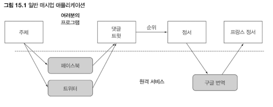

# Chapter 15 - CompletableFuture와 리액티브 프로그래밍 컨셉의 기초

---

### 최근 소프트웨어 개발의 추세

- 멀티코어 프로세서를 잘 써야한다
- MSA가 최근 몇 년 사이에 엄청 늘었다 → 네트워크 통신이 증가함 → 매시업 형태
- 다른 외부의 API를 가져다가 쓰는 일이 많아질 것이다



- 서비스 응답을 기다리면서 뭐하지? 비동기를 잘 활용하면 병렬로 처리할 수 있는게 많지 않을까?
    - 포크/조인 프레임워크
    - 병렬 스트림
- 동시성을 필요로 하는 상황이 있을 수 있음( = 항상 병렬성이 필요한건 아니다)
    - 조금씩 연관된 작업을 같은 CPU에서 동작하는 것
    - 코어를 바쁘게 유지하는 것

**⇒ 동시(Concurrency)라는 것은 어떻게 분배할 것인가**


# 15.1 동시성을 구현하는 자바 지원의 진화

- 초기 자바 : `Runnable`, `Thread`
- 자바5 : `ExecutorService`, `Callable<T>`, `Future<T>`
    - 표현력있는 동시성을 지원하며 스레드 실행과 테스크 제출을 분리함
- 이후 자바 : 개선된 동시성 지원 추가
    - 멀티코어 CPU 지원을 위함
    - 분할 정복 알고리즘의 포크/조인 지원 (`RecursiveTask`)
- 자바8 : 스트림, 람다 지원에 기반한 병렬 프로세서, `Future` 조합 기능 추가
- 자바9 : 분산 비동기 프로그래밍을 명시적으로 지원

⇒ 독립적인 테스크를 가능하게 하며, 멀티코어 또는 여러 기기를 통해 병렬성을 쉽게 이용함

## 15.1.1 스레드와 높은 수준의 추상화

- 프로세스 vs 스레드
- 프로세스는 운영체제에 한 개 이상의 스레드 즉, 본인이 가진 프로세스와 같은 주소 공간을 공유하는 프로세스를 요청함으로 태스크를 동시에 또는 협력적으로 실행 가능


- 멀티코어에서는 스레드의 도움 없이 프로그램이 노트북의 컴퓨팅 파워를 모두 활용할 수 없음
- 각 코어는 한 개 이상의 프로세스나 스레드에 할당될 수 있지만 프로그램이 스레드를 사용하지 않는다면 프로세서 코어 중 한 개만을 사용할 것
- 자바 스트림으로 내부 반복을 통해 병렬성 달성 가능

    ```java
    sum = Arrays.stream(stats).parallel().sum();
    ```


**⇒ 병렬 스트림 반복은 명시적으로 스레드를 사용하는 것에 비해 높은 수준의 개념**

(명시적으로 스레드를 사용 : 나눠서 실행한 다음에 루프 돌아서 sum 합치는 것)

**⇒ 스트림을 이용해 스레드 사용 패턴을 추상화할 수 있음**

## 15.1.2 Executor와 스레드 풀

- 추상화의 기반 개념
- 테스크 제출과 실행을 분리

### 스레드의 문제

- 자바 스레드는 직접 운영체제 스레드에 접근함
    - 근데 운영체제 스레드는 비용이 비쌈!
    - 운영체제 스레드는 그 숫자가 제한되어있음
- 최적의 자바 스레드 개수는 사용할 수 있는 하드웨어 코어의 개수에 따라 달라짐

### 스레드 풀 그리고 스레드 풀이 더 좋은 이유

```java
ExecutorService neewFixedThreadPool(int nThreads)

// 워크 스레드라 불리는 nThread를 포함하는 ExecutorService를 만들고 이를 스레드 풀에 저장함
// 스레드 풀에서 사용하지 않은 스레드로 제출된 태스크를 먼저 온 순서대로 실행
// 이들 테스크 실행이 종료되면 이들 스레드로 풀을 반환함
```

- 하드웨어에 맞는 수의 테스크를 유지함과 동시에 수 천개의 태스크를 스레드 풀에 아무 오버헤드 없이 제출할 수 있음
- 프로그래머가 **태스크(Runnable, Callable)**을 제공하면 **스레드**가 이를 실행함

### 스레드 풀 그리고 스레드 풀이 나쁜 이유

[스레드 풀](https://www.notion.so/ce2b00a0c1b84463b35f0e690765283d)

- 거의 모든 관점에서 스레드를 직접 사용하는 것보다 스레드 풀을 이용하는 것이 바람직
- 주의사항은 있음!
1. k 스레드를 가진 스레드 풀은 오직 k 만큼의 스레드를 동시에 실행할 수 있다
    1. 초과 제출된 태스크는 큐에 저장되며 이전 태스크 하나가 빌 때까지 스레드에 할당하지 않는다
    2. 네트워크 연결을 기다리는 태스크가 있다면 주의해야함
    3. 처음 제출한 테스크가 기존 실행 중인 테스크가 나중에 테스크 제출을 기다리는 상황이라면 데드락에 걸릴 수 있음
    4. 블록할 수 있는 테스크는 스레드 풀에 제출하지 말아야함

   

2. 프로그램을 종료하기 전에 모든 스레드 풀을 종료하는 습관을 가져야함
    1. 중요한 코드를 실행하는 스레드가 죽는 일이 발생하지 않도록 보통 자바 프로그램은 main이 반환하기 전에 모든 스레드의 작업이 끝나길 기다린다
    2. 풀의 워커 스레드가 만들어진 다음 다른 테스크 제출을 기다리면서 종료되지 않은 상태일 수 있음

## 15.1.3 스레드의 다른 추상화 : 중첩되지 않은 메서드 호출

- 엄격한 포크/조인
    - 한 개의 특별한 속성 즉, 테스크나 스레드가 메서드 호출 안에서 시작되면 그 메서드 호출은 반환하지 않고 작업이 끝나기를 기다림
    - 스레드 생성과 `join()`이 한 쌍 처럼 중첩된 메서드 호출 내에 추가됨

  

  


> **비동기 메서드**
: 메서드 호출자에 기능을 제공하도록 메서드가 반환된 후에도 만들어진 테스크 실행이 계속되는 메서드
>
- 여기 챕터에서는 사용자의 메서드 호출에 의해 스레드가 생성되고 메서드를 벗어나 계속 실행되는 동시성 형태에 초점을 맞춤

  

    - 스레드 실행은 메서드를 호출한 다음의 코드와 동시에 실행되므로 데이터 경쟁 문제를 일으키지 않도록 조심해야함
    - 기존 실행 중이던 스레드가 종료되지 않은 상황에서 자바의 `main()` 메서드가 반환하면 어떻게 될까?
        - 애플리케이션을 종료하지 못하고 모든 스레드가 실행을 끝낼 때까지 기다림
        - 애플리케이션 종료를 방해하는 스레드를 강제종료 시키고 애플리케이션을 종료함

      ⇒ 둘 다 Thread-safe 하지 못함

- 어플리케이션의 모든 스레드를 추적하고 종료하기 전에 스레드 풀을 포함한 모든 스레드를 종료하는 것이 좋음
- `setDemon()`
    - 데몬 또는 비데몬으로 구분
    - 데몬 스레드는 애플리케이션이 종료될 때 강제 종료 (디스크의 데이터 일관성을 파괴하지 않음)
    - 비데몬 스레드가 종료될 때까지 `main()`을 끝내지 않고 기다림

## 15.1.4 스레드에 무엇을 바라는가?

- 프로그램을 작은 테스크 단위로 구조화하는 것
- 모든 하드웨어 스레드를 활용해 병렬성의 장점을 극대화하도록 프로그램 구조를 만드는 것
- 앞으로는 스레드를 조작하는 복잡한 코드를 구현하지 않고 메서드를 호출하는 방법을 살펴볼 것임!

# 15.2 동기 API와 비동기 API

- 병렬성을 이용할 수 있는 두 가지 단계
1. 외부 반복(for 루프)를 내부 반복(스트림 메서드)로 변경
2. 스트림에 `parallel()` 메서드를 이용하여 자바 런타임 라이브러리가 복잡한 스레드 작업을 하지 않고 병렬로 요소가 처리될 수 있도록 함

```java
class ThreadExample {

    public static void main(String[] args) throws InterruptedException {
        int x = 1337;
        Result result = new Result();

        Thread t1 = new Thread(() -> { result.left = f(x); } );
        Thread t2 = new Thread(() -> { result.right = g(x); });
        t1.start();
        t2.start();
        t1.join();
        t2.join();
        System.out.println(result.left + result.right);
    }

    private static class Result {
        private int left;
        private int right;
    }
}
```

- future API로 단순화 할 수 있음

```java
public class ExecutorServiceExample {
    public static void main(String[] args)
        throws ExecutionException, InterruptedException {

        int x = 1337;

        ExecutorService executorService = Executors.newFixedThreadPool(2);
        Future<Integer> y = executorService.submit(() -> f(x));
        Future<Integer> z = executorService.submit(() -> g(x));
        System.out.println(y.get() + z.get());

        executorService.shutdown();
    }
}
```

- 그러나 아직 명시적인 `submit` 메서드 등 불필요한 코드가 있음

⇒ 비동기 API 기능으로 API를 변경하여 해결 가능

1. 자바의 Future
2. 발행-구독 프로토콜에 기반한 자바의 `java.util.concurrent.Flow` 인터페이스 이용

## 15.2.1 Future 형식 API

```java
// 시그니처 
Future<Integer> f(int x);
Future<Integer> g(int x);
```

```java
// 호출부 
Future<Integer> y = f(x);
Future<Integer> z = g(x);
System.out.println(y.get() + z.get());
```

- `메서드f`는 호출 즉시 자신이 원래 바디를 평가하는 테스크를 포함하는 `Future`를 반환
- 마지막에 `get`으로 합쳐지길 기다림
- `매서드g`를 유지하면서 `매서드f`에만 `Future`를 적용할 수 있지만 이렇게 하지는 않는다 ❌
    - 다른 상황에서는 `매서드g`에도 `Future` 형식이 필요할 수 있으므로 API 형식을 통일
    - 병렬 하드웨어로 프로그램 실행 속도를 극대화하려면 여러 작은 합리적인 크기의 테스크로 나누는 것이 좋음

## 15.2.2 리액티브 형식 API

- `메서드f`와 `메서드g`의 시그니처를 바꿔서 콜백 형식의 프로그래밍을 이용함

```java
// 시그니처 
void f(int x, IntConsumer dealWithResult);
```

- `매서드f`에 추가 인수로 콜백(람다)을 전달해서 `매서드f`의 바디에서는 return문으로 결과반환을 하는 것이 아니라 결과가 준비되면 이를 람다로 호출하는 태스크를 만듦

```java
// 호출 
public class CallbackStyleExample {
    public static void main(String[] args) {

        int x = 1337;
        Result result = new Result();

        f(x, (int y) -> {
            result.left = y;
            System.out.println((result.left + result.right));
        } );

        g(x, (int z) -> {
            result.right = z;
            System.out.println((result.left + result.right));
        });

    }
}
```

- 호출 합계를 정확히 출력하지 않고 상황에 따라 먼저 계산된 값을 출력함
- 락을 사용하지 않으므로 값을 두 번 출력할 수 있을 뿐더러 때로는 피연산자가 `println`이 호출되기 이전에 업데이트 됨
- 다음 방법으로 보완 가능
    1. `if-then-else`를 이용해 적절한 락을 이용해 두 콜백이 모두 호출되었는지 확인한 다음 `println`을 호출해 원하는 기능을 수행함
    2. 리액티브 형식의 API는 보통 한 결과가 아니라 일련의 이벤트에 반응하도록 설계되었으므로 `Future`를 이용하는 것이 더 적절함
- 리액티브 형식의 프로그래밍으로 `메서드f`와 `메서드g`는 `dealWithResult` 콜백을 여러 번 호출 가능 (원래는 한 번만 return 하도록 되어있었음)

**⇒ 리액티브 형식의 비동기 API는 자연스럽게 일련의 값(나중에 스트림으로 연결)을, Future 형식의 API는 일회성의 값을 처리하는 데 적합함**

- API는 명시적으로 스레드를 처리하는 코드에 비해 사용 코드를 더 단순하게 만들어주며 높은 수준의 구조를 유지할 수 있게 도와줌
    - 계산이 오래 걸리는 메서드 (수 밀리 초 이상)
    - 네트워크나 사람의 입력을 기다리는 메서드

## 15.2.3 잠자기(그리고 기타 블로킹 동작)는 해로운 것으로 간주

- 스레드는 잠들어도 여전히 시스템 자원을 점유함
- 스레드 풀에서 잠을 자는 테스크는 다른 테스크가 시작되지 못하게 막으므로 자원을 소비함 (운영 체제가 이들 테스크를 관리해서 일단 스레드로 할당된 태스크는 중지시키지 못함)
- 블록도 막음…
- 이상적으로는 절대 테스크에서 기다리는 일을 만들지 말거나 코드에서 예외를 일으킴
- 테스크를 앞과 뒤 두 부분으로 나누고 블록되지 않을 때만 뒷 부분을 자바가 스케쥴링하도록 요청할 수 있음

```java
work1();
Thread.sleep(10000); // 워커 스레드를 점유한 상태에서 10초 동안 아무것도 하지 않음
work2();
```

```java

public class ScheduledExecutorServiceExample {
    public static void main(String[] args) {
        ScheduledExecutorService scheduledExecutorService = Executors.newScheduledThreadPool(1);
        work1();
				// work1()이 끝난 다음 10초 뒤에 work2()를 개별 테스크로 스케쥴함
        scheduledExecutorService.schedule(ScheduledExecutorServiceExample::work2, 10, TimeUnit.SECONDS);
        scheduledExecutorService.shutdown();
    }

    public static void work1(){
        System.out.println("Hello from Work1!");
    }

    public static void work2(){
        System.out.println("Hello from Work2!");
    }
}
```

**⇒ 전자는 자는 동안 귀중한 스레드 자원을 점유하는 반면 후자는 다른 작업이 실행될 수 있도록 허용함**

⇒ 스레드를 사용할 필요 없이 메모리만 조금 더 사용함

- 테스크가 일단 실행되면 귀중한 자원을 점유하므로 테스크가 끝나서 자원을 해제하기 전까지는 테스크를 계속 실행해야함
- 블록하기 보다는 다음 작업을 테스크로 제출하고 현재 테스크는 종료하는 것이 바람직함

## 15.2.4 현실성 확인

- 모두 비동기로 설계한다면 병렬 하드웨어를 최대한 활용할 수 있음
- 다만 모든 API를 비동기로 만드는 것을 따지지 말고 개선된 동시성 API를 사용해보길 권장함

## 15.2.5 비동기 API에서 예외는 어떻게 처리하는가?

- 비동기 API에서 호출된 메서드의 실제 바디는 별도의 스레드에서 호출됨
- 이때 발생하는 에러는 이미 호출자의 실행 범위와 관계 없는 상황이 됨
- 예외에서 회복할 수 있도록 `exceptionally()` 같은 메소드 제공

```java
// 추가 콜백 
void f(int x, Consumer<Integer> dealWithResult,
              Consumer<Throwable> dealWithException);
// 수행
dealWithException(e);

// 여러개의 콜백을 하나의 객체로 감싸준다 
void    onComplete()
void    onError(Throwable throwable) // 도중에 에러 발생
void    onNext(T item) // 값이 있을때

// 추가 콜백을 Subscriber 객체로 감싼 시그니처 
void f(int x, Subscriber<Integer> s);
s.onError(t); // Throwable을 가리키는 t로 예외가 일어남
```

- 데이터 구조체가 아닌 “더 이상 처리할 데이터가 없어요" 알림을 만든다 → **이벤트**

# 15.3 박스와 채널 모델

- 병렬성을 직접 프로그래밍하는 관점을 콤비네이터를 이용해 내부적으로 작업을 처리하는 관점으로 바꿔줌
    - 자바8 스트림은 자료 구조를 반복해야하는 코드를 내부적으로 작업을 처리하는 스트림 콤비네이터로 바꿔줌


```java
int t = p(x);
System.out.println( r(q1(t), q2(t)) );
```

```java
// Future를 이용해 병렬로 평가 - q1, q2 만 future로 감싸줌 
int t = p(x);
Future<Integer> a1 = executorService.submit(() -> q1(t));
Future<Integer> a2 = executorService.submit(() -> q2(t));
System.out.println( r(a1.get(),a2.get()));

```

```java
// 원래 의도했던 작업 
System.out.println( r(q1(t), q2(t)) + s(x) );
```

- 시스템이 커지면 많은 태스크가 `get()` 메서드를 호출해놓고 `Future`가 끝나기를 기다리는 상태일 수 있음
- 박스와 채널 다이어그램은 콤비네이터로 코딩할 수 있다

```java
p.thenBoth(q1,q2).thenCombine(r)
```

⇒ 박스와 채널 모델을 이용해 생각과 코드를 구조화할 수 있음

- 대규모 시스템 구현의 추상화 수준을 높인다
- 박스(또는 프로그램의 콤비네이터)로 원하는 연산을 표현하면 손으로 코딩한 결과보다 효율적일 것
- 수학적 함수 뿐 아니라 `Future`와 리액티브 스트림 데이터에도 적용할 수 있음

# 15.4 CompletableFuture와 콤비네이터를 이용한 동시성

- 동시 코딩 작업을 `Future` 인터페이스로 생각하도록 유도한다는 점이 `Future` 인터페이스의 문제점
- 자바8에서는 `Future` 인터페이스의 구현인 `CompletableFuture`를 이용해 `Future`를 조합할 수 있는 기능을 추가함
- `CompleteFuture`는 실행할 코드 없이 `Future`를 만들 수 있도록 허용하며 `complete()` 메서드를 이용해 나중에 어떤 값을 이용해 다른 스레드가 이를 완료할 수 있고 `get()`으로 값을 얻을 수 있도록 허용함
- `f(x)`의 실행이 끝나지 않거나 `g(x)`의 실행이 끝나지 않으면 `get()`을 기다려야하므로 프로세싱 자원을 낭비할 수 있음 → `**CompletableFuture`를 이용하여 해결**

```java
// 시그니처 
CompletableFuture<V> thenCombine(CompletableFuture<U> other,
                                 BiFunction<T, U, V> fn)

// 실행
public class CFCombine {

    public static void main(String[] args) throws ExecutionException,
     InterruptedException {

        ExecutorService executorService = Executors.newFixedThreadPool(10);
        int x = 1337;

        CompletableFuture<Integer> a = new CompletableFuture<>();
        CompletableFuture<Integer> b = new CompletableFuture<>();
        CompletableFuture<Integer> c = a.thenCombine(b, (y, z)-> y + z); // 여기가 핵심!
        executorService.submit(() -> a.complete(f(x)));
        executorService.submit(() -> b.complete(g(x)));

        System.out.println(c.get());
        executorService.shutdown();

    }
}
```


- `CompletableFuture`와 콤비네이션을 이용해 `get()`에서 블록하지 않을 수 있고 그렇게 함으로 병렬 실행의 효율성을 높이고 데드락을 피하는 최상의 해결책 구현 가능

# 15.5 발행-구독 그리고 리액티브 프로그래밍


## 15.5.1 두 플로를 합치는 예제

```java
private class SimpleCell implements Publisher<Integer>, Subscriber<Integer> {
    private int value = 0;
    private String name;
    private List<Subscriber> subscribers = new ArrayList<>();

    public SimpleCell(String name) {
        this.name = name;
    }

    @Override
    public void subscribe(Subscriber<? super Integer> subscriber) {
        subscribers.add(subscriber);
    }

		// 새로운 값이 있음을 알리는 메서드
    private void notifyAllSubscribers() {
        subscribers.forEach(subscriber -> subscriber.onNext(this.value));
    }
		
		
    @Override
    public void onNext(Integer newValue) {
        this.value = newValue;// 구독한 셀에 새 값이 생겼을때 값을 갱신해서 반응함
        System.out.println(this.name + ":" + this.value);
        notifyAllSubscribers(); // 값이 갱신됨을 구독자들에게 알림
    }
}
```

```java
public class ArithmeticCell extends SimpleCell {

        private int left;
        private int right;

        public ArithmeticCell(String name) {
            super(name);
        }

        public void setLeft(int left) {
            this.left = left;
            onNext(left + this.right); // 셀 값을 갱신하고 모든 구독자들에게 알림
        }

        public void setRight(int right) {
            this.right = right;
            onNext(right + this.left);  // 셀 값을 갱신하고 모든 구독자들에게 알림
        }
    }
```

```java
ArithmeticCell c3 = new ArithmeticCell("C3");
SimpleCell c2 = new SimpleCell("C2");
SimpleCell c1 = new SimpleCell("C1");

c1.subscribe(c3::setLeft);
c2.subscribe(c3::setRight);

c1.onNext(10); // C1의 값을 10으로 갱신 
c2.onNext(20); // C2의 값을 20으로 갱신 
c1.onNext(15); // C1의 값을 15으로 갱신

// 출력 
C1:10
C3:10

C2:20
C3:30

C1:15
C3:35
```

## 15.5.2 역압력

```java
interface Subscription {
    void   cancel();
    void   request(long n);
}
```

## 15.5.3 실제 역압력의 간단한 형태

# 15.6 리액티브 시스템 vs 리액티브 프로그래밍

> **리액티브 시스템**
: 런타임 환경이 변화에 대응하도록 전체 아키텍처가 설계된 프로그램
>

> **리액티브 프로그래밍**
: 아래의 속성들을 구현함
: java.util.concurrent.Flow 관련 자바 인터페이스에서 제공
>
- 리액티브 시스템 공식 속성
    - 반응성 : 리액티브 시스템이 큰 작업을 처리하느라 간단한 질의의 응답을 지원하지 않고 실시간으로 입력에 반응함
    - 회복성 : 한 컴포넌트의 실패로 전체 시스템이 실패하지 않음
    - 탄력성 : 시스템이 자신의 작업 부하에 맞게 적응하며 작업을 효율적으로 처리함
    - 메시지 주도

# 15.7 마치며

- 16장에서는 자바 예시로 CompletableFuture API
- 17장에서는 플로(발행-구독) API

