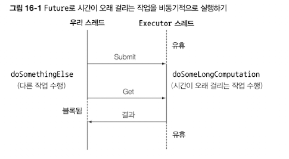

# 16.1 Future의 단순 활용

- 비동기 계산을 이용하는 데 Future 활용
- 호출자 스레드가 결과를 기다리는 동안 다른 작업 수행
- 저수준의 스레드에 비해 직관적으로 이해하기 쉬움

```java
// 스레드 풀에 테스크를 제출하려면 ExecutorService를 만들어야함
ExecutorService executor = Executors.newCachedThreadPool();
Future<Double> future = executor.submit(new Callable<Double>() { // Callable을 ExecutorService로 제출함
        public Double call() {
            return doSomeLongComputation(); // 시간이 오래 걸리는 작업은 다른 스레드에서 비동기적으로 실행
        }});
doSomethingElse(); // 비동기 작업을 수행하는 동안 다른 작업을 함
try {
		// 비동기 작업의 결과를 가져온다. 결과가 준비되어 있지 않으면, 호출 스레드가 블록된다.
		// 하지만 최대 1초까지 기다린다
    Double result = future.get(1, TimeUnit.SECONDS);
} catch (ExecutionException ee) {
    // 계산 중 예외 발생
} catch (InterruptedException ie) {
    // 현재 스레드에서 대기 중 인터럽트 발생
} catch (TimeoutException te) {
    // Future가 완료되기 전에 타임아웃 발생
}
```



- `get` 메서드를 오버로드해서 우리 스레드가 대기할 최대 타임아웃 시간을 정해주는 것이 좋음

## 16.1.1 Future 제한

- 여러 Future의 결과가 있을 때 이들의 의존성을 표현하기 어려움
- 선언형 기능이 있다면 유용할 것
    - 두 개의 비동기 계산 결과를 하나로 합친다. 두 가지 계산 결과는 서로 독립적일 수 있으며 또는 두 번째 결과가 첫 번째 결과에 의존하는 상황일 수 있음
    - Future 집합이 실행하는 모든 태스크의 완료를 기다림
    - Future 집합에서 가장 빨리 완료되는 태스크를 기다렸다가 결과를 얻는다 (예를 들어, 여러 태스크가 다양한 방식으로 같은 결과를 구하는 상황)
    - 프로그램적으로 Future를 완료시킨다 (즉, 비동기 동작에 수동으로 결과 제공)
    - Future 완료 동작에 반응한다 (즉, 결과를 기다리면서 블록되지 않고 결과가 준비되었다는 알림을 받은 다음에 Future의 결과로 원하는 추가 동작을 수행할 수 있음)

⇒ CompletableFuture 클래스

> Future - Completable
Collection - Stream
>

## 16.1.2 CompletableFuture로 비동기 애플리케이션 만들기

- 여러 온라인 상점중 가장 저렴한 가격을 제시하는 상점을 찾는 애플리케이션
1. 고객에게 비동기 API를 제공하는 방법을 배움
2. 동기 API를 사용해야할 때 코드를 비블록으로 반드는 방법을 배움
    1. 두 개의 비동기 동작을 파이프라인으로 만듦
    2. 두 개의 동작 결과를 하나의 비동기 계산으로 합침
3. 비동기 동작의 완료에 대응하는 방법을 배움
    1. ex) 모든 상점에서 가격 정보를 기다리는 것이 아니라 즉시 최저가격을 찾는 애플리케이션을 갱신

> 동기 API와 비동기 API
> - 동기 API **⇒ 블록 호출**  
>  : 메서드를 호출한 다음에 메서드가 계산을 완료할 때까지 기다렸다가 메서드가 반환되면 호출자는 반환된 값으로 계속 다른 동작을 수행  
> - 비동기 API **⇒ 비블록 호출**  
>  : 메서드가 즉시 반환되며 끝내지 못한 나머지 작업을 호출자 스레드와 동기적으로 실행될 수 있도록 다른 스레드에 할당함  
>  : 할당된 다른 메서드의 계산 결과는 콜백 메서드를 호출해서 전달하거나 호출자가 ‘기다림' 메서드를 추가로 호출하여 전달 가능
>

# 16.2 비동기 API 구현

- 1초 지연을 위한 메서드

```java
public static void delay() {
    try {
        Thread.sleep(1000L);
    } catch (InterruptedException e) {
        throw new RuntimeException(e);
    }
}
```

- getPrice 메서드 지연

```java
public double getPrice(String product) {
    return calculatePrice(product);
}

private double calculatePrice(String product) {
    delay();
    return random.nextDouble() * product.charAt(0) + product.charAt(1);
}
```

사용자가 이 API를 호출하면 비동기 동작이 완료될 때까지 1초 동안 블록됨

⇒ 비동기 API가 더 효율적

## 16.2.1 동시 메서드를 비동기 메서드로 변환

```java
public Future<Double> getPriceAsync(String product) {
		// 계산 결과를 포함할 CompletableFuture를 생성함
    CompletableFuture<Double> futurePrice = new CompletableFuture<>();
    new Thread( () -> {
                double price = calculatePrice(product); // 다른 스레드에서 비동기적으로 계산을 수행함
                futurePrice.complete(price); // 오랜 시간이 걸리는 계산이 완료되면 Future에 값을 설정
    }).start();

		// 계산 결과라 완료되길 기다리지 않고 Future를 반환함
    return futurePrice;
}
```

```java
Shop shop = new Shop("BestShop");
long start = System.nanoTime();

// 상점에 제품가격 정보 요청
Future<Double> futurePrice = shop.getPriceAsync("my favorite product");
long invocationTime = ((System.nanoTime() - start) / 1_000_000);
System.out.println("Invocation returned after " + invocationTime + " msecs");

// 제품의 가격을 계산하는 동안
doSomethingElse();

// 다른 상점 검색 등 다른 작업 수행
try {
    double price = futurePrice.get(); // 가격 정보가 있으면 Future에서 가격 정보를 읽고, 없으면 받을 때까지 블록함
    System.out.printf("Price is %.2f%n", price);
} catch (Exception e) {
    throw new RuntimeException(e);
}
long retrievalTime = ((System.nanoTime() - start) / 1_000_000);
System.out.println("Price returned after " + retrievalTime + " msecs");
```

## 16.2.2 에러 처리 방법

- 예외가 발생하면 해당 스레드에만 영향을 미친다
- 에러가 발생해도 가격 계산은 계속 진행되며 일의 순서가 꼬인다

⇒ 타임아웃 값을 받는 get 메서드의 오버로드 버전을 만들어 문제 해결

⇒ `CompletableFuture` 내부에서 발생한 예외를 클라이언트에 전달해야함

```java
public Future<Double> getPriceAsync(String product) {
    CompletableFuture<Double> futurePrice = new CompletableFuture<>();
    new Thread( () -> {
        try {
            double price = calculatePrice(product);
						// 계산이 정상적으로 종료되면 Future에 가격 정보를 저장한 채로 Future를 종료함
            futurePrice.complete(price);
        } catch (Exception ex) {
						// 도중에 문제가 발생하면 발생한 에러를 포함시켜 Future를 종료함
            futurePrice.completeExceptionally(ex);
        }
    }).start();
    return futurePrice;
}
```

### 팩토리 메서드 supplyAsync로 CompletableFuture 만들기

```java
public Future<Double> getPriceAsync(String product) {
    return CompletableFuture.supplyAsync(() -> calculatePrice(product));
}
```

- `Supplier`를 인수로 받아서 `CompletableFuture`를 반환함
- 두 번째 인수를 받는 오버로드 버전의 `supplyAsync` 메서드를 이용해서 다른 `Executor`를 지정할 수 있음
- 비동기적으로 여러 상점에 질의, 한 요청의 응답을 기다리며 블록하는 상황을 피해 검색 애플리케이션의 성능 향상

# 16.3 비블록 코드 만들기

- 모든 상점에 순차적으로 정보를 요청하는 findPrices

```java
public List<String> findPrices(String product) {
    return shops.stream()
       .map(shop -> String.format("%s price is %.2f",
                                  shop.getName(), shop.getPrice(product)))
       .collect(toList());
}
```

## 16.3.1 병렬 스트림으로 요청 병렬화하기

```java
public List<String> findPrices(String product) {
    return shops.parallelStream()
       .map(shop -> String.format("%s price is %.2f",
                                  shop.getName(), shop.getPrice(product)))
       .collect(toList());
}
```

## 16.3.2 CompletableFuture로 비동기 호출 구현하기

```java
List<CompletableFuture<String>> priceFutures =
        shops.stream()
        .map(shop -> CompletableFuture.supplyAsync(
             () -> String.format("%s price is %.2f",
             shop.getName(), shop.getPrice(product))))
        .collect(toList());
```

- CompletableFuture의 `join` - Future 인터페이스의 `get`
- `join`은 아무 예외도 발생시키지 않음

```java
public List<String> findPrices(String product) {
    List<CompletableFuture<String>> priceFutures =
            shops.stream()
            .map(shop -> CompletableFuture.supplyAsync( // CompletableFuture로 각각의 가격을 비동기적으로 계산함
                         () -> shop.getName() + " price is " +
                               shop.getPrice(product)))
            .collect(Collectors.toList());
    return priceFutures.stream()
            .map(CompletableFuture::join) // 모든 비동기 동작이 끝나길 기다림
            .collect(toList());
}
```


⇒ 뭔가 많이 했는데 병렬 스트림보다 느림..!

## 16.3.3 더 확장성이 좋은 해결 방법

- 네 개의 상점에 하나의 스레드를 할당해서 네 개의 작업을 병렬로 수행
- 병렬 스트림 버전에서는 네 개의 모든 스레드가 사용되었고 하나가 끝나야 다섯 번째가 가능함
- `CompletableFuture`는 병렬 스트림 버전에 비해 작업에 이용할 수 있는 다양한 `Executor`를 지정할 수 있음

⇒ 스레드 풀의 크기를 조절하는 등 최적화된 설정을 만들 수 있음

## 16.3.4 커스텀 Executor 사용하기

> **스레드 풀 크기 조절**
> - 스레드 풀은 너무 커서도 안되고 너무 작아서도 안됨
>
> - 딱 작업할 상점 수 만큼의 스레드를 갖도록 `Executor`를 설정함

```java
private final Executor executor =
    Executors.newFixedThreadPool(Math.min(shops.size(), 100),
                                 (Runnable r) -> {
            Thread t = new Thread(r);
            t.setDaemon(true); // 프로그램 종료를 방해하지 않는 데몬 스레드를 사용함
            return t;
        }
);
```

**⇒ 애플리케이션의 특성에 맞는 Executor를 만들어 CompletableFuture를 활용하는 것이 바람직함**

> **스트림 병렬화와 CompletableFuture 병렬화**
> 1. 병렬 스트림으로 변환해서 컬렉션 처리
> 2. 하나의 컬렉션을 반복하면서 `CompletableFuture` 내부의 연산으로 만듦 (스레드 풀 크기 조절 가능)
>
> 상황에 따라 선택할 병렬화 기법이 달라짐
> - I/O가 포함되지 않았다면 스트림이 가장 간단
> - I/O를 기다리는 작업을 병렬로 수행하면 `CompletableFuture`가 더 많은 유연성 제공
>

# 16.4 비동기 작업 파이프라인 만들기

```java
public String getPrice(String product) {
    double price = calculatePrice(product);
    Discount.Code code = Discount.Code.values()[
                            random.nextInt(Discount.Code.values().length)];
    return String.format("%s:%.2f:%s", name, price, code);
}

private double calculatePrice(String product) {
    delay();
    return random.nextDouble() * product.charAt(0) + product.charAt(1);
}
```

## 16.4.1 할인 서비스 구현

- Discount 서비스
- Quote 객체
- 할인된 문자열을 반환하는 applyDiscount 메서드

## 16.4.2 할인 서비스 사용

```java
public List<String> findPrices(String product) {
    return shops.stream()
            .map(shop -> shop.getPrice(product)) // 각 상점에서 할인 전 가격 얻기
            .map(Quote::parse) // 상점에서 반환한 문자열을 Quote 객체로 변환
            .map(Discount::applyDiscount) // Discount 서비스를 이용해서 각 Quote에 할인 적용
            .collect(toList());
}
```

- 병렬 스트림에서는 스트림이 사용하는 스레드 풀의 크기가 고정되어 있어서 상점 수가 늘어났을 때처럼 검색 대상이 확장되었을 때 유연하게 대응할 수 없음
- 커스텀 Executor를 정의하므로서 CPU 사용을 극대화함

## 16.4.3 동기 작업과 비동기 작업 조합하기

```java
public List<String> findPrices(String product) {
    List<CompletableFuture<String>> priceFutures =
        shops.stream()
             .map(shop -> CompletableFuture.supplyAsync(
                                   () -> shop.getPrice(product), executor))
             .map(future -> future.thenApply(Quote::parse))
             .map(future -> future.thenCompose(quote ->
                         CompletableFuture.supplyAsync(
                           () -> Discount.applyDiscount(quote), executor)))
                .collect(toList());
    return priceFutures.stream()
            .map(CompletableFuture::join)
            .collect(toList());
}
```


1. 가격 정보 얻기
2. Quote 파싱하기
3. CompletableFuture를 조합해서 할인된 가격 계산하기
    1. 상점에서 가격 정보를 얻어와서 Quote로 변환
    2. 변환된 Quote를 Discount 서비스로 전달해서 할인된 최종가격 획득하기
- 자바8의 CompletableFutre API는 두 비동기 연산을 파이프라인으로 만들 수 있도록 `theCompose` 메서드를 제공함

## 16.4.4 독립 CompletableFuture와 비독립 CompletableFuture 합치기

```java
Future<Double> futurePriceInUSD =
  CompletableFuture.supplyAsync(() -> shop.getPrice(product))
  .thenCombine(
      CompletableFuture.supplyAsync(
          () ->  exchangeService.getRate(Money.EUR, Money.USD)),
      (price, rate) -> price * rate
  ));
```


## 16.4.5 Future의 리플렉션과 CompletableFuture의 리플렉션

```java
// 테스크를 스레드 풀에 제출할 수 있도록 ExecutorService를 생성함
ExecutorService executor = Executors.newCachedThreadPool();

final Future<Double> futureRate = executor.submit(new Callable<Double>() {
        public Double call() {
            return exchangeService.getRate(Money.EUR, Money.USD);
        }});

Future<Double> futurePriceInUSD = executor.submit(new Callable<Double>() {
        public Double call() {
            double priceInEUR = shop.getPrice(product);
            return priceInEUR * futureRate.get();
        }});
```

## 16.4.6 타임아웃 효과적으로 사용하기

- `CompletableFuture`에 타임아웃 추가

```java
Future<Double> futurePriceInUSD =
		CompletableFuture.supplyAsync(() -> shop.getPrice(product))
		.thenCombine(
		    CompletableFuture.supplyAsync(
		        () ->  exchangeService.getRate(Money.EUR, Money.USD)),
		    (price, rate) -> price * rate
		))
		.orTimeout(3, TimeUnit.SECONDS);
```

- CompletableFuture에 타임아웃이 발생하면 기본값으로 처리

```java
Future<Double> futurePriceInUSD =
        CompletableFuture.supplyAsync(() -> shop.getPrice(product))
        .thenCombine(
            CompletableFuture.supplyAsync(
                () ->  exchangeService.getRate(Money.EUR, Money.USD))
              .completeOnTimeout(DEFAULT_RATE, 1, TimeUnit.SECONDS),
            (price, rate) -> price * rate
        ))
        .orTimeout(3, TimeUnit.SECONDS);
```

# 16.5 CompletableFuture의 종료에 대응하는 방법

## 16.5.1 최저가격 검색 애플리케이션 리팩터링

- Future 스트림을 반환하도록 findPrices 메서드 리팩터링하기

```java
public Stream<CompletableFuture<String>> findPricesStream(String product) {
    return shops.stream()
             .map(shop -> CompletableFuture.supplyAsync(
                                   () -> shop.getPrice(product), executor))
             .map(future -> future.thenApply(Quote::parse))
             .map(future -> future.thenCompose(quote ->
                      CompletableFuture.supplyAsync(
                          () -> Discount.applyDiscount(quote), executor)));
}
```

- CompletableFuture 종료에 반응하기

```java
CompletableFuture[] futures = findPricesStream("myPhone")
        .map(f -> f.thenAccept(System.out::println))
        .toArray(size -> new CompletableFuture[size]);
CompletableFuture.allOf(futures).join();
```

## 16.5.2 응용

```java
long start = System.nanoTime();
CompletableFuture[] futures = findPricesStream("myPhone27S")
        .map(f -> f.thenAccept(
             s -> System.out.println(s + " (done in " +
                  ((System.nanoTime() - start) / 1_000_000) + " msecs)")))
        .toArray(size -> new CompletableFuture[size]);
CompletableFuture.allOf(futures).join();
System.out.println("All shops have now responded in "
                   + ((System.nanoTime() - start) / 1_000_000) + " msecs");
```

# 16.6 로드맵

- 17장에서는 `CompletableFuture`의 기능이 한 번에 종료되지 않고 일련의 값을 생산
- 자바9 플로 API

# 16.7 마치며

- 한 개 이상의 원격 외부 서비스를 사용하는 긴 동작을 실행할 때는 비동기 방식으로 애플리케이션의 성능과 반응성을 향상시킬 수 있다
- 우리 고객에게 비동기 API를 제공하는 것을 고려해야한다. CompletableFuture의 기능을 이용하면 쉽게 비동기 API를 구현할 수 있다
- CompletableFuture를 이용할 때 비동기 태스크에서 발생한 에러를 관리하고 전달할 수 있다.
- 동기 API를 CompletableFuture로 감싸서 비동기적으로 소비할 수 있다
- 서로 독립적인 비동기 동작이든 아니면 하나의 비동기 동작이 다른 비동기 동작의 결과에 의존하는 상황이든 여러 비동기 동작을 조립하고 조합할 수 있다
- CompletableFuture에 콜백을 등록해서 Future가 동작을 끝내고 결과를 생상했을 때 어떤 코드를 실행하도록 지정할 수 있다
- CompletableFuture 리스트의 모든 값이 완료될 때까지 기다릴지 아니면 첫 값만 완료되길 기다릴지 선택할 수 있다
- 자바 9에서는 `orTimeout`, `completeOnTimeout` 메서드로 CompletableFuture에 비동기 타임아웃 기능을 추가했다