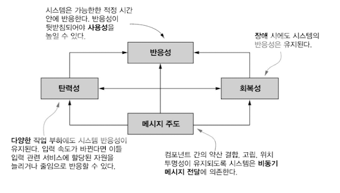

> - 리액티브 프로그래밍을 정의하고 리액티브 매니패스토를 확인함
>- 애플리케이션 수준, 시스템 수준의 리액티브 프로그래밍
>- 리액티브 스트림, 자바 9 플로 API를 사용한 예제 코드
>- 널리 사용되는 리액티브 라이브러리 RXJava 소개
>- 여러 리액티브 스트림을 변환하고 합치는 RXJava 동작 살펴보기
>- 리액티브 스트림의 동작을 시각적으로 문서화하는 마블 다이어그램
>

### 리액티브 프로그래밍 패러다임이 중요한 3가지 이유

1. 빅데이터 : 보통 빅데이터는 페타바이트 단위이며 매일 증가함
2. 다양한 환경 : 모바일 디바이스 ~ 클라우드 클러스터
3. 사용패턴 : 1년 내내 무중단 밀리 세컨 단위의 응답시간

⇒ 이전 아키텍처로는 이를 만족시킬 수 없음

**⇒ 리액티브 프로그래밍에서는 다양한 시스템과 소스에서 들어오는 데이터 항목 스트림을 비동기적으로 처리하여 문제를 해결**

- 여러 컴포넌트에도 리액티브 기법을 적용함
    - 고장, 정전 같은 상태에 대처
    - 다양한 네트워크 상태에서 메시지를 교환하고 전달함
    - 무거운 작업에서도 가용성 제공
- 컴포넌트 자체가 애플리케이션인 상황이 많음

> **💡 근데 리액티브가 뭐야?**
>- 변화의 전파와 데이터 흐름과 관련된 선언적 프로그래밍 패러다임
>- 프로그래밍 언어로 정적 또는 동적인 데이터 흐름을 쉽게 표현할 수 있어야하며, 데이터 흐름을 통해 하부 실행 모델이 자동으로 변화를 전파할 수 있는 것을 의미
>


# 17.1 리액티브 매니패스토

> **💡 매니패스토는 또 뭐야**  
>- 개인이나 단체가 대중에 대하여 확고한 정치적 의도와 견해를 밝히는 것으로 연설이나 문서의 형태
>- 종종 비정치적인 분야에서도 자신의 주장과 견해를 분명히 밝히는 때에도 사용
>  (출처 : 위키피디아)
>



### 리액티브 애플리케이션과 시스템 개발의 핵심 원칙

- 반응성 (Responsive) : 사용자의 기대에 부응하는 빠른 반응
- 회복성 (Resilient) : 장애가 발생해도 비동기 작업(컴포넌트의 시간, 공간 분리)이 정상적으로 완료됨
- 탄력성 (Elastic) : 작업 부하가 발생하면 관련 컴포넌트에 할당된 자원 수를 늘림
- 메시지 주도 (Message-drive) : 비동기 메시지를 통해 컴포넌트끼리 통신함 ← 회복성 + 탄력성
    - 회복성 : 장애를 메시지로 처리
    - 탄력성 : 주고 받은 메시지의 수를 감시하고 메시지의 양에 따라 적절하게 리소스 할당

## 17.1.1 애플리케이션 수준의 리액티브

- 비동기로 작업 수행 가능
- 이벤트 스트림을 블록하지 않고 비동기로 처리하는 것이 최신 멀티코어 CPU의 사용률을 극대화함
- 리액티브 프레임워크와 라이브러리는 스레드를 퓨처, 액터, 일련의 콜백을 발생시키는 이벤트 루트와 공유하고 처리할 이벤트를 변환, 관리함

> 이벤트, 메시지, 시그널, 이벤트 루프, 발행-구독, 리스너, 역압력은 15장 도입부 참고
>
- 스레드보다 가볍고 비동기 애플리케이션 구현의 추상 수준을 높일 수 있음

⇒ 동기 블록, 경쟁 조건, 데드락 같은 멀티스레드 문제를 개발자가 직접 처리할 필요가 없어짐

### 메인 이벤트 루프 안에서는 절대 동작을 블록하지 않아야 한다는 전제 조건

- 두 스레드를 포함하는 풀이 있고 이벤트 스트림 3개를 처리중임
- 한 번에 오직 2개의 스트림 처리 가능 → 효율적으로 공유해야함
- 느린 I/O 작업이 발생해버림!

  


⇒ 블록 동작 때문에 스레드가 다른 동작을 수행하지 못하고 낭비됨

- `RxJava`, `Akka` 같은 리액티브 프레임워크는 별도 지정된 스레드 풀에서 블록 동작을 실행하여 문제 해결

⇒ 메인 풀의 모든 스레드는 방해받지 않음

⇒ CPU 관련 작업과 I/O 작업을 분리하면 조금 더 정밀하게 풀의 크기를 설정 가능 (다만 개발자가 어떤 관련 작업인지 적절하게 선택해야함)

## 17.1.2 시스템 수준의 리액티브

- 리액티브 시스템은 여러 애플리케이션이 한 개의 일관적인, 회복 가능한 플랫폼을 구성할 수 있게 함
- 애플리케이션 중 하나가 실패해도 전체 시스템은 운영될 수 있도록 하는 소프트웨어 아키텍처
- 리액티브 애플리케이션 vs 시스템
    - *리액티브 애플리케이션 :* 비교적 짧은 시간동안 유지되는 데이터 스트림에 기반한 연산을 수행하며 주로 이벤트 주도로 분류함
        - 이벤트 - 관련 이벤트를 관찰하도록 등록한 컴포넌트가 수신함
        - 시간에 기반한 비동기, 동시적, 비결합
    - *리액티브 시스템 :* 애플리케이션을 조립하고 상호소통을 조절하며 주로 메시지 주도로 분류함
        - 메시지 - 정의된 목적지 하나
        - 위치 투명성을 통한 공간적 비결합할 수 있음
- 리액티브 시스템에서는 수신자와 발신자가 각각 수신 메시지, 발신 메시지와 결합하지 않도록 메시지를 비동기로 처리함
- 각 컴포넌트를 완전히 고립해야 회복성과 탄력성 유지 가능
    - 장애 고립 → 컴포넌트 전파를 막음 → 회복성 제공 (결함 허용 능력)
    - 위치 투명성 → 시스템 복제 → 작업 부하에 따른 애플리케이션 확장 → 탄력성 제공
        - 위치 투명성 : 리액티브 시스템의 모든 컴포넌트가 수신자의 위치에 상관없이 다른 모든 서비스와 통신할 수 있음
        - 위치를 따지지 않는 확장성
- 자바 9의 플로 API를 통해 리액티브 프로그래밍 예제 적용

# 17.2 리액티브 스트림과 플로 API

- 리액티브 프로그래밍 : 리액티브 스트림을 사용하는 프로그래밍
- 리액티브 스트림 : 잠재적으로 무한의 비동기 데이터를 순서대로 그리고 블록하지 않는 **역압력**을 전제해 처리하는 표준 기술
- 역압력 : 발행-구독 프로토콜에서 이벤트 스트림의 구독자가 발행자가 이벤트를 제공하는 속도보다 느린 속도로 이벤트를 소비하면서 문제가 발생하지 않도록 보장하는 장치
- 컴포넌트에 부하가 발생하면, 부하가 발생한 컴포넌트는 업스트림 발행자에게 발생속도를 늦추라고 하거나, 처리하는데 얼마나 걸릴지 알려줘야한다
- 스트림 처리의 비동기 특성상 역압력 기능 내장은 필수! (암묵적으로 블록 API로 역압력 제공중이었음)

**⇒ 역압력이나 제어 흐름 기법이 필요함**

⇒ 데이터 수신자가 스레드를 블록하지 않고도 데이터 수신자가 처리할 수 없을 만큼 많은 데이터를 받는 일을 방지하는 프로토콜을 제공함

### 리액티브 스트림 프로젝트

- 리액티브 스트림 구현이 제공해야하는 최소 기능 집합
    1. Publisher
    2. Subscriber
    3. Subscription
    4. Processor
- java.util.concurrent.Flow(자바9), Akka 스트림(라이트벤드), 리액터(피보탈), RxJava(넷플릭스), Vert.x(레드햇) 에서 제공함

## 17.2.1 Flow 클래스 소개

- java.util.concurrent.Flow
- 정적 컴포넌트 하나를 포함하고 있으며 인스턴스화 할 수 없음
- 리액티브 스트림 프로젝트의 표준을 따르며 프로그래밍 발행-구독 모델 지원


1. Publisher
    1. 항목 발행
    2. 자바의 함수형 인터페이스 (한 개의 추상 메서드로만 정의)
    3. 역압력 기법에 의해 이벤트 제공 속도가 제한됨
    4. `Flow.Publisher` 인터페이스

    ```java
    @FunctionalInterface
    public interface Publisher<T> {
      void subscribe(Subscriber<? super T> s);
    }
    ```

2. Subscriber
    1. 한 개씩 또는 한 번에 여러 항목 소비
    2. Publisher가 발행한 이벤트의 리스너로 자신을 등록
    3. `Flow.Subscriber` 인터페이스
    4. Subscriber가 Publisher에 자신을 등록할 때 Publisher는 처음으로 `onSubscribe` 메서드를 호출해 Subscription 객체를 전달함

    ```java
    public interface Subscriber<T> {
    	// 프로토콜에서 정의한 순서로 지정된 메소드 호출을 통해 발행 되어야함
    	// onSubscribe onNext* (onError | onComplete)?
    	// onSubscribe가 항상 처음 호출되고 onNext가 여러 번 호출 가능
    	void onSubscribe(Subscription s);
    	void onNext(T t);
    	
    	void onError(Throwable t); // 장애 발생 시 호출
    	void onComplete(); // 이벤트 스트림은 영원히 지혹되거나 onComplete를 통해 종료를 알림
    }
    ```

3. Subscription
    1. 소비 과정을 관리
    2. Publisher와 Subscriber 사이의 제어 흐름, 역압력 관리
    3. `Flow.Subscription` 인터페이스

    ```java
    public interface Subscription {
      void request(long n); // 주어진 개수의 이벤트를 처리할 준비가 되었음
      void cancel(); // Publisher에게 더 이상 이벤트를 받지 않음
    }
    ```

4. Processor
    1. Publisher와 Subscriber를 상속받을 뿐 아무 메서드도 추가하지 않음
    2. 리액티브 스트림에서 처리하는 이벤트의 변환 단계를 나타냄
        1. 에러를 수신하면 모든 Subscriber에 에러 전파 가능
        2. Subscriber가 Subscription을 취소하면 Processor는 자신의 업스트림 Subscription도 취소함으로 취소 신호를 전파함
    3. `Flow.Processor` 인터페이스

    ```java
    public interface Processor<T, R> extends Subscriber<T>, Publisher<R> { }
    ```


### 자바 9 플로 명세서 규칙 집합 요약


- 자바 9 플로 API / 리액티브 스트림 API에서는 Subscriber 인터페이스의 모든 메서드 구현이 Publisher를 블록하지 않도록 강제하지만 이들 메서드가 이벤트를 동기적으로 처리해야 하는 지 아니면 비동기적으로 처리해야 하는지는 지정하지 않음

## 17.2.2 첫 번째 리액티브 애플리케이션 만들기

- Flow의 인터페이스는 직접 구현하도록 의도된건 아니지만 자바9 라이브러리는 구현 클래스를 제공하지 않음
    - 위에서 언급한 리액티브 라이브러리에서는 구현함
- Flow 명세는 리액티브 라이브러리를 이용해 개발된 리액티브 애플리케이션이 서로 협동하고 소통할 수 있는 공용어를 제시함

### ⛳  현재 보고된 온도를 전달하는 자바 빈

- `TempInfo` : 원격 온도계를 흉내냄
- `TempSubscriber` : 레포트를 관찰하면서 각 도시에 설치된 센서에서 보고한 온도 스트림을 출력함

```java
import java.util.Random;

public class TempInfo {

  public static final Random random = new Random();

  private final String town;
  private final int temp;

  public TempInfo(String town, int temp) {
    this.town = town;
    this.temp = temp;
  }

	// 정적 팩토리 메서드를 이용해 해당 도시의 TempInfo 인스턴스를 만듦
  public static TempInfo fetch(String town) {
    if (random.nextInt(10) == 0) // 10분의1 확률로 온도 가져오기 작업 실패
        throw new RuntimeException("Error!");
		// 0에서 99 사이에서 임의의 화씨 온도를 반환
    return new TempInfo(town, random.nextInt(100));
  }

  @Override
  public String toString() {
    return town + " : " + temp;
  }

  public int getTemp() {
    return temp;
  }

  public String getTown() {
    return town;
  }
}
```

Subscriber가 요청할 때마다 해당 도시의 온도를 전송하도록 Subscription을 구현

```java
import java.util.concurrent.Flow.*;

public class TempSubscription implements Subscription {

  private final Subscriber<? super TempInfo> subscriber;
  private final String town;

  public TempSubscription( Subscriber<? super TempInfo> subscriber,
                           String town ) {
    this.subscriber = subscriber;
    this.town = town;
  }

  @Override
  public void request( long n ) {
		// Subscriber가 만든 요청을 한 개씩 반복
    for (long i = 0L; i < n; i++) {
      try {
          subscriber.onNext( TempInfo.fetch( town ) ); // 현재 온도를 Subscriber로 전달
      } catch (Exception e) {
          subscriber.onError( e ); // 온도 가져오기를 실패하면 Subscriber로 에러 전달
          break;
      }
    }
  }

  @Override
  public void cancel() {
      subscriber.onComplete(); // 구독이 취소되면 완료(onComplete)신호를 Subscriber로 전달
  }
}
```

새 요소를 얻을 때마다 Subscription이 전달한 온도를 출력하고 새 레포트를 요청하는 Subscriber 클래스

```java
import java.util.concurrent.Flow.*;

public class TempSubscriber implements Subscriber<TempInfo> {

  private Subscription subscription;

  @Override
  public void onSubscribe( Subscription subscription ) {
		// 구독 저장하고 첫 번째 요청을 전달
    this.subscription = subscription;
    subscription.request( 1 );
  }

  @Override
  public void onNext( TempInfo tempInfo ) {
		// 수신한 온도를 출력하고 다음 정보를 요청
    System.out.println( tempInfo );
    subscription.request( 1 );
  }

  @Override
  public void onError( Throwable t ) {
		// 에러가 발생하면 에러 메시지 출력
    System.err.println(t.getMessage());
  }

  @Override
  public void onComplete() {
    System.out.println("Done!");
  }
}
```

실제 동작할 수 있도록 Publisher를 만들고 TempSubscriber를 이용해 Publisher에 구독하도록 Main 클래스 구현

```java
import java.util.concurrent.Flow.*;

public class Main {
  public static void main( String[] args ) {
		// 뉴욕에 새 Publisher를 만들고 TempSubscriber를 구독시킴
    getTemperatures( "New York" ).subscribe( new TempSubscriber() );
  }

  private static Publisher<TempInfo> getTemperatures( String town ) {
		// 구독한 Subscriber에게 TempSubscription을 전송하는 Publihser를 반환
    return subscriber -> subscriber.onSubscribe(
                            new TempSubscription( subscriber, town ) );
  }
}
```

- 람다의 시그니처가 Publisher의 함수형 인터페이스의 유일한 메서드와 같은 시그니처를 가지므로 자바 컴파일러는 자동으로 람다를 Publisher로 바꿈
- 임의로 에러를 발생시키지 않고 main을 오래 실행시키면? → `StackOverflow` 발생!!


- `StackOverflow`를 해결하려면 어떻게?!
    - Executor를 TempSubscription으로 추가
    - 다른 스레드에서 TempSubscriber로 새 요소를 전달함

    ```java
    import java.util.concurrent.ExecutorService;
    import java.util.concurrent.Executors;
    
    public class TempSubscription implements Subscription {
    
      private static final ExecutorService executor =
                                         Executors.newSingleThreadExecutor();
    
      @Override
      public void request( long n ) {
    		// 다른 스레드에서 다음 요소를 구독자에게 보냄
        executor.submit( () -> {
          for (long i = 0L; i < n; i++) {
            try {
                subscriber.onNext( TempInfo.fetch( town ) );
            } catch (Exception e) {
                subscriber.onError( e );
                break;
            }
          }
        });
      }
    }
    ```


## 17.2.3 Processor로 데이터 변환하기

- Processor는 Subscriber이며 동시에 Publisher
- Processor의 목적은 Publisher를 구독한 다음 수신한 데이터를 가공해 다시 제공

화씨를 섭씨로 변환하는 Processor

```java
import java.util.concurrent.Flow.*;

// TempInfo를 다른 TempInfo로 변환하는 프로세서
public class TempProcessor implements Processor<TempInfo, TempInfo> {

  private Subscriber<? super TempInfo> subscriber;

  @Override
  public void subscribe( Subscriber<? super TempInfo> subscriber ) {
    this.subscriber = subscriber;
  }

  @Override
  public void onNext( TempInfo temp ) {
		// 섭씨로 변환한 다음 TempInfo를 다시 전송
    subscriber.onNext( new TempInfo( temp.getTown(),
                                   (temp.getTemp() - 32) * 5 / 9) );
  }

	// 다른 모든 신호는 업스트림 구독자에 전달
  @Override
  public void onSubscribe( Subscription subscription ) {
    subscriber.onSubscribe( subscription );
  }

  @Override
  public void onError( Throwable throwable ) {
    subscriber.onError( throwable );
  }

  @Override
  public void onComplete() {
    subscriber.onComplete();
  }
}
```

Main 클래스 : Publisher를 만들고 TempSubscriber를 구독시킴

```java
import java.util.concurrent.Flow.*;

public class Main {
  public static void main( String[] args ) {
    getCelsiusTemperatures( "New York" ) // 뉴욕의 섭씨 온도를 전송할 Publisher를 만듦
        .subscribe( new TempSubscriber() ); // TempSubscriber를 Publisher로 구독
  }

  public static Publisher<TempInfo> getCelsiusTemperatures(String town) {
    return subscriber -> {
			// TempProcessor를 만들고 Subscriber와 반환된 Publisher 사이로 연결
      TempProcessor processor = new TempProcessor();
      processor.subscribe( subscriber );
      processor.onSubscribe( new TempSubscription(processor, town) );
    };
  }
}
```

## 17.2.4 자바는 왜 플로 API 구현을 제공하지 않는가?

- 자바 라이브러리는 보통 인터페이스와 구현을 제공하는 반면 플로 API는 구현을 제공하지 않아 직접 인터페이스를 구현함
- 인터페이스가 프로그래밍의 구조를 만드는데 도움은 되지만 프로그램을 더 빨리 구현하는 데는 도움이 되지 않는다

**⇒ API를 만들 당시 Akka, RxJava 등 다양한 리액티브 스트림의 자바 코드 라이브러리가 이미 존재했음**

- Flow가 각각의 라이브러리를 협력할 수 있게 한 표준화 과정

# 17.3 리액티브 라이브러리 RxJava 사용하기

- 넷플릭스에서 개발하였으며 가장 널리 사용되는 라이브러리
- 자바 9 플로 인터페이스를 구현함
- import 문
    - 자바 플로 : `import java.lang.concurrent.Flow.*;`
    - RxJava : `import io.reactivex.Observable;`

> 좋은 시스템 아키텍처 스타일을 유지하려면 시스템에서 오직 일부에 사용된 개념의 세부 사항을 전체 시스템에서 볼 수 있게 만들지 않아야 함
ex. 추가 구조가 필요한 상황에서만 `Observable`을 사용하고 그렇지 않으면 `Publisher`의 인터페이스를 사용
>
- RxJava는 `Flow.Publihser`를 구현하는 두 클래스를 제공함
    - 리액티브 당김 기반 역압력 기능이 있는 Flow를 포함하는 `io.reactivex.Flowable` 클래스
    - 역압력 : Publisher가 너무 빠른 속도로 데이터를 발행하면서 Subscriber가 이를 감당할 수 없는 상황에 이르는 것을 방지하는 기능
    - 하나는 역압력 기능이 있고 하나는 역압력 미지원 버전의 클래스 (Publisher `io.reactivex.Obserable`)
        - 마우스 움직임 같은 사용자 인터페이스 이벤트 스트림에는 역압력을 적용하기 어렵기 때문
- RxJava는 아래 상황의 경우 역압력을 적용하지 말 것을 권장함
    - 천 개 이하의 요소를 가진 스트림
    - 마우스 움직임, 터치 이벤트 등 GUI 이벤트
    - 자주 발생하지 않는 종류의 이벤트
- 구독자는 구독 객체의 `request(Long.MAX_VALUE)` 메서드를 이용해 역압력 기능을 끌 수 있음
    - Subscriber가 정해진 시간 안에 수신한 모든 이벤트를 처리할 수 있다고 확신하는게 아니면 역압력 기능은 끄지 않는 것이 좋음

## 17.3.1 Observable 만들고 사용하기

- 역압력을 사용하지 않은 상태에서 Observable 인터페이스를 사용하는 방법
- `Observable`, `Flowable` 클래스는 다양한 종류의 리액티브 스트림을 편리하게 만들 수 있는 여러 팩토리 메소드를 제공함

### ⛳ 미리 정의한 요소로 간단한 Observable 객체 생성

```java
Observable<String> strings = Observable.just( "first", "second" );

// 구독자는 아래 순서대로 메시지를 받음
// onNext("first")
// onNext("second")
// onComplete()
```

### ⛳ 사용자와 실시간으로 상호작용하면서 지정된 속도로 이벤트를 방출

```java
Observable<Long> onePerSec = Observable.interval(1, TimeUnit.SECONDS);
```

| RxJava | Flow API |
| --- | --- |
| Observable | Publisher |
| Observer | Subscriber |
- Observable은 역압력을 지원하지 않으므로 Subscription의 request 메서드를 포함하지 않음

```java
public interface Observer<T> {
  void onSubscribe(Disposable d);
  void onNext(T t);
  void onError(Throwable t);
  void onComplete();
}
```

- RxJava의 API는 자바9 네이티브 플로 API보다 유연함
    - `onNext` 시그니처에 해당하는 람다 표현식을 전달해 Observable을 구독할 수 있음
    - 이벤트를 수신하는 Consumer의 `onNext` 메서드만 구현하고 나머지 완료, 에러 처리 메서드는 아무것도 하지 않는 기본 동작을 가진 Observer를 만들어 Observable에 가입할 수 있음

```java
onePerSec.subscribe(i -> System.out.println(TempInfo.fetch( "New York" )));
```

→ 아무것도 출력되지 않음

→ 매 초마다 정보를 발행하는 Observable이 RxJava의 연산 스레드 풀 (데몬 스레드)에서 실행되기 때문

→ sleep 메서드를 추가할 수도 있지만 blockingSubscribe 메서드 사용 가능

```java
onePerSec.blockingSubscribe(
    i -> System.out.println(TempInfo.fetch( "New York" ))
);
```

→ 임의로 실패를 발생시키는데 Observer는 onError 같은 에러 관리 기능을 포함하지 않아 사용자에게 바로 예외가 보임

### ⛳ 온도를 직접 출력하지 않고 사용자에게 팩토리 메서드를 제공해 매 초마다 온도를 방출하는 Observable 반환

```java
public static Observable<TempInfo> getTemperature(String town) {
	// Observer를 소비하는 함수로부터 Observable 만들기
  return Observable.create(emitter ->
			// 매 초마다 무한으로 증가하는 일련의 long 값을 방출하는 Observable
       Observable.interval(1, TimeUnit.SECONDS)
         .subscribe(i -> {
							// 소비된 Observer가 아직 폐기되지 않았으면 어떤 작업을 수행
             if (!emitter.isDisposed()) {
                 if ( i >= 5 ) { // 온도를 다섯 번 보고했으면 Observer를 완료하고 스트림 종료
                     emitter.onComplete();
                 } else {
                     try {
                         emitter.onNext(TempInfo.fetch(town)); // 아니면 온도를 Observer로 보고
                     } catch (Exception e) {
                         emitter.onError(e); // 에러가 발생하면 Observer에 알림
                     }
                 }
             }}));
}
```

RxJava 기본 Emitter

- 새 Disposable을 설정하는 메서드와 시퀀스가 이미 다운스트림을 폐기했는지 확인하는 메소드 제공

```java
public interface Emitter<T> {
  void onNext(T t);
  void onError(Throwable t);
  void onComplete();
}
```

### ⛳ 수신한 온도를 출력하는 Observer

```java
import io.reactivex.Observer;
import io.reactivex.disposables.Disposable;

public class TempObserver implements Observer<TempInfo> {
  @Override
  public void onComplete() {
    System.out.println( "Done!" );
  }

  @Override
  public void onError( Throwable throwable ) {
    System.out.println( "Got problem: " + throwable.getMessage() );
  }

  @Override
  public void onSubscribe( Disposable disposable ) {
  }

  @Override
  public void onNext( TempInfo tempInfo ) {
    System.out.println( tempInfo );
  }
}
```

### ⛳  뉴욕의 온도를 출력하는 Main 메소드

```java
public class Main {
  public static void main(String[] args) {
    Observable<TempInfo> observable = getTemperature( "New York" );
    observable.blockingSubscribe( new TempObserver() );
  }
}
```

→ 다섯 번 출력하는 동안 에러가 발생하지 않고 `onComplete` 신호 전송

## 17.3.2 Observable을 변환하고 합치기

- 한 개 이상의 리액티브 스트림 핸들링
- 스트림에서 관심있는 요소만 거른 다른 스트림을 만들거나 매핑 함수로 요소를 반환하거나 두 스트림을 다양한 방법으로 합치는 작업 가능 (`Flow.Processor` 만으로는 어려움)

> **💡 마블 다이어그램**
>: 수평선으로 표시된 리액티브 스트림에 임의의 순서로 구성된 요소가 기하학적 모형을 나타냄
>- 특수 기호는 에러나 신호를 나타냄
>- 박스는 해당 연산이 요소를 어떻게 변화하거나 여러 스트림을 어떻게 합치는지 보여줌
>


조금 더 깔끔한 화씨를 섭씨로 변환하는 코드

```java
public static Observable<TempInfo> getCelsiusTemperature(String town) {
  return getTemperature( town )
            .map( temp -> new TempInfo( temp.getTown(),
                                      (temp.getTemp() - 32) * 5 / 9) );
}
```

- `getTemperature` 메서드가 반환하는 `Observable`을 받아 화씨를 섭씨로 변환
- 매 초 한 개씩 온도를 다시 방출하는 또 다른 `Observable`을 반환

### 퀴즈) 영하 온도만 거르기

Predicate를 인수로 받아 조건에 만족하는 요소만 방출하는 `Observer`

```java
public static Observable<TempInfo> getNegativeTemperature(String town) {
  return getCelsiusTemperature( town )
             .filter( temp -> temp.getTemp() < 0 );
}
```

### ⛳ 한 개 이상의 도시의 온도 보고를 합침

```java
public static Observable<TempInfo> getCelsiusTemperatures(String... towns) {
  return Observable.merge(Arrays.stream(towns)
							                  .map(TempObservable::getCelsiusTemperature)
							                  .collect(toList()));
}
```

### ⛳ 세 도시의 온도를 출력하는 Main 메서드

```java
public class Main {
  public static void main(String[] args) {
    Observable<TempInfo> observable = getCelsiusTemperatures(
                              "New York", "Chicago", "San Francisco" );
    observable.blockingSubscribe( new TempObserver() );
  }
}
```

- 각 도시에서 온도를 가져오는 동작을 수행하다 에러가 발생해 데이터 스트림이 동작을 멈추기 전 까지 main 메서드는 매 초마다 도시의 온도를 출력함

# 17.4 마치며


